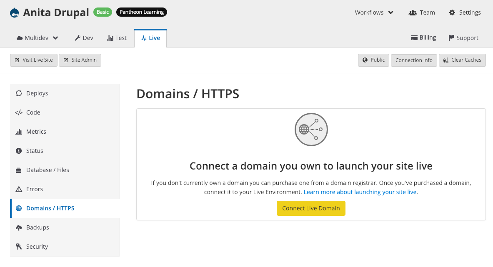
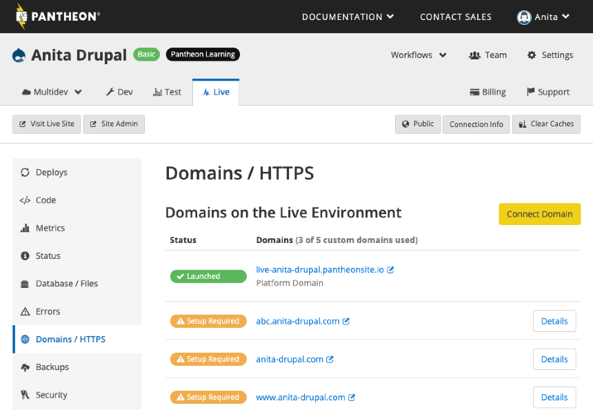
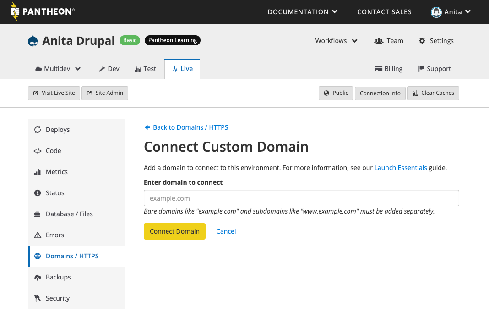
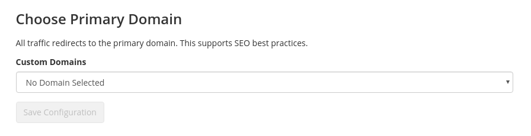

A domain name is the web address or URL used to visit your site. The Domain Name System (DNS) resolves human-readable names like `www.example.com` into machine-readable IP addresses like 127.0.0.1. All Pantheon sites are accessible via platform domains, and you can easily connect your own custom domain to paid sites.

<Enablement title="Get WebOps Training" link="https://pantheon.io/agencies/learn-pantheon?docs">

Optimize your dev team and streamline internal workflows. Pantheon delivers custom workshops to help development teams master our platform and improve their internal WebOps

</Enablement>

## Platform Domains
Pantheon issues platform domains for all environments. Each environment (Dev, Test, Live, each Multidev) is accessible via the platform domain, matching the following patterns:

- dev-site-name.pantheonsite.io
- test-site-name.pantheonsite.io
- live-site-name.pantheonsite.io
- multidev-env-site-name.pantheonsite.io

All platform domains are available over HTTPS. Redirecting to HTTPS during development and testing is a good best practice to ensure you are ready to go live with HTTPS. See [Redirect to HTTPS](/redirects/#redirect-to-https) for more information.

### robots.txt
Pantheon serves a default robots.txt that disallows crawlers on platform domains (`/*.pantheonsite.io`, `/*.pantheon.io`, `/*.gotpantheon.com`, and `/*.sites.my-agency.com`). Crawlers are allowed on the Live environment for requests served with a custom domain (e.g., `www.example.com`). If you attempt to access your Live environment with a platform domain, even if you have a domain associated with the environment, the default robots.txt will be served.

Pantheon does not allow crawlers on Dev, Test, or Multidev environments. Adding a custom domain to an environment other than Live will not permit crawlers to that environment.

## Custom Domains
If you don't already own a domain name, register one with a third-party provider. Pantheon is not a domain registrar, but we've created documentation for several popular DNS managers:

<Accordion title="DNS Host-Specific Instructions" id="host-specific2" icon="info-sign">

 - [1&1 Domain Configuration](/1-and-1/)
 - [Cloudflare Domain Configuration](/cloudflare/)
 - [DNS Made Easy Domain Configurationi](/dns-made-easy/)
 - [DreamHost Domain Configuration](/dreamhost/)
 - [Dyn Domain Configuration](/dyn/)
 - [eNom Domain Configuration](/enom/)
 - [Gandi Domain Configuration](/gandi/)
 - [GoDaddy Domain Configuration](/godaddy/)
 - [Google Domain Configuration](/google/)
 - [Namecheap Domain Configuration](/namecheap/)
 - [Network Solutions Domain Configuration](/network-solutions/)
 - [Amazon Route 53 Domain Configuration](/route53/)

</Accordion>

Connect your custom domain on the Site Dashboard, and point DNS at Pantheon to trigger [automated HTTPS provisioning](/https/).


<Partial file="tables/custom-domains-limit.md" />


<Alert title="Note" type="info">

Add all domains (example.com and www.example.com are different domains!) you want to resolve to Pantheon within the Site Dashboard, for each respective environment, as described in [Launch Essentials](/guides/launch/). Automatic resolution of domains and wildcards are not supported.

</Alert>

### Add a Custom Domain

<Partial file="secure-only-tlds.md" />

1. From your site dashboard, for the environment you want the domain to point to (usually Live), click on the <em class="fa fa-home"></em>**Domains / HTTPS** tab.

1. If no domains have been added yet, click **Connect Live Domain**:

    

   If one (or more) domains have already been added, click **Connect Domain**:

    

1. Enter the domain you'd like to add in the "Enter domain to connect" field, then click **Connect Domain**:

    

1. After adding your domain, you'll be automatically taken to the domain's "Details" page where you will see both the current DNS records detected (the "Detected Values"), as well as the values to be added at your DNS host ("Required Values"):

    

1. Add the values to your DNS management service. For more details, see [Introduction to Domain Name Services](/dns/).

1. You will also see an option to choose a primary domain:

  

## Choose Primary Domain
Pantheon uses the term **primary domain** to refer to a single domain used to serve all traffic from a site. For example, configuring `www.example.com` as the primary domain means that requests to `example.com` (or any other domain connected to the environment) all get redirected to `www.example.com`. This assumes that you have added **both** `example.com` and `www.example.com` to the Site Dashboard.

Redirecting all traffic to a primary domain is a best practice for SEO since it avoids duplicate content. It also prevents session strangeness, where a user can be logged in to one domain but logged out of other domains at the same time, and it can make it easier to measure and monitor website traffic.

<Alert title="Note" type="info">

Redirects cannot be managed via `.htaccess`, which is ignored on our platform. For details, see [Configure Redirects](/redirects/#php-vs-htaccess).

</Alert>

<Partial file="primary-domain.md" />

### Update or Remove Primary Domain
Update the Primary Domain using either method provided in [the previous section](#set-a-primary-domain-via-the-dashboard).

Remove an existing selection for the Primary Domain on any environment using [Terminus](/docs/terminus/): 

```bash
terminus domain:primary:remove my-site.live
```

### Redirect to HTTPS
It's a best practice for SEO and security to standardize all traffic on HTTPS and choose a primary domain. Configure redirects to the primary domain with HTTPS in [pantheon.yml](/pantheon-yml#enforce-https--hsts)

### Redirect with PHP
If your site configuration prevents you from setting the primary domain from the platform level, you can use PHP redirects:

<Accordion title="PHP Redirection" >

<Partial file="_redirects.md" />

</Accordion>

For more redirect scenarios, see [Configure Redirects](/redirects).

## Vanity Domains for Organizations
Pantheon Partners, Strategic Partners, Enterprise accounts, Resellers, and OEM Partners have the ability to provision a custom vanity domain for each environment on every site running on the platform, in addition to the default platform domain (`pantheonsite.io`).

For details, see [Vanity Domains](/vanity-domains/).

## Troubleshooting
### Failed cache clears, search and replace, or Drush and WP-CLI operations
All redirect logic should include the `php_sapi_name() != "cli"` conditional statement to see if WordPress or Drupal is running via the command line. Drush and WP-CLI are used by the platform for operations like cache clearing and search and replace, so it is important to only redirect web requests, otherwise the redirect will kill the PHP process before Drush or WP-CLI is executed, resulting in a silent failure:

```bash
[notice] Command: site.env -- 'drush <command>' [Exit: 1]
[error]
```


### Infinite Redirect Loops
#### HTTP_X_FORWARDED_PROTO
Errors referencing too many redirects may be a result of using the ` $_SERVER['HTTP_X_FORWARDED_PROTO']` variable within redirect logic located in your site's `wp-config.php` or `settings.php` file.

Resolve this error by replacing the offending redirect logic with the [recommended code samples in the above section](#redirect-to-https-and-the-primary-domain) and for your specific use case.

#### Modules and Plugins
Modules and plugins that support managing redirects in the Site Admin interface can produce redirect errors when repeating or conflicting with redirects managed via PHP in your site's configuration file. Some examples include:

WordPress plugins: Redirection, Quick Page/Post Redirect, Safe Redirect Manager, Simple 301 Redirects

Drupal modules: Language (when using URL detection), Securepages, Redirect

When troubleshooting a redirect loop, you may want to deactivate any module or plugin that may be providing its own redirect logic.

### Mixed-mode Browser Warnings
Replace `http://` in the site's database and configure your CMS to assume users are visiting via HTTPS and the site’s primary domain. Templates for example should reference HTTPS in absolute CSS and Javascript sources, even when accessed with HTTP.

<Partial file="cname-workaround.md" />

### Test Domain Names Before DNS
You can modify your local `hosts` file to validate domain-specific settings before DNS is in place.

<Partial file="_hosts-file.md" />


## See Also
- [Configure Redirects](/redirects)
- [Launch Essentials](/guides/launch/)
- [Relaunch Existing Pantheon Site](/relaunch/)
