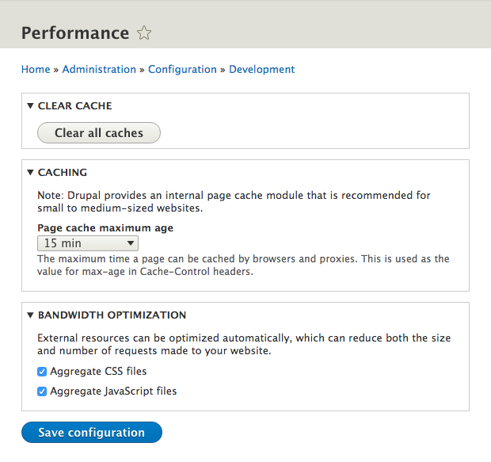

To maximize your site's performance on Pantheon and to take advantage of our Varnish caching, you'll need to configure your site's performance settings.

<Enablement title="Agency WebOps Training" link="https://pantheon.io/agencies/learn-pantheon?docs" campaign="docs-webops">

Learn industry best practices for Drupal caching, how to take advantage of them on the platform, and troubleshooting common issues with help from the experts at Pantheon.

</Enablement>

## Drupal 8 Performance Configuration
Visit `/admin/config/development/performance` for Drupal's performance settings.

## Caching

In Drupal 8, anonymous page caching is enabled by default. There is no option to turn it on or off. To disable caching for development purposes, set the "Page cache maximum age" to **no caching**.

Page cache maximum age sets the max-age value in the Cache-Control headers that are output by Drupal 8. The only value that will disable Drupal's caching is "no caching". For an in-depth explanation of the max-age header, see the [W3.org official documentation](https://www.w3.org/Protocols/rfc2616/rfc2616-sec14.html#sec14.9.3).

## Bandwidth Optimization

On the Live environment, make sure to enable **Aggregate and compress CSS files** and **Aggregate and compress JavaScript files**. This is critical for page render times by reducing the number of HTTP requests and the amount of data transferred. There is no longer a "compress cached pages" setting in Drupal 8.

Some developers may wonder if HTTP/2 has replaced CSS and Javascript aggregation as a best practice. While HTTP/2 certainly reduces the overhead of requesting and downloading many files, our testing with real-world browsers and web connections still shows benefits for aggregation even with HTTP/2.

* Aggregation allows multiple source files to share compression data. HTTP/2 does not inherently support doing this between responses. The result is that disaggregating the files and serving them over HTTP/2 makes the overall size of page load larger, often by hundreds of kilobytes. Aggregated files avoid this problem by combining similar data (CSS or Javascript) into fewer responses. [Brotli compression](https://en.wikipedia.org/wiki/Brotli) should eventually minimize this issue, but it's not broadly available for web servers and CDNs as of January 2018.
* The TCP foundations of today's HTTP/2 deployments still impose [ordering overhead](https://en.wikipedia.org/wiki/Head-of-line_blocking) that undermines the intended parallelism. In real-world environments, we've seen HTTP/2 with no aggregation perform substantially worse (hundreds of milliseconds) than pages using aggregation. This overhead occurs even with HTTP/2 push, though that reduces it somewhat. [QUIC](https://en.wikipedia.org/wiki/QUIC) may solve this gap, but it's even more experimental than Brotli. As of January 2018, it isn't clear if QUIC will find broad support and deployment.

### Other Caching Locations
Other modules like `views.module`, which is now in Drupal 8's core, and `panels.module` contain their own caching options, which are much more fine-grained than the basic Drupal cache settings. If you use these modules, you should consider implementing their cache settings to provide a good logged-in user experience.

## See Also
- [Global CDN Caching for High Performance](/global-cdn-caching)
- [Cache API in Drupal 8](https://www.drupal.org/developing/api/8/cache)
- [Drupal 8 Cache API Documentation](https://api.drupal.org/api/drupal/core!core.api.php/group/cache/8)
- [Drupal 8's Dynamic Page Cache](http://wimleers.com/article/drupal-8-dynamic-page-cache)
