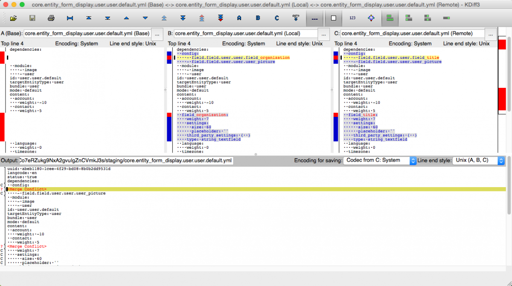

Managing configuration is an extremely important part of any team website project, but in many cases, this area of the project does not receive as much attention as it deserves. The tools for Drupal 7 do not provide complete coverage of all configuration settings, leading to inconsistencies in configuration handling and inconvenient workarounds. This has led to configuration management becoming a real thorn in the side for many projects.

Pantheon supports the [Drupal 9 Configuration Management system](https://www.drupal.org/documentation/administer/config). Each Pantheon Drupal site defaults configuration into the `/config` directory.

You can export your configuration into that directory directly using Drush's `config-export` command or indirectly using Drupal's UI to download the configuration. For more information, check out the [Managing Content, Configuration, and Code Across Environments](/guides/drupal8-commandline#managing-content-configuration-and-code-across-environments) section of [Create a Drupal 8 Site From the Command Line Using Terminus and Drush](/guides/drupal8-commandline).

<Accordion title="Watch: Configuration Management in Drupal" id="d8-config-video" icon="facetime-video">

<Youtube src="D-4gu1zPCMg" title="Configuration Management in Drupal" />

</Accordion>

## Basic Workflow

1. Confirm that the Development environment is in SFTP mode and then export your configuration to code:

   ```bash{promptUser: user}
   drush config:export -y
   ```

1. Return to the Dashboard and commit the configuration changes.

1. Deploy the code to Test.

1. Import the configuration from code into the test environment database:

   ```bash{promptUser: user}
   drush config:import -y
   ```

1. Test the site.

1. Deploy the code to Live.

1. Import the configuration from code into the live environment database:

   ```bash{promptUser: user}
   drush config:import -y
   ```

Using Terminus, you can complete the above process from the command line.

### Workflow Example

In the commands below, replace `site` with your site name and the correct environment:

```bash{outputLines: 2,4,6,8,10,12,14}
terminus drush <site>.dev -- config:export -y

terminus env:commit <site>.dev --message="Export configuration to code"

terminus env:deploy <site>.test --sync-content --updatedb --note="Deploy configuration to test"

terminus env:clear-cache <site>.test

terminus drush <site>.test -- config:import -y

open https://test-mysite.pantheonsite.io

terminus env:deploy <site>.live --note="Deploy configuration to live"

terminus env:clear-cache <site>.live

terminus drush <site>.live -- config:import -y

open https://live-mysite.pantheonsite.io
```

## Configuration Tools for Drupal 9

With [Drupal 9](/drupal-9), much more powerful tools promise to greatly improve this situation. The new configuration management system provides complete and consistent import and export of all configuration settings, and Git already provides facilities for managing parallel work on different branches. When conflicts occur, it is  possible to back out the conflicting changes, take just the version provided in the central repository, or use three-way merge tools such as `kdiff3` to examine and manually resolve each difference. A new Drush project, [config-extra](https://github.com/drush-ops/config-extra), includes a `config-merge` command that streamlines the use of these tools.

## Config Direct Save Module

If you prefer to use a GUI to manage configuration management, try the Config Direct Save Module, available on [Drupal.org](https://www.drupal.org/project/config_direct_save). Activating this module creates a new **Update** menu option under your configuration menu. This module can make backups of configurations (when you check the backup check box) and override the sync (all files with old configuration) by the new configurations (replace all configurations files).

## Drush Config Workflow

Even with tools, a project needs to make a plan to manage the configuration workflow. To help projects get started, Pantheon has set up a public repository called [Drush Config Workflow](https://github.com/pantheon-systems/drush-config-workflow). This repository contains documentation on a couple of different configuration workflows that can be used during different phases of a project.

### Git Configuration

The [Git configuration workflow](https://github.com/pantheon-systems/drush-config-workflow/blob/master/docs/git_workflow.md) describes how to use `config-merge` to export your configuration changes, commit them to Git, push them to the central repository, pull the changes locally, and then merge them with your local development site’s configuration. All of this is done in a single command.

### Rsync Configuration

The [rsync configuration workflow](https://github.com/pantheon-systems/drush-config-workflow/blob/master/docs/rsync_workflow.md) allows you to use a similar workflow in situations where you cannot make commits on the remote Drupal site. In these instances, `config-merge` will export changes to a temporary directory and then rsync them to the local system, where they are committed to a temporary branch in Git and then merged with the local configuration changes.

### Three-way Merge

Additionally, the [three-way merge page](https://github.com/pantheon-systems/drush-config-workflow/blob/master/docs/three_way_merge.md) in this repository describes what to do when the `config-merge` tool encounters a conflict, and brings up a three-way merge tool such as [kdiff3](http://kdiff3.sourceforge.net/). This tool can considerably reduce the time needed to comprehend and resolve merge conflicts.



### Installation Script

If you would like to try out any of the example scenarios presented in the repository, there is also a handy installation script that will quickly set up a local environment for you to use. It can be used to either clone a Pantheon site locally, or it can create both sites locally. Instructions on how to use the script are detailed on the [installation page](https://github.com/pantheon-systems/drush-config-workflow/blob/master/INSTALL.md).

## Relocated Configuration Directory

Configuration files can contain sensitive information. Drupal takes some measures to protect the default configuration directory, but the conventional way to secure these files is to locate them outside of the document root so they are not web accessible. Following this convention may help make site configuration easier to manage.

### Before you Begin

- Refer to [Serving Sites from the Web Subdirectory](/nested-docroot) to enable nested docroot on a new or existing Drupal 9 site.

### Configure and Relocate

After implementing a nested docroot, set a new path (`/config`) for configuration directories by adding the following to `settings.php`<Popover title="Syntax note" content="As of <a class='external' href='https://www.drupal.org/docs/8/configuration-management/changing-the-storage-location-of-the-sync-directory#s-syntax-changes-in-drupal-880'>Drupal 8.8.0</a> the sync directory is defined in $settings and not $config_directories. " />:

```php:title=settings.php
/**
 * Place the config directory outside of the Drupal root.
 */
$settings['config_sync_directory'] = dirname(DRUPAL_ROOT) . '/config';
```

<Alert title="Note" type="info">

Care should be taken to ensure that this code is added after the `settings.pantheon.php` is included; otherwise, the `CONFIG_SYNC_DIRECTORY` will be overwritten with the Pantheon default value. The configuration directory must exist before this variable is changed.

</Alert>

Relocate the configuration directory for the default location using `git mv`:

```bash{promptUser: user}
git mv web/sites/default/files/config .
```


