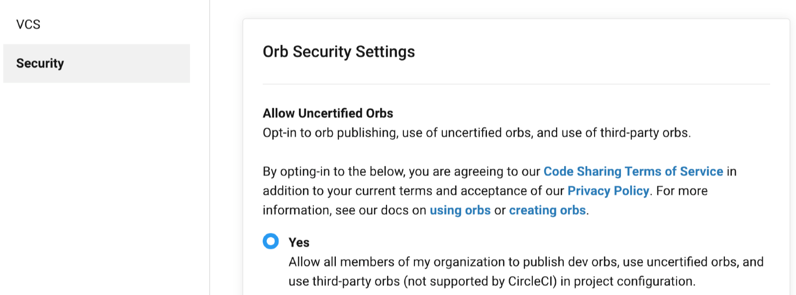

Drupal 9 is, according to [drupal.org](https://www.drupal.org/docs/understanding-drupal/drupal-9-resources):

> "...a cleaned-up version of Drupal 8... \[with] deprecated code removed and third-party dependencies updated."

Drupal 9 updates Drupal’s underlying dependencies like [Symfony 4.4](https://symfony.com/releases/4.4) and [Twig 2](https://twig.symfony.com/doc/2.x/index.html), removes several deprecated API functions in favor of better options, and allows everyone running Drupal 8.8+ an easy upgrade path to Drupal 9 and beyond.

<Alert title="Early Access Only - Not for Production Use" type="danger">

**Do not use this Early Access release for your live site.**

Currently, Drupal 9 is only available on Pantheon as an Early Access feature release. This means the feature is currently in active development and is intended for testing and evaluation purposes only.

Pantheon engineers are rolling out changes often, and easy updates from Drupal 9 Early Access are not guaranteed.

Sites may be deleted without notice.

</Alert>

Test Drupal 9 with a fresh installation using either our Integrated Composer Early Access program or Build Tools:

- [Create a new Drupal 9 site with integrated Composer](#create-a-new-drupal-9-site-with-integrated-composer).
  - If you simply want to test the browser experience of Drupal 9 and get access to forthcoming Pantheon support for Composer in the Dashboard.

- [Create a new Drupal 9 Site with Continuous Integration and Build Tools](#create-a-drupal-9-site-with-continuous-integration-via-build-tools).
  - To create a new site with a continuous integration (**CI**) workflow using GitHub.

|                                                                                        | **Benefits**                                                                                                                                               | **Considerations**                                                                                                         |
|----------------------------------------------------------------------------------------|------------------------------------------------------------------------------------------------------------------------------------------------------------|----------------------------------------------------------------------------------------------------------------------------|
| [**Integrated Composer**](#create-a-new-drupal-9-site-with-integrated-composer)        | • Composer automatically runs on Pantheon <br /> • Lean repository (vendor dir not in git) <br /> • Integrated 1-click Pantheon updates & Custom Upstreams | • Early Access only <br /> • Requires a unique site-name prefix                                                            |
| [**Build Tools**](#create-a-drupal-9-site-with-continuous-integration-via-build-tools) | • Composer automatically runs via CI <br /> • Pull request-based workflow <br /> • Supports automated testing                                              | • Requires 3rd-party CI <br /> • Terminus required <br /> • Composer updates happen outside the 1-click Pantheon Dashboard |

If you're not ready to create a new site yet, you can also [check an existing site's compatibility to upgrade](#test-an-existing-drupal-site-for-drupal-9-upgrade-compatibility). Once you're ready, [test-upgrade an existing Pantheon Drupal 8 site to Drupal 9](#test-upgrade-an-existing-pantheon-drupal-8-site-to-drupal-9).

## Create a New Drupal 9 Site with Integrated Composer

Join our Early Access program to test out both Drupal 9 and Pantheon Integrated Composer support.

1. [Fill out this form](https://docs.google.com/forms/d/1lahWKMT2VHXfr9hg15VIQY2Kn6z_j77o7Te6hZqsNgw) to get access to our “Drupal 9 Early Access” group. Once you are added, you'll have access to a new "Drupal 9 Early Access" site creation option from your Pantheon Dashboard.

1. Spin up a new "Drupal 9 Early Access" site! This will give you the [Drupal 9 starter codebase](https://github.com/stevector/drupal-9-project) and will automatically trigger a Composer install and `git commit` on site creation.

## Create a Drupal 9 Site with Continuous Integration via Build Tools

Want to regularly develop with continuous integration (CI) and automated tests? Leverage Pantheon’s [Build Tools](/guides/build-tools) to get up and running quickly with a CI workflow to build, test, and deploy Drupal 9.

These steps use GitHub and CircleCI:

1. Install the [Terminus Build Tools plugin](https://github.com/pantheon-systems/terminus-build-tools-plugin).
   - This will require generating a [Pantheon machine token](/machine-tokens), a [CircleCI API token](https://circleci.com/docs/2.0/managing-api-tokens/), and a [GitHub API credential](https://developer.github.com/v3/#authentication).
1. Enable support for custom CircleCI Orbs in your Organizational settings. In CircleCI, click **Settings**, then **Security**, and under **Allow Uncertified Orbs** click **Yes**:

   

1. Use Terminus to create a new Drupal 9 site, complete with a customizable CI workflow. Remember to replace `<NEW-SITE-NAME>` in this example with a name for your new site, and `optional-pantheon-organization-name` with your choice (if any):

  ```bash{promptUser: user}
  terminus build:project:create "pantheon-systems/drupal-9-with-circleci-orb:dev-master" <NEW-SITE-MACHINE-NAME> --stability=dev --team='optional-pantheon-organization-name'
  ```

## Test an Existing Drupal Site for Drupal 9 Upgrade Compatibility

1. Review the [How to Prepare Your Drupal 7 or Drupal 8 Site for Drupal 9](https://www.drupal.org/docs/9/how-to-prepare-your-drupal-7-or-8-site-for-drupal-9) guide on Drupal.org. Note that although Drupal supports upgrading to version 9 from version 8.8, you should ensure that your site is on the latest Drupal 8.9 release before trying Drupal 9 on Pantheon.

1. Use the [Upgrade Status](https://www.drupal.org/project/upgrade_status) Drupal 8/9 module to generate a full report of your site’s compatibility.

1. Check out [Acquia’s Drupal 9 Deprecation Status Upgrade Tracker](https://dev.acquia.com/drupal9/deprecation_status) for information about Drupal 9 support for contributed Drupal modules and themes.

### Update Deprecated Code for Drupal 9 Compatibility

Drupal 9 has deprecated a number of different functions and APIs in favor of better options going forward.

For example, `node_load()` was replaced in Drupal 9 with `Node::load` resulting in this change needed:

Drupal 8:

```php
$node = node_load(1);
```

Drupal 9:

```php
use \Drupal\node\Entity\Node;
$node = Node::load(1);
```

Since most of these changes are relatively minor, there are a number of [deprecation checking and correction tools](https://www.drupal.org/docs/9/how-to-prepare-your-drupal-7-or-8-site-for-drupal-9/deprecation-checking-and-correction-tools) available.

## Test-upgrade an Existing Pantheon Drupal 8 Site to Drupal 9

Are you already running a Pantheon site using our [Drupal 8 upstream](https://github.com/pantheon-systems/drops-8)? Use our [Multidev](/multidev) feature to test Drupal 9 in a new branch.

1. Clone your Drupal 8 site’s codebase [to your computer](/local-development#get-the-code) and change directory to it. You can create a new Drupal 8 site or use an existing Drupal 8 site:

  ```bash{promptUser: user}
  git clone <url for site repo>
  cd <site-name>
  ```

1. Install the [Terminus D9 Preview plugin](https://github.com/pantheon-systems/terminus-d9-preview) to create a Multidev environment called `preview-d9` on your Drupal 8 site for testing:

  ```bash{promptUser: user}
  composer create-project -d ~/.terminus/plugins pantheon-systems/terminus-d9-preview:^0.1
  ```

1. Create and switch to a new testing multidev:

  ```bash{promptUser: user}
  terminus preview:d9
  ```

1. Modify the `pantheon.yml` file to specify PHP 7.3 or newer and Drush 8:

  ```yaml:title=pantheon.yml
  php_version: 7.4
  drush_version: 8
  ```

  Note that Drupal 9 is not yet compatible with the pre-installed Drush 10 on Pantheon.

1. Commit and push your changes:

  ```bash{promptUser: user}
  git commit -am "test upgrade to Drupal 9"
  git push origin preview-d9
  ```

You should not attempt to merge your preview multidev back into the dev environment until Drupal 9 is supported on Pantheon. If you make changes to your dev environment after you create the preview-d9 multidev, you may run the `terminus preview:d9` command again to update the existing multidev. Note that this command destroys the code, database and files on the existing preview-d9 multidev and re-creates it from the latest dev environment, so be sure to save any changes you made before refreshing the environment.

## FAQ

### Pantheon Drupal 8 Modules Being Upgraded to Drupal 9

| Module Name                                                                                 | Drupal 8 Version? | Drupal 9 Version? |
|---------------------------------------------------------------------------------------------|:-----------:|:-----------:|
| [Pantheon Advanced Page Cache](https://www.drupal.org/project/pantheon_advanced_page_cache) |     Yes     |     Yes     |
| [Search API Pantheon](https://www.drupal.org/project/search_api_pantheon)                   |     Yes     |   Not yet   |

### Does Pantheon have plans to upgrade MariaDB?

Yes, Pantheon has plans to upgrade MariaDB platform-wide with the official platform release of Drupal 9.

### When will Drupal 9 be officially supported for production sites on Pantheon?

There are no new features in Drupal 9 until Drupal 9.1, which is scheduled for release on December 2. Drupal 9 on Pantheon is currently in early access and scheduled for general availability with the release of Drupal 9.1.

### Where can I report an issue?

Drupal 9 issues can be reported on GitHub:

- Report issues with Drupal 9 via Build Tools to the [drupal-9-with-circleci-orb](https://github.com/pantheon-systems/drupal-9-with-circleci-orb/issues) repo.
- Report issues with Drupal 9 via Integrated Composer to the [drupal-9-project](https://github.com/stevector/drupal-9-project/issues) repo.
