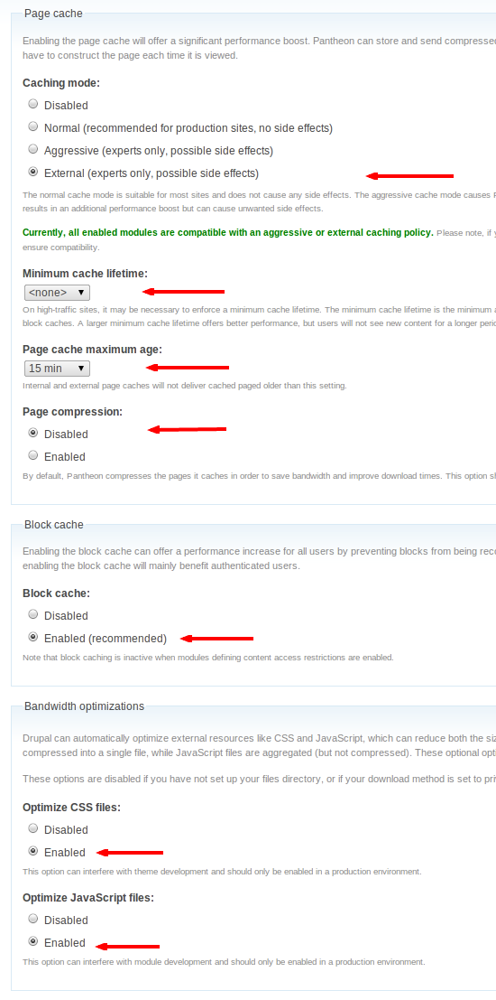

To maximize your site's performance on Pantheon and to take advantage of our [Global CDN caching](/global-cdn-caching), you'll need to configure your site's performance settings.

<Enablement title="Agency WebOps Training" link="https://pantheon.io/learn-pantheon?docs" campaign="docs-webops">

Learn industry best practices for Drupal caching, how to take advantage of them on the platform, and troubleshooting common issues with help from the experts at Pantheon.

</Enablement>

## Drupal 8 Performance Configuration

Visit `/admin/config/development/performance` for Drupal's performance settings.

### Caching

**This is a key setting**. It determines what value Drupal delivers in its `max-age` header, which is how long the reverse-proxy layer will retain a cache.

Performance is often a trade-off between how fresh your content is, and how fast you want to deliver it to the internet. A good value to start with is 15 minutes, but this is something to consider. If you can set it to an hour, that's great for performance.

On Pantheon, this value defaults to 15 minutes. This is done on the first cache-clear operation on the site; immediately after installing the site, you may see this set to `<no caching>`. In this case, press the "Clear all caches" button, or select the page cache maximum age from the available selections.

Note that Drupal 8 has no setting to configure the minimum cache lifetime.

### Bandwidth Optimization
  
On the Live environment, make sure to enable "Aggregate and compress CSS files" and "Aggregate and compress JavaScript files". This is critical for page render times by reducing the number of HTTP requests and reducing the amount of data transferred.

### Cache Tags
Drupal 8 introduced a [cache metadata](https://www.drupal.org/docs/8/api/cache-api/cache-api) system that allows internal and external caches to be cleared in very granular fashion as data is changed. For instance, if `node 123` were resaved, caches that depends upon that node, like the full page cache of the page `mysite.com/node/123`, should be cleared.

This functionality can be added via the [Pantheon Advanced Page Cache](https://www.drupal.org/project/pantheon_advanced_page_cache) module, which uses Drupal 8's cache metadata to communicate with the [Pantheon Global CDN](/global-cdn). The Drupal 7 version of the module depends upon the [Drupal 8 Cache Backport module](https://www.drupal.org/project/d8cache).

## Drupal 7 Performance Configuration

Visit `/admin/config/development/performance` for Drupal's performance settings.

### Caching

Unless needed for development, you should always enable "Cache pages for anonymous users". Without it, your Drupal site will have to rebuild every page and the Pantheon Global CDN will not cache your site. If possible, enable "Cache blocks" as well to increase performance for logged-in users.

### Minimum Cache Lifetime

Minimum caching lifetime forces cached content to continue to exist before it can be flushed. If all caches are cleared, any content under the minimum cache lifetime will not be expunged. High traffic sites may want to set this to a non-zero value; when in doubt, set it to none.

### Expiration of Cached Pages
  
**This is a key setting**. It determines what value Drupal delivers in its `max-age` header, which is how long the reverse-proxy layer will retain a cache.

Performance is often a trade-off between how fresh your content is, and how fast you want to deliver it to the internet. A good value to start with is 15 minutes, but this is something to consider. If you can set it to an hour, that's great for performance. More than a day is usually excessive, since the edge cache will decay over that amount of time in most cases.

### Bandwidth Optimization
  
On Pantheon, the "Compress cached pages" setting should not checked, as pages are already compressed with gzip.   
  
On the Live environment, make sure to enable "Aggregate and compress CSS files" and "Aggregate and compress JavaScript files". This is critical for page render times by reducing the number of HTTP requests and reducing the amount of data transferred.

## Drupal 6

### Caching Mode

In Drupal 6, most users should set their cache mode to "Aggressive" to take advantage of the reverse-proxy layer. This is like checking "cache pages for anonymous users": Drupal will "double cache" the pages locally. That can be an advantage as they'll be held until the next cache flush, which can last much longer in practice than the reverse-proxy layer.

Checking "External" prevents this kind of "double caching" by freeing Drupal from the responsibility to store a page that is also being stored at the reverse-proxy layer. Again, this should only be used on sites that don't want the long-term protection of an internal page cache.

### Compatibility Warnings
Any module implementing Drupal's `hook_boot()` or `hook_exit()` will show up with a compatibility warning on External or Aggressive modes. This is because when Drupal uses Aggressive mode no logic is executed on a successful cache hit. As soon as the CMS detects that the URL being request has a cache, it returns that cache.

Obviously, when the page is cached Externally in a reverse-proxy layer, Drupal is not consulted when cached pages are delivered.

This limits some functionality in Drupal. For instance, the core `statistics.module` cannot count anonymous pageviews if it isn't being exercised every time a page is viewed. That said, `statistics.module` is not great for high performance sites.

As a developer, you should understand the implications of the code in your application, and what it means to have cached pages delivered from an external source.

### Minimum Cache Lifetime

This is useful for high traffic sites that don't want to be flushing their caches when every comment is submitted.

### Page Cache Maximum Age

This determines the amount of time a cache will be honored in the reverse-proxy layer. Set it as high as you are comfortable.

### Block Cache

This can help with logged-in performance by preventing regeneration of block elements in sidebars every pageview.

### Optimize CSS and JavaScript Files

This setting controls whether or not to compile and cache your CSS and JavaScript files together, speeding up browser render times significantly. You might want to turn it off in Dev if you are building a theme (or developing JS), but this should always be enabled in production.

### Contributed Modules

Contributed modules like `views.module` and `panels.module` contain their own caching options, which are much more fine-grained than the basic Drupal cache settings. If you use these modules, you should definitely look at implementing their cache settings to provide a good logged-in user experience.

## See Also
- [Global CDN Caching for High Performance](/global-cdn-caching)
