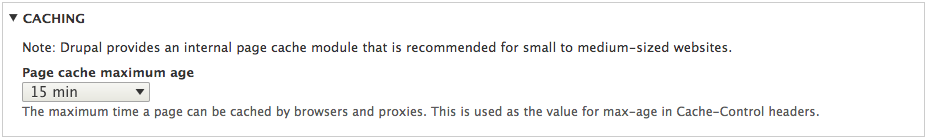

To maximize your site's performance on Pantheon and to take advantage of our [Global CDN caching](/global-cdn-caching), you'll need to configure your site's performance settings.

<Enablement title="Agency WebOps Training" link="https://pantheon.io/learn-pantheon?docs" campaign="docs-webops">

Learn industry best practices for Drupal caching, how to take advantage of them on the platform, and troubleshooting common issues with help from the experts at Pantheon.

</Enablement>

## Drupal 8 Performance Configuration

Visit `/admin/config/development/performance` for Drupal's performance settings.

### Caching


**This is a key setting**. It determines what value Drupal delivers in its `max-age` header, which is how long the reverse-proxy layer will retain a cache.

Performance is often a trade-off between how fresh your content is, and how fast you want to deliver it to the internet. A good value to start with is 15 minutes, but this is something to consider. If you can set it to an hour, that's great for performance.

On Pantheon, this value defaults to 15 minutes. This is done on the first cache-clear operation on the site; immediately after installing the site, you may see this set to `<no caching>`. In this case, press the "Clear all caches" button, or select the page cache maximum age from the available selections.

Note that Drupal 8 has no setting to configure the minimum cache lifetime.

### Bandwidth Optimization


On the Live environment, make sure to enable "Aggregate and compress CSS files" and "Aggregate and compress JavaScript files". This is critical for page render times by reducing the number of HTTP requests and reducing the amount of data transferred.

### Cache Tags

Drupal 8 introduced a [cache metadata](https://www.drupal.org/docs/8/api/cache-api/cache-api) system that allows internal and external caches to be cleared in very granular fashion as data is changed. For instance, if `node 123` were resaved, caches that depends upon that node, like the full page cache of the page `mysite.com/node/123`, should be cleared.

This functionality can be added via the [Pantheon Advanced Page Cache](https://www.drupal.org/project/pantheon_advanced_page_cache) module, which uses Drupal 8's cache metadata to communicate with the [Pantheon Global CDN](/global-cdn). The Drupal 7 version of the module depends upon the [Drupal 8 Cache Backport module](https://www.drupal.org/project/d8cache).

For Drupal 9, install the Pantheon Advanced Page Cache module via [Composer](/guides/integrated-composer#add-a-dependency-to-an-individual-site), then enable it via the Drupal Admin:

```bash{promptUser: user}
composer require drupal/pantheon_advanced_page_cache
git commit -am "add pantheon advanced page cache module" && git push origin master
```

## Drupal 7 Performance Configuration

Visit `/admin/config/development/performance` for Drupal's performance settings.

### Caching


Unless needed for development, you should always enable "Cache pages for anonymous users". Without it, your Drupal site will have to rebuild every page and the Pantheon Global CDN will not cache your site. If possible, enable "Cache blocks" as well to increase performance for logged-in users.

### Minimum Cache Lifetime


Minimum caching lifetime forces cached content to continue to exist before it can be flushed. If all caches are cleared, any content under the minimum cache lifetime will not be expunged. High traffic sites may want to set this to a non-zero value; when in doubt, set it to none.

### Expiration of Cached Pages
 <br />
**This is a key setting**. It determines what value Drupal delivers in its `max-age` header, which is how long the reverse-proxy layer will retain a cache.

Performance is often a trade-off between how fresh your content is, and how fast you want to deliver it to the internet. A good value to start with is 15 minutes, but this is something to consider. If you can set it to an hour, that's great for performance. More than a day is usually excessive, since the edge cache will decay over that amount of time in most cases.

### Bandwidth Optimization
 <br />
On Pantheon, the "Compress cached pages" setting should not checked, as pages are already compressed with gzip.  <br />
 <br />
On the Live environment, make sure to enable "Aggregate and compress CSS files" and "Aggregate and compress JavaScript files". This is critical for page render times by reducing the number of HTTP requests and reducing the amount of data transferred.

### The `cache_form` Table

Drupal 7 sites can encounter performance problems when the `cache_form` table in the database grows to be too large in size. Unlike other Drupal cache tables, entries in `cache_form` are only removed after expiration. By default, entries expire after six hours. Entries which are older than six hours will be deleted.

In addition to storing in-flight form data, Drupal writes to the `cache_form` table every time a form that uses the `#ajax` Form API property is viewed. On a high-traffic site, or a site with an AJAX form on every page (for example a search field with autocomplete), traffic can cause the table to grow large enough to severely impact performance, impede MySQL replication, and cause downtime.

[Drupal 7.61](https://www.drupal.org/node/2857751) introduced a feature to control the expiration of entries in `cache_form`. If your site is having issues with the table, you can add the following code to your `settings.php` file:

```php
$conf['form_cache_expiration'] = 1800; // Expire cache_form items after 30 minutes.
```

Cleanup on the `cache_form` table runs on cron. If the table continues to grow to be too large, despite setting a low expiration time, you can [troubleshoot cron](/drupal-cron#troubleshooting-cron). You can also safely delete the contents of the table with a SQL query:

```sql
mysql> TRUNCATE TABLE cache_form;
```

## See Also
- [Global CDN Caching for High Performance](/global-cdn-caching)
