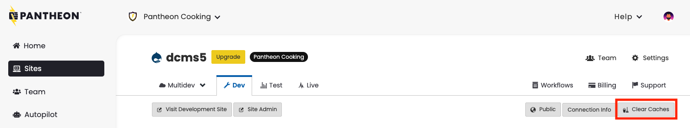

# Drupal CMS

Released in January of 2025, Drupal CMS is a wrapper around Drupal Core.
Drupal CMS builds on the concept of [Recipes](https://www.drupal.org/docs/extending-drupal/drupal-recipes) to [radically reduce the amount of time and expertise required to stand up common functionality](https://pantheon.io/blog/drupal-cms-innovations).
In particular, Drupal CMS is aimed at Marketers and Content Editors who commonly use Drupal, but who may not have the technical expertise to install and configure modules themselves.

For Pantheon's developer-centric community, Drupal CMS can be used as a reference point and proving ground for recipes.

After trial usage of recipe combinations in sandbox sites, experienced development teams can then replicate their favorite recipes on new or pre-existing live sites, or provide those recipes for an easy deployment on their sites for less experienced users.

Recipes also reduce the time and knowledge it requires to install and setup some functionalities and modules. While in the past installing some specific modules would require having a minimum knowledge of what we are installing, how to configure them, etc, in the era of the Drupal recipes adding new functionality to any site has been highly simplified. 

## Installing Drupal CMS on Pantheon

Drupal CMS can be installed in a fresh sandbox site on Pantheon.
[This link will take you straight to site creation with Drupal CMS in the dashboard](https://dashboard.pantheon.io/sites/create?upstream_id=462d08e2-3322-48a1-b150-f12a075eaabe).


If you prefer, you can also create a new site with Drupal CMS using [Terminus](/terminus):

```bash
terminus site:create drupal-cms-sandbox "A Drupal CMS Sandbox" drupal-cms-composer-managed --org=pantheon-cooking
```

After the site creation process provisions a database, code, and other resources, use the browser-based installer to set up your Drupal CMS site.


## Troubleshooting common issues with Drupal CMS

In addition to Recipes, Drupal CMS elevates other new technical constructs within Drupal that can be challenging to troubleshoot or raise the importance of workflow clarity.

### Timeouts and Errors during Drupal CMS Installation

Selecting a large number of recipes in during installation seems to correlate with an increased likelihood of timeouts and errors.

If you encounter a timeout or error during installation you can likely resolve it by clearing caches:

  

If clearing caches does not resolve the error, you may need to wipe your database and install again. Wiping can be done via the [dashboard](/site-dashboard) or [Terminus](/terminus/commands/env-wipe).

[See this GitHub issue for more discussion of timeouts and errors during Drupal CMS installation.](https://github.com/pantheon-upstreams/drupal-cms-composer-managed/issues/1)

### Project Browser

Project Browser in Drupal is a tool designed to simplify the process of discovering, evaluating, and installing modules directly from within the Drupal administrative interface. It provides a user-friendly interface that allows site administrators and developers to search for modules, view detailed information about them, and install them without needing to leave Drupal or manually download and upload module files.

#### Project Browser and file system write access

Adding modules and recipes to a site using assumes some version-controlled files and directories are writable by the web server and it also presumes that there is only one web server.

On Pantheon sites, Test and Live environments are locked down for security purposes, and therefore not writable.
Also, on some plans, Test and Live environments have multiple containers that can serve web requests.
This means that Project Browser can only be used on Pantheon in the Dev and Multidev environments when those environments are in SFTP mode.

After using Project Browser to install modules, you must [commit and push the changes to your codebase in order to deploy them to Test and Live](/drupal-configuration-management).

#### Project Browser and Pantheon-provided Composer scripts

If you intend to use Project Browser, first remove the composer scripts that Pantheon provides on site creation. These scripts hook into the Composer lifecycle and can interfere with the Project Browser's ability to install modules and recipes.

Pantheon's upstream configuration scripts are most useful for teams that create and maintain their own upstreams or distributions.
They also provide some helper functionality like keeping the PHP versions declared in `composer.json` in sync with those declared in `pantheon.yml`.

To remove these scripts:

1. Delete the `upstream-configuration` entry from the `repositories` section of `composer.json`:

```json
        {
            "type": "path",
            "url": "upstream-configuration"
        }
```

2. Delete the `"upstream-configuration` entry from the `require` section of `composer.json`:


```json
        "pantheon-upstreams/upstream-configuration": "dev-main",
```

3. Delete the `autoload`, `scripts`, and `scripts-descriptions` that reference `upstream-configuration` or `DrupalComposerManaged` from `composer.json`:

```json
    "autoload": {
        "classmap": [
            "upstream-configuration/scripts/ComposerScripts.php"
        ]
    },
    "scripts": {
        "pre-update-cmd": [
            "DrupalComposerManaged\\ComposerScripts::preUpdate"
        ],
        "upstream-require": [
            "DrupalComposerManaged\\ComposerScripts::upstreamRequire"
        ]
    },
    "scripts-descriptions": {
        "upstream-require": "Add a dependency to an upstream. See https://pantheon.io/docs/create-custom-upstream for information on creating custom upstreams."
    },
```

4. Delete the `upstream-configuration` directory from the root of your project:

```bash
rm -rf upstream-configuration
```

[See this GitHub issue for more discussion of updated guidance for these scripts.](https://github.com/pantheon-systems/documentation/issues/9420)

## Applying Recipes from Drupal CMS to existing sites

Recipes from Drupal CMS can be applied to existing Drupal 11 sites using Drush.

For instance, the Remote Video can be installed on an existing site via Drush through Terminus through:

```
terminus drush <site>.<env> -- recipe "../recipes/drupal_cms_remote_video"
```

Again, these recipes should only be applied in development environments where [configuration can be exported and committed to Git](/drupal-configuration-management).

