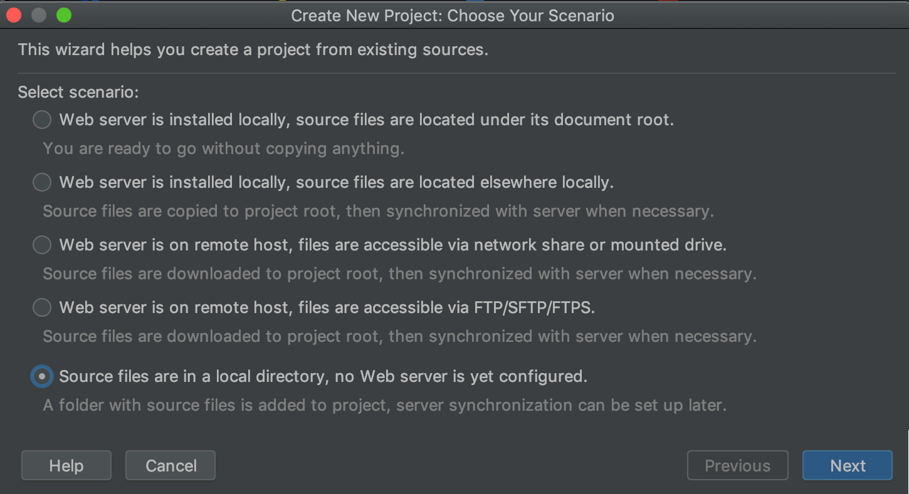
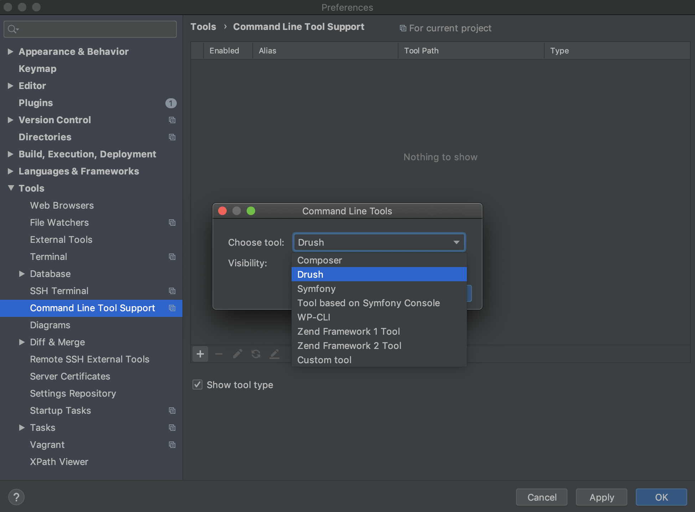
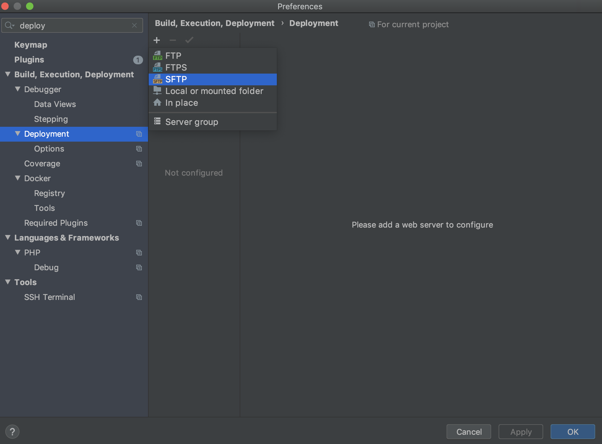

[JetBrains PhpStorm](https://www.jetbrains.com/phpstorm/) is a commercial PHP IDE that you can configure to work with your Drupal sites. For detailed information, see [Drupal Development Using PhpStorm](https://confluence.jetbrains.com/display/PhpStorm/Drupal+Development+using+PhpStorm) and [Developing on Pantheon with PhpStorm](https://confluence.jetbrains.com/display/PhpStorm/Developing+on+Pantheon+with+PhpStorm).

This article covers some best practices and recommendations for building a Drupal site on Pantheon using PhpStorm.

## Initial Site Setup

After you've [created your site on Pantheon](/create-sites), you'll need to set up your local environment.

### Clone the Code Repository

Make sure your Dev environment is in Git mode, then [clone your Git repository](/git) to your local workstation.

### Create a New PhpStorm Project

1. Open PhpStorm and create a new project from existing files.

1. From the **Create New Project: Choose Your Scenario**, window select **Source files are in a local directory, no Web server is yet configured**, then click **next**:

  

1. Choose the [project directory](https://www.jetbrains.com/help/phpstorm/create-new-project-choose-project-directory.html).

1. Select the parent folder for all the project sources and click the **Project Root** icon, or choose **Project Root** on the menu.

1. Click **Finish**.

## Configure a PhpStorm Project

1. Ensure that PhpStorm uses [Drupal settings](https://www.jetbrains.com/help/phpstorm/drupal.html) by going to **Preferences** > **Languages & Frameworks** > **PHP**.

1. Expand the Drupal dropdown.

1. Enable Drupal integration and select the Drupal installation path.

1. Set up PHP/Include Paths.

1. Choose the Drupal major version.

1. Configure the correct version of PHP by going to **Preferences**  > **Languages & Frameworks** > [**PHP**](https://www.jetbrains.com/help/phpstorm/php.html), and choose PHP Language Level 5.3.

### Drush Support

  We recommend [enabling Drush support](https://confluence.jetbrains.com/display/PhpStorm/Drupal+Development+using+PhpStorm#DrupalDevelopmentusingPhpStorm-DrupalCommandLineToolDrushIntegration).

1. From **Preferences** > **Tools** > [**Command Line Tool Support**](https://www.jetbrains.com/help/phpstorm/command-line-tool-support.html), click **Plus**.

1. **Choose Tool** > **Drush**, and specify the path.

  

## Configure On-Server Development

1. Put your [Dev environment into SFTP mode](/sftp), and click **Connection Info** to see the connection settings.

1. Within PhpStorm, go to Build, Execution, Deployment > Deployment.

1. Click **plus** for the [add server dialog](https://www.jetbrains.com/help/phpstorm/add-server-dialog.html), and choose SFTP

  

1. Enter the Pantheon site name followed by a dash and the environment. For example, `anita-drupal-dev`.

### Connection Tab

  [Configure the server](https://www.jetbrains.com/help/phpstorm/deployment-connection-tab.html) connection tab in the following order:

* **SFTP Host**: SFTP Host from Connection Info
* **Port**: 2222
* **Username**: Username from Connection Info
* **Auth Type**: Key Pair
* **Private Key File**: Navigate to the location of your `id_rsa` file. Example: `/Users/jon/.ssh/id_rsa`
* Click **Test SFTP Connection...**
* **Root Path**: Click Autodetect, then navigate to the end of the detected path and add `/code` to the end

### Mappings Tab

1. Deployment path on server: `/code`

1. Web path on server: URL of your Pantheon Dev environment. Example: `https://dev-anita-drupal.pantheonsite.io`

1. Click **OK**.

1. Go to **Tools** > **Deployment** > **Automatic Upload** > and select the server you created.

Now any files you change and save locally will be automatically uploaded to Pantheon.
