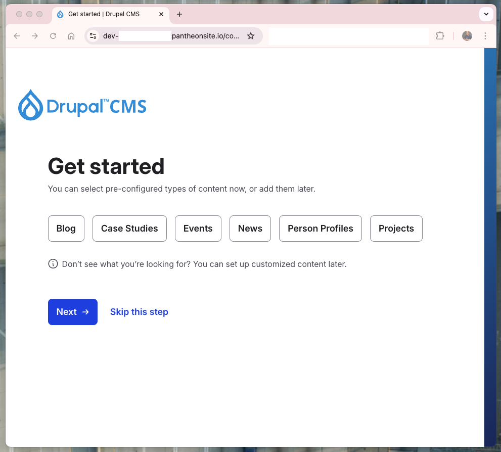

DrupalCMS is a powerful and flexible content management system that allows you to build and manage your website with ease. This guide will walk you through the process of creating a new DrupalCMS site on Pantheon.

## Prepare

Just login in your Pantheon Dashboard

## Create a Site based on DrupalCMS


You can install Drupal CMS via the UI:
1. Log in to Pantheon.
2. Use this direct link to start the installation of your site, including both production and non-production environments: Drupal CMS on Pantheon.

For power users, the geekier (and much cooler) way to do this is using Terminus:

```
terminus site:create <site> <label> drupal-cms-composer-managed
```

For example:

```
terminus site:create my-new-drupal-cms-in-pantheon "Just a Drupal CMS by Alex Moreno" drupal-cms-composer-managed
```

And that’s it, super simple.

Terminus will show some messages while it makes progress, and you’ll end up with this:

 ```[notice] Creating a new site...
 [notice] Deploying CMS...
 [notice] Waiting for site availability...
 [notice] mydrupalsitebyalex site has been created successfully and is available for use.
alex.moreno@JFM93PXQRY-alex ~ %
```


Now, if we run terminus site:list, we should see our new site listed along with some useful information:

```
terminus site:list
```


Finally, you just need to access the site and complete the installation.
You can do this via:

- UI/Dashboard: Navigate to your Pantheon Dashboard, find your new site, and open it.
- Terminus: Use the following command to open the site dashboard directly:
    - terminus dashboard:view mydrupalsitebyalex


Once you're in, the only step left is to install Drupal itself. Follow the official Drupal installation guide to complete the setup.




