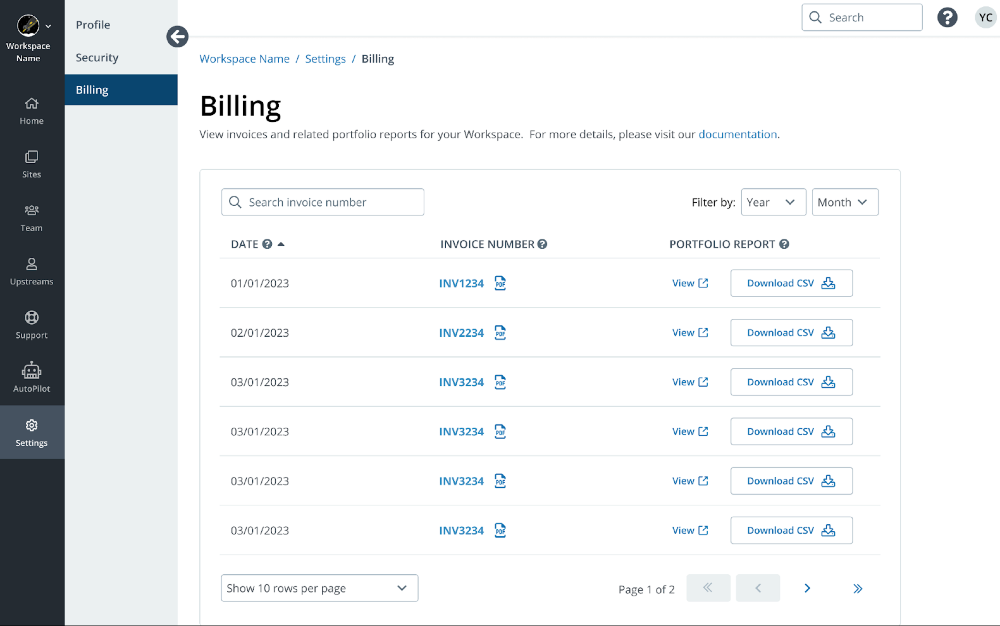

<TabList>

<Tab title="Overview" id="overview" active={true}>

Billing can be challenging, especially for businesses managing large numbers of sites. The Enterprise Billing Center provides detailed billing and site plan information for Enterprise (contract) customers.  The information available here will allow you to:

- Self-serve common billing needs

- Determine chargebacks to internal departments

- Provide access to billing information to your team

- Analyze your spend across multiple contracts

</Tab>

<Tab title="Features" id="features">

Access all invoices and associated portfolio reports in a central location.  Each report provides a detailed breakdown of all site plan changes applied to your contract:

- All active sites in your portfolio

- Newly added sites

- Sites with Automatic Plan Upgrades

- Deactivated sites

*Site Portfolio Report*

</Tab>

<Tab title="Requirements" id="requirements">

- You must be an Enterprise (contract) customer

- You must have [Administrator privileges](/guides/account-mgmt/workspace-sites-teams/teams#change-a-users-role).

</Tab>

<Tab title="Resources" id="resources">

## Documentation

- [Enterprise Billing Center Guide](/guides/enterprise-billing-center)

## Support

- [Account holders](https://dashboard.pantheon.io/workspace/ee3995c4-652e-44a0-b00b-0085e92d78da/support)

- Reach out to your Account Manager and/or respective Pantheon support contact.

</Tab>

</TabList>
