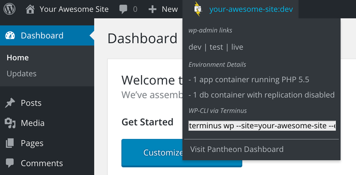

Each site on Pantheon comes with three environments: Dev, Test, and Live. This allows you to develop and test features without impacting the live site. Additional development environments are available with [Multidev](/multidev).

For a heads-up indicator of your Pantheon site and environment, we recommend installing the [Pantheon HUD](https://wordpress.org/plugins/pantheon-hud) plugin on WordPress sites and the [Environment Indicator](https://www.drupal.org/project/environment_indicator) module on Drupal sites.

## WordPress: Pantheon HUD
The Pantheon HUD plugin is developed and maintained on GitHub. [Create an issue](https://github.com/pantheon-systems/pantheon-hud/issues) with questions, feature requests, or bug reports.

1. [Set the connection mode to SFTP](/sftp) for the Dev or Multidev environment via the Pantheon Dashboard or with [Terminus](/terminus):

 ```bash{promptUser: user}
 terminus connection:set <site>.<env> sftp
 ```

2. Install and activate [Pantheon HUD](https://wordpress.org/plugins/pantheon-hud/) from within the Dev or Multidev environment's WordPress Dashboard (`/wp-admin/plugin-install.php?tab=search&s=pantheon+hud`) or with Terminus:

 ```bash{promptUser: user}
 terminus wp <site>.<env> -- plugin install pantheon-hud --activate
 ```

3. Deploy the plugin to the Test environment within the Site Dashboard or with Terminus:

 ```bash{promptUser: user}
 terminus env:deploy <site>.test --sync-content --cc --updatedb --note="Install Pantheon HUD plugin"
 ```

4. Activate the plugin within the WordPress Dashboard on the Test environment (`/wp-admin/plugins.php`) or with Terminus:

 ```bash{promptUser: user}
 terminus wp <site>.test -- plugin activate pantheon-hud
 ```

5. Deploy the plugin to the Live environment within the Site Dashboard or with Terminus:

 ```bash{promptUser: user}
 terminus env:deploy <site>.live --cc --note="Install Pantheon HUD plugin"
 ```

6. Activate the plugin within the WordPress Dashboard on the Live environment (`/wp-admin/plugins.php`) or with Terminus:

 ```bash{promptUser: user}
 terminus wp <site>.live -- plugin activate pantheon-hud
 ```

All environments will now show the following indicator for logged-in users with the `manage_options` capability:



You can restrict this to specific users with the `pantheon_hud_current_user_can_view` filter:

```php
add_filter( 'pantheon_hud_current_user_can_view', function(){
    $current_user = wp_get_current_user();
    if ( $current_user && in_array( $current_user->user_login, array( 'myuserlogin' ) ) ) {
        return true;
    }
    return false;
});
```

## Drupal: Environment Indicator

The [Environment Indicator](https://www.drupal.org/project/environment_indicator) module is officially supported for Drupal 7 and Drupal 8 sites.

1. [Set the connection mode to SFTP](/sftp) for the Dev or Multidev environment via the Pantheon Dashboard or with [Terminus](/terminus):

 ```bash{promptUser: user}
 terminus connection:set <site>.dev sftp
 ```

2. Install and enable the [Environment Indicator](https://www.drupal.org/project/environment_indicator) module using the [Drupal interface](https://drupal.org/documentation/install/modules-themes) or with Terminus:

 ```bash{promptUser: user}
 terminus drush <site>.dev -- en environment_indicator -y
 ```

3. Add the following within `settings.php`:

  <TabList>

  <Tab title="Drupal 8" id="d8tab" active={true}>

  ```php
  if (!defined('PANTHEON_ENVIRONMENT')) {
      $config['environment_indicator.indicator']['name'] = 'Local';
      $config['environment_indicator.indicator']['bg_color'] = '#808080';
      $config['environment_indicator.indicator']['fg_color'] = '#ffffff';
    }
    // Pantheon Env Specific Config
    if (isset($_ENV['PANTHEON_ENVIRONMENT'])) {
      switch ($_ENV['PANTHEON_ENVIRONMENT']) {
        case 'dev':
          $config['environment_indicator.indicator']['name'] = 'Dev';
          $config['environment_indicator.indicator']['bg_color'] = '#d25e0f';
          $config['environment_indicator.indicator']['fg_color'] = '#ffffff';
          break;
        case 'test':
          $config['environment_indicator.indicator']['name'] = 'Test';
          $config['environment_indicator.indicator']['bg_color'] = '#c50707';
          $config['environment_indicator.indicator']['fg_color'] = '#ffffff';
          break;
        case 'live':
          $config['environment_indicator.indicator']['name'] = 'Live!';
          $config['environment_indicator.indicator']['bg_color'] = '#4C742C';
          $config['environment_indicator.indicator']['fg_color'] = '#ffffff';
          break;
        default:
          // Multidev catchall
          $config['environment_indicator.indicator']['name'] = 'Multidev';
          $config['environment_indicator.indicator']['bg_color'] = '#efd01b';
          $config['environment_indicator.indicator']['fg_color'] = '#000000';
          break;
      }
    }
  ```

  </Tab>

  <Tab title="Drupal 7" id="d7tab">

  ```php
  $conf['environment_indicator_overwrite'] = TRUE;
    $conf['environment_indicator_overwritten_position'] = 'top';
    $conf['environment_indicator_overwritten_fixed'] = FALSE;

    if (!defined('PANTHEON_ENVIRONMENT')) {
        $conf['environment_indicator_overwritten_name'] = 'Local';
        $conf['environment_indicator_overwritten_color'] = '#808080';
        $conf['environment_indicator_overwritten_text_color'] = '#ffffff';
    }
    // Pantheon Env Specific Config
    if (isset($_ENV['PANTHEON_ENVIRONMENT'])) {
        switch ($_ENV['PANTHEON_ENVIRONMENT']) {
          case 'dev':
            $conf['environment_indicator_overwritten_name'] = 'Dev';
            $conf['environment_indicator_overwritten_color'] = '#d25e0f';
            $conf['environment_indicator_overwritten_text_color'] = '#ffffff';
            break;
          case 'test':
            $conf['environment_indicator_overwritten_name'] = 'Test';
            $conf['environment_indicator_overwritten_color'] = '#c50707';
            $conf['environment_indicator_overwritten_text_color'] = '#ffffff';
            break;
          case 'live':
            $conf['environment_indicator_overwritten_name'] = 'Live!';
            $conf['environment_indicator_overwritten_color'] = '#4C742C';
            $conf['environment_indicator_overwritten_text_color'] = '#ffffff';
            break;
          default:
            //Multidev catchall
            $conf['environment_indicator_overwritten_name'] = 'Multidev';
            $conf['environment_indicator_overwritten_color'] = '#efd01b';
            $conf['environment_indicator_overwritten_text_color'] = '#000000';
            break;
        }
    }
  ```

  </Tab>

  </TabList>

4. Deploy the module to the Test environment within the Site Dashboard or with Terminus:

 ```bash{promptUser: user}
 terminus env:deploy <site>.test --sync-content --cc --updatedb --note="Install and configure Environment Indicator"
 ```

5. Deploy the module to the Live environment within the Site Dashboard or with Terminus:

 ```bash{promptUser: user}
 terminus env:deploy <site>.live --cc --updatedb --note="Install and configure Environment Indicator"
 ```

All environments will now show a color-coded environment indicator, as defined within the above `settings.php` snippet.
