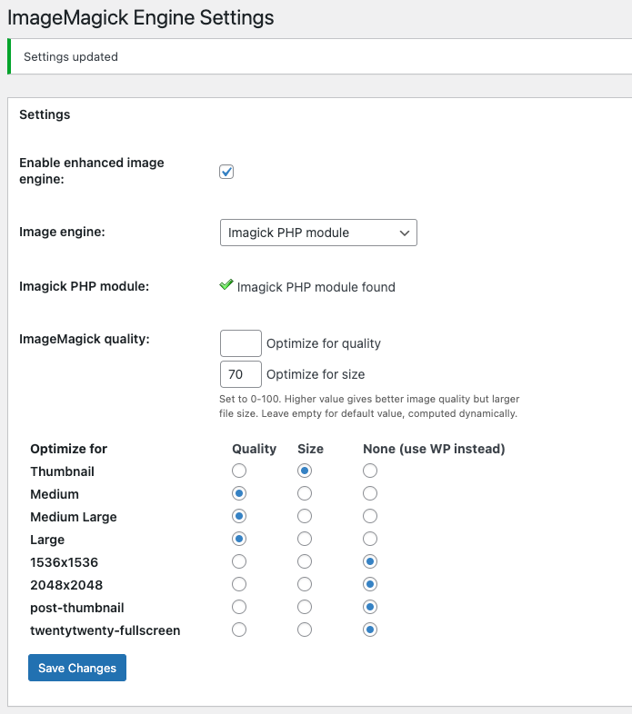
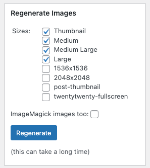

There are some scenarios when an external library is required. The Pantheon platform includes a number of PHP extensions and common libraries that are available for use.

## wkhtmltopdf

[wkhtmltopdf](https://wkhtmltopdf.org/) allows you to create a snapshot or capture the content of a web page easily in a PDF.

wkhtmltopdf can be found on your application container at `/srv/bin/wkhtmltopdf`. To use it, install or create a compatible plugin or module:

<TabList>

<Tab title="Drupal 8" id="d8-example" active={true}>

Download and enable the [wkhtmltopdf module](https://www.drupal.org/project/wkhtmltopdf) from the Drupal Dashboard, or using Drush via [Terminus](/terminus/):

```bash{promptUser: user}
terminus drush <site>.<env> -- en wkhtmltopdf --y
```

Create a symlink to the hosted library and your site's libraries directory [via Git](/git/#clone-your-site-codebase):

```bash{promptUser: user}
mkdir -p sites/all/libraries/wkhtmltopdf
ln -s /srv/bin/wkhtmltopdf sites/all/libraries/wkhtmltopdf/wkhtmltopdf
git add .
git commit -m "Added wkhtmltopdf library"
git push
```

</Tab>

<Tab title="Drupal 7" id="d7-example">

Download and enable the [Print module](https://www.drupal.org/project/print) from the Drupal Dashboard, or using Drush via [Terminus](/terminus/):

```bash{promptUser: user}
terminus drush <site>.<env> -- en print --y
```

Create a symlink to the hosted library and your site's `libraries` directory [via Git](/git/#clone-your-site-codebase):

```bash{promptUser: user}
mkdir -p sites/all/libraries/wkhtmltopdf
ln -s /srv/bin/wkhtmltopdf sites/all/libraries/wkhtmltopdf/wkhtmltopdf
git add .
git commit -m "Added wkhtmltopdf library"
git push
```

</Tab>

<Tab title="WordPress" id="wp-example">

Currently, there are no known plugins that implement wkhtmltopdf directly. However, you can use the converter by creating a custom plugin or by placing the code within your theme's `functions.php` file.

If your WordPress site uses Composer, consider the [PHP WkHtmlToPdf](https://github.com/mikehaertl/phpwkhtmltopdf) PHP wrapper.

</Tab>

</TabList>

### Unable to Generate PDF File

Due to a [known issue in wkhtmltopdf 0.12.5](https://github.com/wkhtmltopdf/wkhtmltopdf/issues/4242) and sites that use the CSS `quotes` property, some users may have issues with downloading a PDF created by wkhtmltopdf. In Live environments, creating a PDF fails silently. On Dev, you'll encounter the error `Unable to generate PDF file`.

To confirm the source of the error, log in to the Drupal Admin and click **Reports** in the menu, then **Recent Log Messages** and look for `print_pdf` or `(returned 127): No stderr output available`.

If you encounter this error, remove the offending `quotes` property from the CSS.

## PhantomJS

In its own words, [PhantomJS](https://github.com/ariya/phantomjs/) is a headless WebKit with JavaScript API. It has fast and native support for various web standards: DOM handling, CSS selector, JSON, Canvas, and SVG.

- PhantomJS (1.7.0) is located at `/srv/bin/phantomjs` on your application container.
- PhantomJS (2.1.1) is located at `/srv/bin/phantomjs-2.1.1` on your application container.

### Drupal PhantomJS Configuration

After you've downloaded and enabled the PhantomJS Capture module, you'll need to configure the image toolkit settings. Go to the image toolkit settings page at `/admin/config/user-interface/phantomjs_capture` to specify the library path.

## Apache Tika

The [Apache Tika](https://tika.apache.org/) toolkit detects and extracts metadata and structured text content from various documents using existing parser libraries.

Tika can extract content from a number of document formats such as HTML, XML, Microsoft Office document formats, and PDFs and more.

<TabList>

<Tab title="Drupal 8" id="d8-example" active={true}>

Download and install the Search API Attachments module ([search_api_attachments](https://www.drupal.org/project/search_api_attachments)), then configure the module's settings.

1. Go to the Search API Attachments settings page at: `/admin/config/search/search_api_attachments` and enter the following fields:

   - **Extraction method:** Tika Extractor
   - **Path to java executable:** `java`
   - **Path to Tika .jar file:** `/srv/bin/tika-app-1.18.jar`

1. Verify that your site is able to extract text from documents. Click **Submit and test extraction**.

If everything is working correctly, you will see the success message "Extracted data: Congratulations! The extraction seems working! Yay!".

</Tab>

<Tab title="Drupal 7" id="d7-example">

Once you have downloaded and installed the ApacheSolr Attachments module ([apachesolr_attachments](https://www.drupal.org/project/apachesolr_attachments)), you'll need to configure the module's settings.

1. Go to the Tika settings page at: `/admin/config/search/apachesolr/attachments` and enter the following fields:

    - **Extract Using:** Tika (local java application)
    - **Tika Directory Path:** `/srv/bin`
    - **Tika jar file:** `tika-app-1.18.jar`

1. Verify that your site is able to extract text from documents. Click **Test your Tika Attachments** under the Actions section.

If everything is working correctly, you will see the success message "Text can be successfully extracted".

</Tab>

<Tab title="WordPress" id="wp-example">

There are no known plugins in the WordPress.org repository that will enable the use of Tika.

</Tab>

</TabList>

### Older Versions

Pantheon also supplies the following older version of Tika:

- `/srv/bin/tika-app-1.1.jar`

Sites that are using an old version of Tika should be upgraded to the supported path as soon as possible.

## ImageMagick

[ImageMagick](https://www.imagemagick.org/script/index.php) is a software suite to create, edit, compose, or convert bitmap images. It can read and write images in a variety of  [formats](https://www.imagemagick.org/script/formats.php) (over 100) including  [DPX](https://www.imagemagick.org/script/motion-picture.php), [EXR](https://www.imagemagick.org/script/high-dynamic-range.php), GIF, JPEG, JPEG-2000, PDF, PNG, Postscript, SVG, and TIFF. Use ImageMagick to resize, flip, mirror, rotate, distort, shear and transform images, adjust image colors, apply various special effects, or draw text, lines, polygons, ellipses and Bézier curves.

Pantheon runs ImageMagick 6.9.10-86 Q16 x86_64 2020-01-13.

### Drupal ImageMagick Configuration

Once you have downloaded and enabled the [ImageMagick module](https://www.drupal.org/project/imagemagick), you'll need to configure the image toolkit settings. Go to the image toolkit settings page at: `admin/config/media/image-toolkit` to select ImageMagick.

When creating a new preset, if the "Division by Zero" warning appears, add the [`image_allow_insecure_derivatives`](https://www.drupal.org/project/image_allow_insecure_derivatives) conf variable to your `settings.php` file.

Some modules (like [ImageAPI Optimize](https://www.drupal.org/project/imageapi_optimize)) require the explicit path to the ImageMagick library. Use the path `/usr/bin/convert`.

ImageAPI Optimize's [support for 3rd party services](https://www.drupal.org/node/773342) (like advpng and OptiPNG) are not available at this time.

### WordPress ImageMagick Configuration

After you've installed the [ImageMagick Engine Plugin](https://wordpress.org/plugins/imagemagick-engine/#installation), you'll need to enable it in your plugin settings and configure the settings. In the Regenerate Images sidebar, select the sizes you would like to reimage and click **Regenerate**.






## Troubleshooting and FAQs

### How do I request the addition of a new library or a newer version of an existing library?

Please [contact support](/support/) with a description of your use case and a link to the library's webpage. We welcome new requests, but please bear in mind they are not guaranteed and it is possible the feature request may be denied. As a result, we recommend you set aside enough time for alternative solutions.

### Will you set up and configure the module/plugin for me?

No. This is not within our [scope of support](/support/#scope-of-support). It is important to be aware of how a Drupal module or WordPress plugin is setup and how it functions. This will prove invaluable in cases where you need to plan and build your site.
