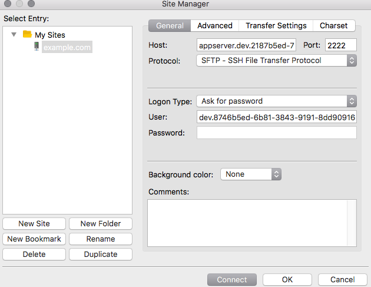
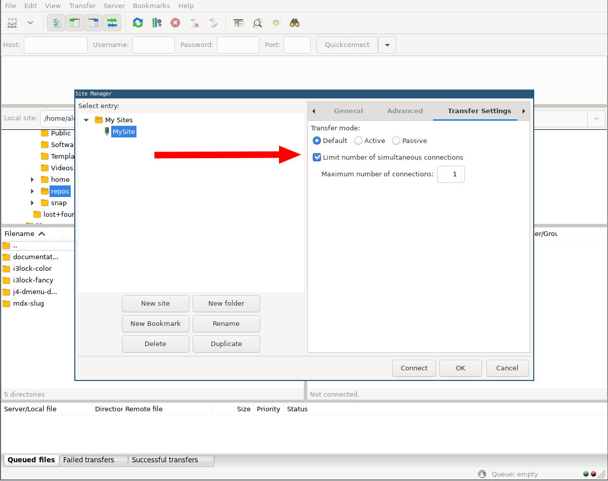

[FileZilla](https://FileZilla-project.org/) is a free open source FTP client that is available for Windows, Mac OS X, and Linux.

## Getting Started

Make sure you have your [Pantheon SFTP credentials](/sftp#sftp-connection-information) on hand; you will need this later to connect to Pantheon using FileZilla.

## Download FileZilla

If you do not have FileZilla installed, [download the latest version](https://FileZilla-project.org/) and install it on your computer.

## Configure FileZilla

Open FileZilla  and launch the Site Manager by clicking the first icon in the menu bar, or by going to the **File Menu > Site Manager** option. From the Site Manager screen, click the **New Site** button.

Enter your SFTP connection details:

For **Host**, enter the host string from your Pantheon environment's **Connect With SFTP** dialog box.



<Alert title="Note" type="info">

Be sure to set the **Protocol:** to `SFTP` (*not* `FTP`) and the server port to `2222`.

Under the **Advanced** Tab, leave the Remote Directory blank.

</Alert>

### Authentication

Select from one of the following **Logon Type:** options in the General tab:

- For **SSH Key-Based** authentication set the **Logon Type:** dropdown to "Key file". In the **Key file:** box enter the path to or browse and select your private SSH key (usually named `id_rsa`) associated with the public key loaded into your User Dashboard.

  <Accordion title="Working With Hidden Directories" id="hidden-dirs" icon="info-sign">

  The "Browse..." button may not show hidden files or directories, which can make it difficult to navigate to your `.ssh` directory. If you cannot navigate to your `.ssh` folder you can enter the full path to the file in the **Key file:** box.

  On MacOS, you can make hidden files and folders visible in the Open File window with the command **⌘ CMD + ⇧ SHIFT + . (period)** .

  </Accordion>

- For **Password-Based** authentication:

  1. Set the **Logon Type:** dropdown to "Normal"
  1. For **User** enter the Pantheon environment account name from your Pantheon environment's [Connect With SFTP](/sftp#sftp-connection-information) dialog box.
  1. For **Password**, enter your dashboard password. You can also select the "Ask for password" type if you don't want to save the password and instead be prompted for it every time you can connect.

### Connection Prompt

When you first connect via SFTP you may be prompted to accept the server's host key and store it in cache for future connections. This allows you to connect to the server and manage your files for the current session.

## Access Code and Files

After logging in, you can access your application code in the `/code` directory.

Your file uploads (Drupal's `sites/default/files` and WordPress's `wp-content/uploads`) can be found in the `files` directory.  Your log files can be found in the `/logs` directory.

## Troubleshooting

### File transfer failed on production environments

Starting at the Performance Medium service level up to Elite plans, the Test and Live environments are provisioned with multiple application containers. When transferring files over SFTP into production environments, you may experience the following error:

```none
/srv/bindings/SITE-BINDING/files/somefile.ext: open for read: no such file or directory
Error:            File transfer failed
```

This error can also occur when the application container has been migrated. Confirm that the [host path](/sftp#sftp-connection-information) is correct before continuing.

Resolve instances of transfer failures by reconfiguring FileZilla to limit the number of simultaneous connections:

1. Under the **File** menu, click on **Site Manager**.

1. Select your site profile, then the **Transfer Settings** tab.

1. Check **Limit number of simultaneous connections**:

  

1. Set the **Maximum number of connections** to `1`.

See also, [this FAQ on our related SFTP doc](/sftp#i-am-receiving-errors-connecting-to-my-server-with-an-sftp-client).

#### Fallback Solution If File Transfer Fails

If all else fails, you can connect directly to an application container via the IP address. Use Dig to find the IP address:

```bash{outputLines:2-3}
dig +short appserver.live.120330a1-xxxxxxxxxxxxxxxxx.drush.
203.0.113.5
203.0.113.47
```

### Uploading to the Files Directory

FileZilla does not correctly upload files when the target directory on Pantheon is `files`. We recommend setting the target directory to `code/sites/default/files` (for Drupal 7) or `code/web/sites/default/files` (for Drupal 8), which are symlinks to `files` on Pantheon. If you experience issues using FileZilla, try the task using an alternate program such as [Transmit](https://panic.com/transmit/) (Mac OS) or [WinSCP](/winscp) (Windows).

### nodename nor servname provided, or not known

The following error is caused by an invalid hostname, most often the result of a typo:

```bash
Error:            ssh_init: nodename nor servname provided, or not known
Error:            Could not connect to server
```

### Site Manager

Features offered in the FileZilla Site Manager (like [Synchronized Browsing](https://wiki.filezilla-project.org/Using#Synchronized_Browsing)) are not supported because the Pantheon platform sometimes migrates sites across appservers without warning and the non-static binding string will change. This means that while you can set up your site in the Site Manager, you will need to reconfigure the login information and file paths whenever the dev environment site binding changes.

The value for **Default remote directory** in the Site Manager can be copied from the **Remote site** field in the main window, and you can append `code` to the path to synchronize with your local codebase. Remember that the site binding is subject to change.

### Quickconnect is refusing to connect

The following error is always thrown when using the Quickconnect option in FileZilla:

```bash
Error:          Cannot establish FTP connection to an SFTP server. Please select proper protocol.
Error:          Critical error: Could not connect to server
```

Quickconnect does not give options for protocol selection. You need to manually add the protocol (`sftp://`) in the **Host** field.
