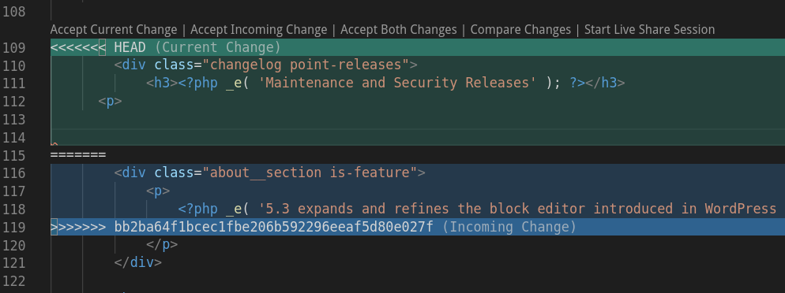

[Git](https://git-scm.com/) is the version control tool at the heart of the Pantheon workflow. If you're a developer who likes to use [local development](/local-development), it's a good way to work with the Pantheon platform: develop locally, commit, and push to master to deploy code into your Pantheon Development environment.

Conflicts can occur when modified file(s) within your site's codebase do not align with changes made to the same file(s) in the site's upstream.

> When a merge isn’t resolved automatically, Git leaves the index and the working tree in a special state that gives you all the information you need to help resolve the merge.
>
> \- [Git Manual](https://www.kernel.org/pub/software/scm/git/docs/)

## Resolve Conflicts When Updating Core

If you receive the error that you have conflicts while updating core, the fastest resolution is often the `-Xtheirs` flag. This will attempt to automatically resolve the conflicts with a preference for upstream changes.

This is safe to run if you don't have your own changes in any of the conflicting files (e.g. problems with `.gitignore`).

<TabList>

<Tab title="Drupal 8" id="d8" active={true}>

  ```bash{promptUser: user}
  git pull -Xtheirs git://github.com/pantheon-systems/drops-8.git default
  # resolve conflicts
  git push origin master
  ```

</Tab>

<Tab title="Drupal 7" id="d7">

  ```bash{promptUser: user}
  git pull -Xtheirs git://github.com/pantheon-systems/drops-7.git default
  # resolve conflicts
  git push origin master
  ```

</Tab>

<Tab title="WordPress" id="wp">

  ```bash{promptUser: user}
  git pull -Xtheirs git://github.com/pantheon-systems/WordPress.git default
  # resolve conflicts
  git push origin master
  ```

</Tab>

<Tab title="WordPress Site Network" id="wp-network">

  ```bash{promptUser: user}
  git pull -Xtheirs git://github.com/pantheon-systems/wordpress-network.git master
  # resolve conflicts
  git push origin master
  ```

</Tab>

</TabList>

Double-check the files before going forward to make sure no bugs were introduced.

If you modify core CMS files, the `-Xtheirs` flag will drop your changes. In that case you should [manually resolve conflicts](#manually-resolve-conflicts). For more details on core updates, see [WordPress and Drupal Core Updates](/core-updates).

### Find a Site's Upstream URL

The upstream URL is provided within the Site Dashboard, under **<span class="glyphicons glyphicons-cogwheel"></span> Settings** > **About site**. Upstream URLs can also be identified via [Terminus](/terminus):

```bash{promptUser: user}
terminus site:info <site> --field=upstream
```

## Manually Resolve Conflicts

How you resolve a merge conflict depends on what type of conflict you're faced with.

### Resolve delete/modify Conflicts

A delete/modify conflict occurs when one commit deletes a file and another modifies it. To resolve such a conflict from the terminal, use the following commands in sequence. Start by identifying the file that is generating a delete error.

For example, the Git log may contain an entry similar to the following:

```git
CONFLICT (delete/modify): scripts/run-tests.sh deleted in HEAD and modified in 72faeeff1c9356221694d1351cdb2000ab3c5d1c. Version 72faeeff1c9356221694d1351cdb2000ab3c5d1c of scripts/run-tests.sh left in tree.
```

1. From your local repository, run this Git command to get a copy of the file in conflict:

  ```bash{promptUser: user}
  git checkout <commit ID> -- <file>
  ```

  <Alert title="Note" type="info">

  When looking for a commit ID, you can find the last instance where the missing file was in the repository.

  </Alert>

1. Run `git status` and verify that there is a new file to add to the repository:

 ```bash{outputLines:2-5}
  git status
  On branch master
  Changes to be committed:
  (use "git reset HEAD ..." to unstage)
  new file: README.txt
  ```

1. Stage and commit:

 ```bash{promptUser: user}
 git commit -am "verifying missing README.txt"
 ```

 You will receive confirmation from Git that the file has been committed.

1. Run the Git push command:

 ```bash{promptUser: user}
 git push origin master
 ```

### Resolve Content Conflicts

A content conflict occurs when two commits modify the same line(s) of a file non-sequentially (without one having the other in its history). For example:

```git
CONFLICT (content): Merge conflict in wp-admin/about.php
Automatic merge failed; fix conflicts and then commit the result.
```

To resolve:

1. Open the conflicting file in your text editor or IDE. Note that the conflicting lines are enclosed with `<<<<<<< HEAD` at the top, and `>>>>>>> <commit-id>` at the bottom, with `=======` delineating the two versions. Some IDEs, like Visual Studio Code for example, will highlight the conflicting section:

  

1. Edit the conflict by either choose one of the two versions of the conflicting line(s), or editing a version containing both updates. Be sure to remove all the delineators notes above from the file.

1. Once you've saved your changes, commit and push:

  ```bash{promptUser: user}
  git add wp-admin/about.php
  git commit -m "Merge conflict resolution"
  git push origin master
  ```

### Resolve Conflicts from Multidevs

If a merge conflict is preventing you from merging a Multidev environment, follow these steps to resolve.

1. Set the Dev environment to Git mode:

  

1. Clone the repository to your local computer:

  

1. From the repository directory, pull the Multidev branch to master. In the example below, replace `multidev` with the Multidev environment name:

  ```bash{promptUser: user}
  git checkout master
  git pull origin multidev
  ```

1. Git will tell you which files are in conflict. [Resolve the conflicts](#manually-resolve-conflicts) using the steps above.
