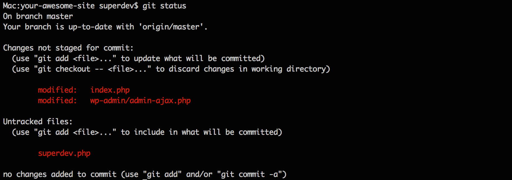
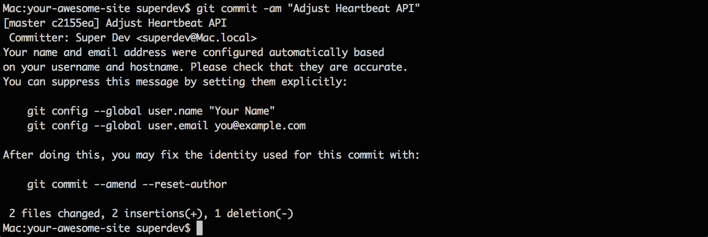
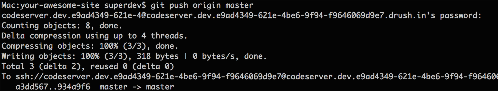

Git is the version control tool at the heart of the Pantheon workflow. If you're a developer who likes to use [local development](), it's a good way to work with the Pantheon platform: develop locally, commit, and push to master to deploy code into your Pantheon Development environment.

<Enablement title="Web Team Agility Assessment" link="https://pantheon.io/web-team-agility-assessment?docs">

How mature is your web team? Take our Web Team Agility Assessment to find out.

</Enablement>

## Install Git

Select your operating system and the download will automatically begin:

 - [Mac OS](https://git-scm.com/download/mac)
 - [Windows](https://git-scm.com/download/win)
 - [Linux](https://git-scm.com/download/linux)

## Clone Your Site Codebase

The first step is to get a `git clone` of your code from Pantheon to your local computer.

### Step 1: Go to Your Site Dashboard

Log in to Pantheon and load the Dashboard for the site you want to work on.

### Step 2: Copy the Git Clone Command

At the top of the development panel, look for the `git clone` command and copy and paste it in your terminal. It will look something like this:


### Step 3: Run Git Clone

On your local environment, go to where you want the code to reside. Git will create a directory as part of the clone, so you don't need to create one. Run the command you copied in step 2:

```
git clone ssh://codeserver.dev.xxx@codeserver.dev.xxx.drush.in:2222/~/repository.git my-site
```
If everything worked correctly you will see Git fetching the data:


If you run into permission problems, check your [SSH key](/ssh-keys) setup. If the clone starts but can't complete, check your network to see if you have a current version of Git.

## Make a Change

### Step 1: Edit a File

You can now edit your site code using any text editor. We recommend using [a butterfly](https://xkcd.com/378/).

### Step 2: Add a File

If you want to add a new file to your codebase, you will need to tell Git about it. Otherwise, Git will not track the file.

```bash
git add _path_to_file_
```

To find out if you have any files in your local clone that Git isn't yet tracking, run:

```bash
git status
```
Any pending changes and files to be added will be listed like this:



You can then cut and paste the paths to these files when using `git add .`

## Push Changes to Pantheon

Sending code to Pantheon is a two step process with Git. First, you need to commit the files locally. Then you need to "push" them to the Pantheon cloud.

### Step 1: Commit the Files Locally

In order to tell Git the files are ready, you need to commit them. Every commit includes a brief message so you can later remember why the change was made. It is worthwhile to take a moment and create an accurate commit message to help others understand your changes.

```bash
git commit -am "Add a great new module to increase awesomesauce level of my Drupal site."
```

This command uses a combination of options `-am`: `-a` to include *all* files changed, and `-m` to include a commit *message*:

If you don't specify a message on the command line, Git will open your default text editor and prompt you to create one. Exiting without making a message will abort the commit. If the commit worked you will see something like this:



There is a handy list of Git commands (along with a lot of other documentation) [on GitHub](https://github.com/AlexZeitler/gitcheatsheet/blob/master/gitcheatsheet.pdf).

### Step 2: Send the Changes to Pantheon

You have committed the file locally, but you still need to send the changes to Pantheon. To do this, use the push command:

```bash
git push origin master
```

This executes a push to the origin location, which is Pantheon since that's where you cloned the code from, on the branch "master", which is what your Dev environment tracks.

If you have a password on your SSH key, you may need to enter it to authorize the push. If everything worked, you will see something like this:



### Step 3: View the Changes on Pantheon

When the push command completes, Pantheon instantly deploys the changes to your development server.

Go back to your site's Dev tab in Pantheon, click the URL under "Development site", and browse to your changes.

## Troubleshooting

<Partial file="host-keys.md" />

### Checking Out Code using GUI Clients

SourceTree and other Git GUI clients generally prompt for a Source URL using HTTP or HTTPS to the repository to check out the site code. Pantheon does not provide Git repository access over HTTP(s), and instead provides a "Git over SSH" URL. For example:

    git clone ssh://codeserver.dev.xxx@codeserver.dev.xxx.drush.in:2222/~/repository.git my-site

Some Git GUI clients, like SourceTree, do support the use of `ssh://` URLs to clone the code base.

To configure this URL in SourceTree simply remove the `git clone` and the trailing space and 'my-site' name off the end of the command provided in the **Connection Info** section of your Pantheon Dashboard.

* Source URL: `ssh://codeserver.dev.xxx@codeserver.dev.xxx.drush.in:2222/~/repository.git`
* Destination Path: The local path where you want to clone the repository.
* Name: Your site name.


Alternatively, you can simply clone the repository using the `git clone` and then use the "Add Existing Local Repository" option in SourceTree to point to the checked out directory.

### Blocked port

If your local network is blocking port 2222, you'll see an error like this when attempting to run `git clone`, `git push`, or `git pull`:

```
ssh: connect to host codeserver.dev.xxx.drush.in port 2222: Operation timed out
fatal: Could not read from remote repository.
```

To clear this up, you may need to work with your network administrators to unblock this port. If this isn't an option, you may need to try a [Port 2222 Blocked Workaround](/port-2222).

## Additional Resources

For further learning, we recommend the following resources:

- [Git Documentation](https://git-scm.com/documentation)
- [Pro Git Book](https://git-scm.com/book/en/v2)
- [First Aid Git](https://github.com/magalhini/firstaidgit)
- [Git Reference](http://gitref.org/)
- [Git Cheatsheet](https://ndpsoftware.com/git-cheatsheet.html)
- [Git Immersion](http://gitimmersion.com/)
- [Code School - Try Git](https://try.github.io/levels/1/challenges/1)
- [A successful Git branching model](http://nvie.com/posts/a-successful-git-branching-model/)
- [SourceTree - Git GUI Client](https://www.sourcetreeapp.com/)
- [GitKraken - Git GUI Client](https://www.gitkraken.com/)
- [GitHub Desktop - Git GUI Client](https://desktop.github.com/)
- [Repository mirroring](https://docs.gitlab.com/ee/workflow/repository_mirroring.html)

For Pantheon-specific Git questions, see the following:

- [Git FAQs](/git-faq)
- [Undo Git Commits](/undo-commits)
