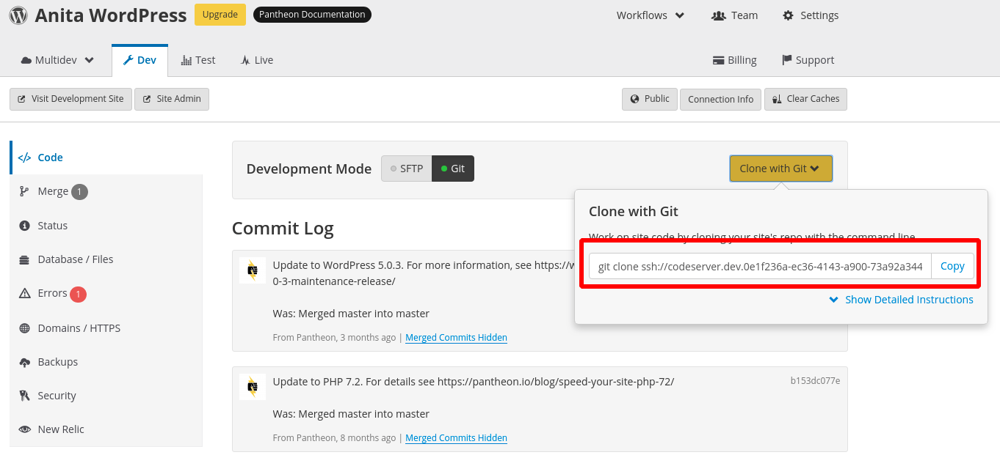
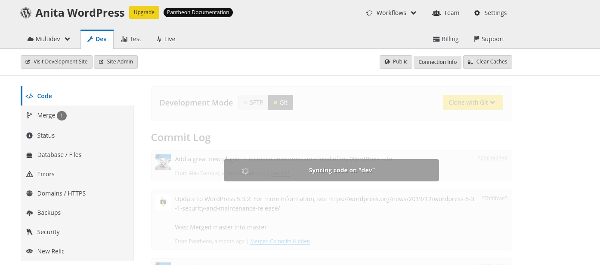
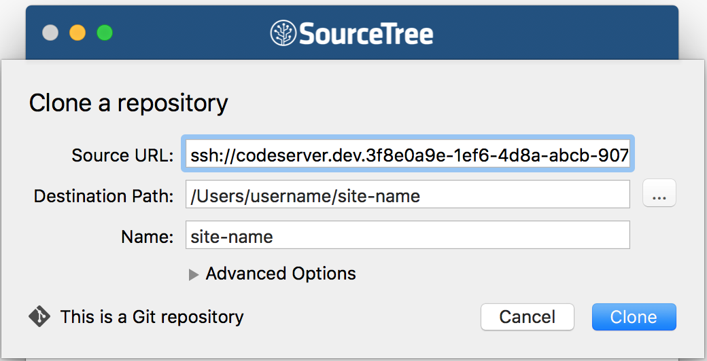

Git is the version control tool at the heart of the Pantheon WebOps<Popover title="WebOps" content="WebOps is a set of practices that facilitates collaboration and automates processes to improve web team productivity." /> workflow. If you like to [develop locally](/local-development), it's a good way to streamline your website operations: develop locally, commit, and push to master to deploy code into your Pantheon Development environment.

<Enablement title="Web Team Agility Assessment" link="https://pantheon.io/web-team-agility-assessment?docs">

How mature is your web team? Take our Web Team Agility Assessment to find out.

</Enablement>

## Before You Begin

This page assumes that you've:

- [Created a site](/create-sites) on Pantheon
- Set up [SSH Keys](/ssh-keys) on your local computer and Pantheon account.

## Install Git

Download and install Git for your operating system:

- [macOS](https://git-scm.com/download/mac)
- [Windows](https://git-scm.com/download/win)
- [Linux](https://git-scm.com/download/linux)

## Configure Git

Before you can commit your code in Git, you must provide a name and email with which your commits will be associated:

```bash{promptUser: user}
git config --global user.name "Anita Pantheon"
git config --global user.email anita@pantheon.io
```

The `--global` option sets these values for all projects you manage with Git.

To set a default editor for commit messages:

```bash{promptUser: user}
git config --global core.editor nano
```

Replace `nano` with your preferred text editor or IDE. For example, `atom` or `code` (for [Visual Studio Code](/visual-studio-code)).

## Clone Your Site Codebase

Begin by creating a local copy of your [codebase](/code#pantheon-git-repository "About your site's code repository on Pantheon") with `git clone`.

1. In your terminal, navigate to the directory where you keep your projects.

1. Log in to Pantheon and load the Site Dashboard for the site you want to work on.

1. In the **<span class="glyphicons glyphicons-wrench"></span> Dev** tab, at the top of the **<span class="glyphicons glyphicons-embed-close"></span> Code** panel, click on **Clone with Git**:

  

1. Copy the `git clone` command and paste it into your terminal. Git will create a directory as part of the clone, so you don't need to create one:

  ```bash{promptUser: user}
  git clone ssh://codeserver.dev.xxx@codeserver.dev.xxx.drush.in:2222/~/repository.git my-site
  ```

  You should see Git fetching the data:

  ```git
  Cloning into 'anita-wordpress'...
  The authenticity of host '[codeserver.dev.....drush.in]:2222 ([173.255.119.72]:2222)' can't be established.
  RSA key fingerprint is SHA256:yPEkh1Amd9WFBSP5syXD5rhUByTjaKBxQnlb5CahZZE.
  Are you sure you want to continue connecting (yes/no/[fingerprint])? yes
  Warning: Permanently added '[codeserver.dev.....drush.in]:2222,[173.255.119.72]:2222' (RSA) to the list of known hosts.
  remote: Counting objects: 20503, done.
  remote: Compressing objects: 100% (8184/8184), done.
  remote: Total 20503 (delta 12802), reused 19671 (delta 11982)
  Receiving objects: 100% (20503/20503), 46.65 MiB | 15.16 MiB/s, done.
  Resolving deltas: 100% (12802/12802), done.
  ```

  If you run into permission problems, check your [SSH key](/ssh-keys) setup. If the clone starts but can't complete, confirm that you have a current version of Git.

## Make Changes

You can now edit your site code using your [preferred](https://xkcd.com/378/ "XKCD comic about text editors") text editor or IDE.

If you want to add a new file to your codebase, you will need to tell Git about it. Otherwise, Git will not track the file.

```bash{promptUser: user}
git add path/to/file.txt
```

To find out if you have any files in your local clone that Git isn't yet tracking, run:

```bash{promptUser: user}
git status
```

Any pending changes and files to be added will be listed like this:

```git
On branch master
Your branch is up to date with 'origin/master'.

Changes not staged for commit:
  (use "git add <file>..." to update what will be committed)
  (use "git checkout -- <file>..." to discard changes in working directory)

        modified:   index.php
        modified:   wp-admin/admin-ajax.php

Untracked files:
  (use "git add <file>..." to include in what will be committed)

        superdev.php

no changes added to commit (use "git add" and/or "git commit -a")
```

You can then cut and paste the paths to these files when using `git add`, which **stages** the files for the next commit.

## Push Changes to Pantheon

Sending code to Pantheon is a two step process with Git. First, you need to commit the files locally. Then you need to "push" them to the Pantheon cloud.

1. In order to tell Git the files are ready, you need to commit them. Every commit includes a brief message so you can later remember why the change was made. It is worthwhile to take a moment and create an accurate commit message to help others understand your changes:

  ```bash{promptUser: user}
  git commit -am "Add a great new plugin to increase awesomesauce level of my WordPress site."
  ```

  This command uses a combination of options `-am`: `-a` to include *all* files changed, and `-m` to include a commit *message*:

  <Alert type="info" title="Note">

  Any _new_ (untracked) files not staged with `git add` will not be included by the `-a` flag. Be sure to review what is and isn't staged with `git status` before you commit your work.

  </Alert>

  If you don't specify a message through the command line, Git will open your default text editor and prompt you to create one. If you exit without providing a commit message, Git will abort the commit. If the commit worked you will see something like this:

  ```git
  [master d2fce4ea] Add a great new plugin to increase awesomesauce level of my WordPress site.
  2 files changed, 3 insertions(+)
  ```

1. You have committed the file locally, but you still need to send the changes to Pantheon. To do this, use the `push` command:

  ```bash{promptUser: user}
  git push origin master
  ```

  This executes a push to the origin location, (which is Pantheon since that's where you cloned the code from), on the branch "master", which is what your Dev environment tracks.

  If you have a passphrase on your SSH key, you may need to enter it to authorize the push. If everything worked, you will see something like this:

  ```git
  Enumerating objects: 9, done.
  Counting objects: 100% (9/9), done.
  Delta compression using up to 8 threads
  Compressing objects: 100% (5/5), done.
  Writing objects: 100% (5/5), 466 bytes | 466.00 KiB/s, done.
  Total 5 (delta 4), reused 0 (delta 0)
  To ssh://codeserver.dev.....drush.in:2222/~/repository.git
    27bf0fca..d2fce4ea  master -> master
  ```

There is a handy list of Git commands (along with a lot of other documentation) [on GitHub](https://github.com/AlexZeitler/gitcheatsheet/blob/master/gitcheatsheet.pdf "Alex Zeitler's Git cheat sheet PDF").

### View the Changes on Pantheon

When the push command completes, Pantheon instantly deploys the changes to your development server:



Back to your site's **<span class="glyphicons glyphicons-wrench"></span> Dev** tab in Pantheon, click **Visit Development Site**, to see the changes made by your new code.

## Troubleshooting

<Partial file="host-keys.md" />

### Checking Out Code using GUI Clients

SourceTree and other Git GUI clients generally prompt for a Source URL using HTTP or HTTPS to the repository to check out the site code. Pantheon does not provide Git repository access over HTTP(s), and instead provides a "Git over SSH" command. For example: `git clone ssh://codeserver.dev.xxx@codeserver.dev.xxx.drush.in:2222/~/repository.git my-site`

Some Git GUI clients, like SourceTree, do support the use of `ssh://` URLs to clone the code base.

To configure this URL in SourceTree simply remove the `git clone` and the trailing space and 'my-site' name off the end of the command provided in the **Connection Info** section of your Pantheon Dashboard.

- Source URL: `ssh://codeserver.dev.xxx@codeserver.dev.xxx.drush.in:2222/~/repository.git`
- Destination Path: The local path where you want to clone the repository.
- Name: Your site name.



Alternatively, you can simply clone the repository using `git clone` and then use the "Add Existing Local Repository" option in SourceTree to point to the checked out directory.

### Blocked Port

If your local network is blocking port 2222, you'll see an error like this when attempting to run `git clone`, `git push`, or `git pull`:

```none
ssh: connect to host codeserver.dev.xxx.drush.in port 2222: Operation timed out
fatal: Could not read from remote repository.
```

To clear this up, you may need to work with your network administrators to unblock this port. If this isn't an option, you may need to try a [Port 2222 Blocked Workaround](/port-2222).

## Additional Resources

For further learning, we recommend the following resources:

- [Git Documentation](https://git-scm.com/documentation)
- [Pro Git Book](https://git-scm.com/book/en/v2)
- [First Aid Git](https://github.com/magalhini/firstaidgit)
- [Git Reference](http://gitref.org/)
- [Git Cheatsheet](https://ndpsoftware.com/git-cheatsheet.html)
- [Git Immersion](http://gitimmersion.com/)
- [Code School - Try Git](https://try.github.io/levels/1/challenges/1)
- [A successful Git branching model](http://nvie.com/posts/a-successful-git-branching-model/)
- [SourceTree - Git GUI Client](https://www.sourcetreeapp.com/)
- [GitKraken - Git GUI Client](https://www.gitkraken.com/)
- [GitHub Desktop - Git GUI Client](https://desktop.github.com/)
- [Repository mirroring](https://docs.gitlab.com/ee/workflow/repository_mirroring.html)

For Pantheon-specific Git questions, see the following:

- [Git FAQs](/git-faq)
- [Undo Git Commits](/undo-commits)
