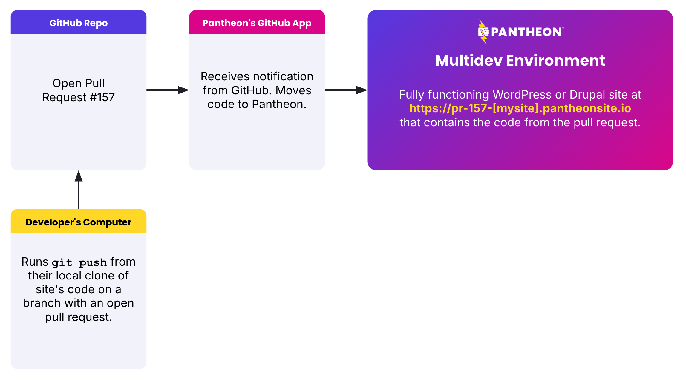

Pantheon's GitHub application directly integrates a GitHub repository with a Pantheon site.
This allows you to use GitHub as your code repository while still using Pantheon to run your site.

The GitHub application is currently in private Beta. [Request access for your Pantheon workspace here](https://docs.google.com/forms/d/e/1FAIpQLSf0vYrRbPQBxR-hT8kGJ4bEdYPtpkTtfDvPM89xD2dNZeqLqA/viewform).

Once turned, on this application accommodates a pull request workflow where a Multidev environment is created for each pull request. This allows you to test the code in the pull request before merging it.

Merging pull requests, or pushing code to the main branch of the GitHub repository, will automatically deploy the code to the Pantheon development environment.

## Asumptions of GitHub application

### Multidev is available at to customers with Gold or higher plans

This GitHub application is designed to work with Multidev environments. Multidev is available to customers on [Gold or higher plans](/guides/multidev). If you are on a lower plan, you can still use the GitHub application, but you will not be able to use the Multidev features.

### Build processes happen on Pantheon

Our separate GitHub action is designed for more customized workflows that might involve building code elsewhere and deploying to Pantheon. The GitHub application is designed for teams that want to use Pantheon as their build server.

Currently, Pantheon can execute "composer install" through our [Integrated Composer](/guides/integrated-composer) feature.
If you need compilation of front-end assets in your WordPress or Drupal theme through something like `npm run build` you should use [our GitHub Action](https://github.com/pantheon-systems/push-to-pantheon) now and [follow this item on our roadmap for eventual inclusion of such functionaity within a Pantheon-prodived build step](https://pantheon.productboard.com/detail/30103699).

## Limitations prior to General Availability

The GitHub application is currently in private Beta.

We will address these limitaitons before the application is made generally available.

### Limited to new projects created by the Terminus plugin

Activating the GitHub Application presently runs through a Terminus plugin that creates a new site on Pantheon and a new GitHub repository. The GitHub Application does not yet support retrofitting existing GitHub repositories or Pantheon sites yet. Follow [this issue](https://github.com/pantheon-systems/terminus-repository-plugin/issues/52) in the queue to find out when this limitation is removed.

### No On Server Development  (SFTP Mode)

New sites made with the GitHub Application do not support "[SFTP Mode](/guides/sftp)" which allows version controlled files to be altered via SFTP or simply by the CMS changing files, as is common with operations like "drush config-export." We know this limitation will stop some teams from using this application and [we are seeking feedback on how important it is to support this style of working when using 3rd party repositories](https://roadmap.pantheon.io/c/115-github-gitlab-and-bitbucket-integration).

### No dashboard representation of Git commit log

_Todo: explain this. Maybe add a screenshot_

