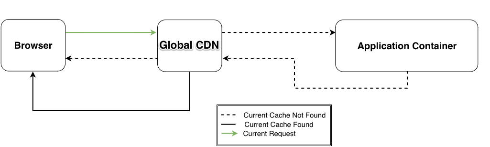

Pantheon's Global CDN supports caching to accelerate both static content and anonymous pages for sites on the platform. By serving data from cache servers all over the world, website visitors receive a response without waiting to access the application container. Clusters of these cache servers in each region are called **points of presence** or **POPs** for short. When a website uses these POPs effectively, the site can free up its PHP workers and database to process more dynamic requests. Each POP can handle hundreds of thousands of requests per second, much more than a site's own PHP and database containers.

Every site on Pantheon already uses the Global CDN; each HTTP request from a website visitor first goes to closest POP to see if there's a regional cache of the content. If the closest POP doesn't have the content, the request will then go to a POP near the origin (i.e. the PHP workers and database). If the content is cached anywhere in the world, the origin POP will have a copy. If neither POP has appropriate cache data, the request will continue to an application container worker, which will generate responses that may be cached on the way back to the browser.



The Global CDN can also improve the availability of your site. For example, if a PHP fatal error breaks your site, anonymous page requests can still be served by POPs, and end-users won't encounter errors or broken pages.

## Configure Your Drupal or WordPress Site for Global CDN

<Alert title="Note" type="info">

No module or plugin installation is required; do **not** install the Drupal Varnish or CDN modules.

</Alert>

The Global CDN respects standard HTTP headers served by your site. If you set pages to expire in 5 minutes, the CDN will expire the content as requested. If your site sends headers that forbid caching, the CDN won't cache the content.

For detailed instructions on how to configure and optimize caching, see [Drupal's Performance Settings](/drupal-cache) or [WordPress Pantheon Cache Plugin Configuration](/wordpress-cache-plugin).

## Troubleshooting Cache Hits

The most common issue with effectively using edge and CDN caching is troubleshooting situations where the cache should hit but doesn't. Here are some common mistakes that will cause cache misses.

### No HTTP Cache Headers

If you have checked your HTTP headers and found that caching is not working, make sure you have configured [Drupal's performance settings](/drupal-cache) or the [WordPress Pantheon Cache Plugin](/wordpress-cache-plugin). Once you have completed this step, go back and check the HTTP headers to verify that caching is working.

#### Drupal

If you are still getting `no-cache, must-revalidate, post-check=0, pre-check=0` as a response, check to see if any messages are being set. The [drupal\_set\_message](https://api.drupal.org/api/drupal/includes%21bootstrap.inc/function/drupal_set_message/7) function disables page caching. Also check to see if messages are present in page templates; themes could have removed them to suppress user facing messages.

### Theme Images Not Refreshing

If you are experiencing issues with theme images not refreshing, you can manually flush the cache by going to your Pantheon Dashboard and clicking the **Clear Caches** button.

#### Drupal

To make sure there are not any other errors within Drupal that may be preventing images from being cached, see if there are any `drupal_set_message()` calls are being sent to the page. If you are doing theme development, also make sure that the `drupal_set_message()` errors are not being suppressed in the theme.

### Clearing Caches in Drupal Doesn't Update Content/Views

If you have cleared caches using the Pantheon Dashboard and still see stale views on your Drupal-powered site, it's possible that the Views cache has persisted. For the views that need to be dynamic, check that those views have caching enabled and cautiously disable some caching as necessary.

### Debugging Cookies and the Global CDN

By default, Pantheon's Global CDN will ignore most cookies, preventing them from breaking through the cache and being passed to the backend. These cookies are still available to JavaScript, so analytics tools (e.g. Google, Chartbeat, etc.) will function out of the box on Pantheon. 

To test whether or not a cookie is preventing the CDN from caching, you can examine the headers output (Age, Max-Age, Cookie) via the following curl command:

```bash{outputLines: 2-5}
curl -I dev.mysite.com
HTTP/1.1 301 Moved Permanently
cache-control: public, max-age=300
Age: 23
Vary: Cookie, Cookie
```

You will notice a max-age of 300, and if you run the command again, the "Age" field will continue to increase until it reaches the TTL set by the max-age.

If your output looks like the following (i.e. an Age of 0) after more than one request, check if a cookie is being set (with the Set-Cookie header). Setting cookies will prevent the CDN from caching that page:

```bash{outputLines: 2-5}
curl -I dev.mysite.com
HTTP/1.1 200 OK
cache-control: public, max-age=900
Age: 0
Vary: Accept-Encoding, Cookie
```

In the event that a cookie is being set and you are unsure of what's setting it, disable modules one by one and test for the cookie via 'curl' after each one. When the cookie is no longer being set, the last module disabled before the test is the culprit.

## See Also

* [Clearing Caches for Drupal and WordPress](/clear-caches)
* [Working with Cookies on Pantheon](/cookies)
* [Bypassing Cache with HTTP Headers](/cache-control)
* [Testing Global CDN Caching](/test-global-cdn-caching)
* [Caching: Advanced Topics](/caching-advanced-topics)
