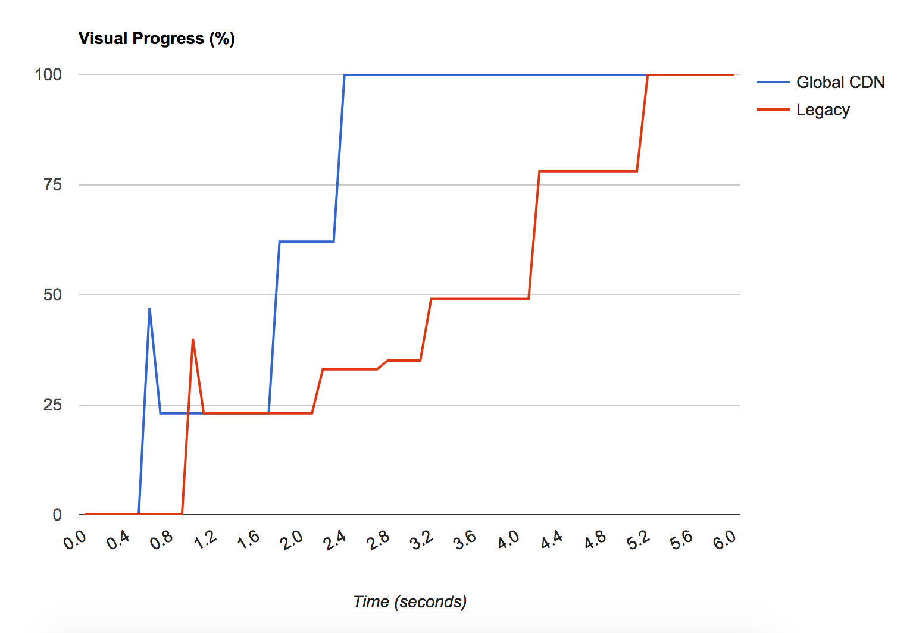

Pantheon's [Global CDN](https://pantheon.io/features/global-cdn) is a core platform offering, with improved performance and security for customer sites. Content is served from 70+ global **POP**s (Points Of Presence) where site pages and assets are cached, and [HTTPS](/https) certificates are fully managed using [Let's Encrypt](https://letsencrypt.org).

<Enablement title="Agency WebOps Training" link="https://pantheon.io/learn-pantheon?docs">

Get the most out of Global CDN with help from the experts at Pantheon. We deliver on-demand training to help development teams master the platform and improve internal WebOps.

</Enablement>

## How Does It Work?

Global CDN takes Pantheon's high-performance page and asset caching system (Varnish) and pushes it out globally. Rather than requests coming all the way to our primary datacenter, we terminate HTTPS and serve pages from a location much closer to the end-user. This speeds up the time to render a web-page significantly.

- The Global CDN cache strategy eliminates "cache sharding," in which the same content needs to be cached in separate edge cache instances. This results in higher cache hit rates.

- Global CDN includes interfaces to dynamically expire selected content from the cache, rather than doing a full cache flush. There are basic implementations available as Drupal modules and WordPress plugins, as well as a developer API for implementing custom cache tagging/clearing behavior.

When we first turned on the Global CDN, we saw multi-second speedups in Visual Progress <Popover title="Visual Progress" content="The pace at which content renders on the visible page" /> even within the continental US. International users will benefit even more:



## Cache Clearing

We recommend installing the Pantheon Advanced Page Cache [plugin](https://wordpress.org/plugins/pantheon-advanced-page-cache/) or [module](https://www.drupal.org/project/pantheon_advanced_page_cache) to take advantage of the granular cache clearing capabilities of the Global CDN. Additionally, you can remove all pages from cache at once from the Site Dashboard, within the Site Admin, and even from the command line.

For more details, see [Clearing Caches for Drupal and WordPress](/clear-caches).

## Persistent Cache

Serve your Drupal or WordPress site, even when it's down. If the server is not responding and can't serve a new copy of a page, it will use a cached version instead of displaying an error. With Persistent Cache, the goal is to provide a seamless, uninterrupted experience for the user.

### How Do I Configure This Setting?

On [Drupal](/drupal-cache#drupal-8-performance-configuration) and [WordPress](//wordpress-cache-plugin#pantheon-page-cache-plugin-configuration), you can adjust your CDN edge configuration to serve stale content for a specific amount of time.


### Caching Exceptions

Your site’s CMS page-level caching must be correctly configured in order to take advantage of Persistent Cache. 

Users with session-style cookies set, or a `NO_CACHE` cookie set will bypass the cache, and will not see cached content. For best results, set the `NO_CACHE` cookie to persist longer than the site’s page cache (this includes logged in users and authenticated traffic). You can learn more about the exceptions to page caching rules in [Caching: Advanced Topics](caching-advanced-topics#allow-a-user-to-bypass-the-cache). 

### How I Know If It's Working?


## Frequently Asked Questions

### I already have a CDN. Can I use it with the Pantheon Global CDN?

Yes, but because it adds additional complexity, we suggest you only do so if you identify a need that the Pantheon Global CDN doesn't address.

To retain your existing CDN, set up a "stacked CDN" configuration. Ensure that you are enforcing HTTPS only at the outer CDN and are assuming HTTPS in the application. Check your CDN for how to redirect all traffic to HTTPS.

While we have some limited documentation for this setup with [Cloudflare](/cloudflare#option-2-use-cloudflares-cdn-stacked-on-top-of-pantheons-global-cdn), this is a largely self-serve practice.

If you need additional features or customization for your CDN, consider our [Advanced Global CDN](/guides/professional-services/advanced-global-cdn) service.

### Is the www-redirector service still available?

No, the www-redirector service is part of the legacy infrastructure. You can choose your primary domain and redirect all traffic to HTTPS by adding [301 redirects](/guides/launch/redirects) to your site's configuration file (wp-config.php or settings.php).

### Are vanity domains supported?

You can upgrade a site to Global CDN that is using [vanity domains](/vanity-domains), but HTTPS will not be provisioned for the vanity domains. Only custom domains will have HTTPS provisioned.

### What about Cloudflare?

See [Cloudflare Domain Configuration](/cloudflare).

### Is the CDN configurable?

No, we pre-configured the CDN so you don’t have to hassle with configuration, and we can guarantee performance and uptime. The Global CDN's behavior is the same as our legacy cache which is heavily optimized for Drupal and WordPress sites, and serves billions of pages monthly, except it's globally distributed.

### Do I get access to hit rates or other statistics?

Hit rates are not currently available, but you can measure traffic for the Live environment. For details, see [Metrics in the Site Dashboard](/metrics).

### Can I use my own Fastly account with the Pantheon Global CDN?

You can, but as mentioned above you should identify a need for adding additional complexity first. If you're using Fastly TLS services with WordPress, you'll want to check for the `HTTP_FASTLY_SSL` header so that WordPress can build URLs to your CSS and JS assets correctly. Do this by adding the following to `wp-config.php`:

```php:title=wp-config.php
if (!empty( $_SERVER['HTTP_FASTLY_SSL'])) {
  $_SERVER['HTTPS'] = 'on';
}
```

### Can I expose the `Surrogate-Key-Raw` header?

Yes! Expose `Surrogate-Key-Raw` by including `Pantheon-Debug:1` in a curl request, then use `grep` to filter the output. Replace `https://www.example.com/` in the following example:

```bash{promptUser: user}
curl -IsH "Pantheon-Debug:1" https://www.example.com/ | grep surrogate-key-raw
```


To prevent issues with Twitter card validation and to reduce the overall time to load, the `Surrogate-Key-Raw` header is not returned by default. Exposing this header provides context for entities included on a given page.

## Advanced Global CDN

For custom solutions addressing the unique challenges your site build presents, see our [Advanced Global CDN](/guides/professional-services/advanced-global-cdn) service.
