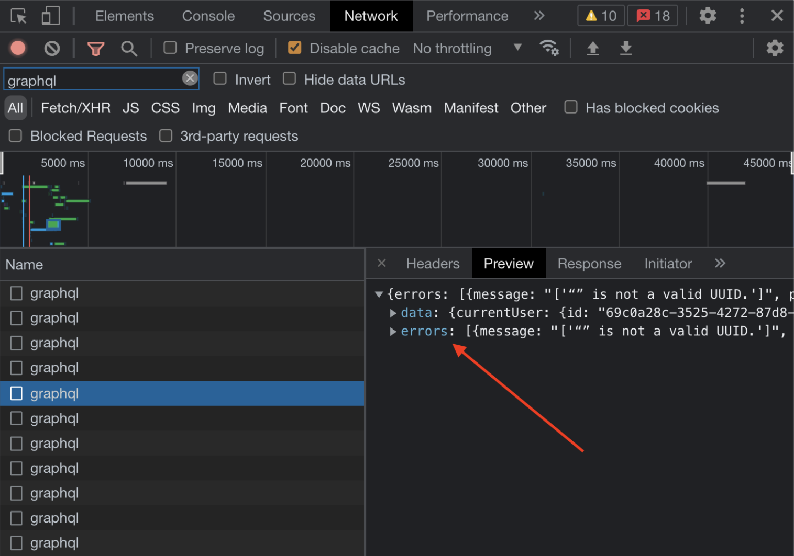

[GraphQL](https://graphql.org/) is an API query language that uses a server-side runtime for executing queries. A GraphQL service is created when you define types and fields for those types, and then provide functions for each field on each type. GraphQL is not tied to a specific database or storage engine, but is instead backed by your existing code and data.

[Apollo Client](https://www.apollographql.com/docs/react/) is a Javascript management library that is frequently used with GraphQL. You can manage local and remote data when using Apollo Client with GraphQL. Management features include:

- Fetch
- Cache
- Modify application data
- Automatic updating of your UI

Pantheon cannot troubleshoot or provide GraphQL solutions, but we can provide some suggestions for best practices and known working solutions for common errors. 

## Best Practices

### Always Request an ID

Apollo Client identifies unique entities (sites) by a combination of their Type and ID as part of the cache normalization process. When an entity is requested without an ID and later updated, Apollo Client can’t be certain that the update belongs to the same entity. In most cases, Apollo Client can detect this and will print a warning to the browser console. However, you should always include the ID as part of a query, even if it won’t be used in your presentation component.

### Naming Operations

All operations should be named, for example:

`query WorkspacesList {…}` 
 
Names should be in PascalCase, and should be descriptive of the operation’s use case. This is especially important if you use an API mocking library, such as Mock Service Worker, that uses the operation name for routing request and response handlers to test GraphQL operations.

## Troubleshooting  

### Request Errors

Note that GraphQL does not use HTTP status codes in the same way that REST-based APIs do. GraphQL responses return a 200 status code if the request was completed, and 5xx status code if it was not completed. If the requesting client was able to reach the gateway and the gateway responded, the response will contain a 200 status code regardless of the content of the response. As a result, failed queries and mutations take additional work to identify in DevTools.

In this image, for example, it is not immediately obvious that one of these queries failed, as every request returned a 200 status code:

However, if you inspect each of the requests, you will see one of them contains an errors key in the response:

This is the only identifiable symptom in DevTools when an operation has failed. For better network insights on GraphQL requests, you can install the [GraphQL Network Inspector Chrome extension](https://chrome.google.com/webstore/detail/graphql-network-inspector/ndlbedplllcgconngcnfmkadhokfaaln?hl=en-GB).

### Understanding Error Responses

Each request can result in one or more errors. This means that the error key in the response will always be an array. Each error has a message, which should be the most reliable, human-readable source of information for an error. It also has an extensions attribute that may contain a code and/or `status_code` attribute, which are used for determining what error message should be displayed in the UI.

Here is an example of an error returned for a workspace that requires multi-factor authentication to be enabled:

## See Also

- [Local Development](/local-development)
- [Pantheon Professional Services](/guides/professional-services)