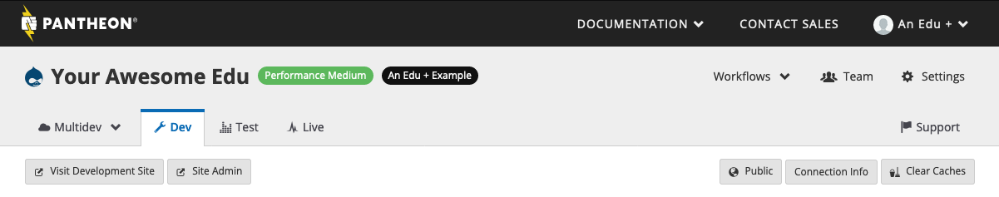

The permission to manage a site's plan is granted only to the roles of **Site Owner** / **Organization Administrator**. Other roles do not have access to change the site plan as described on this page. For details, see [Role-Based Permissions & Change Management](/change-management/#site-level-roles-and-permissions).

<Alert title="Note" type="info">

If you need to assume site and billing ownership, the current Site Owner must [transfer it to you directly](/guides/legacy-dashboard/site-billing#transfer-ownership-and-billing-for-this-site).

</Alert>

## Before You Make Changes

Consider the following changes to feature access _before_ upgrading or downgrading the site's plan. Certain scenarios require code changes in order to safely change the site plan.

### Basic Plan

[New Relic](/guides/new-relic), [Object Cache](/object-cache) (formerly Redis), and [Pantheon Search](/solr) are not available for Basic sites. These features must be disabled in order to select Basic as the new site plan when upgrading or downgrading plans.

For Object Cache and Pantheon Search (Solr), the following code changes are required before the feature can be safely disabled:

<TabList>

<Tab title="WordPress" id="wp-id" active={true}>

#### Safely Remove Object Cache

<Partial file="remove-addons/wp-redis.md" />

#### Safely Remove Pantheon Search

<Partial file="remove-addons/wp-solr.md" />

</Tab>

<Tab title="Drupal 7" id="d7-id">

#### Safely Remove Object Cache

<Partial file="remove-addons/drupal-redis.md" />

#### Safely Remove Pantheon Search

<Partial file="remove-addons/d7-solr.md" />

</Tab>

</TabList>

### Elite Plan

Elite sites cannot manage plans from the Site Dashboard. [Contact our sales team](https://pantheon.io/contact-us) or reach out to your dedicated Client Sales Executive for details.

## Upgrades

Site plan upgrades will change your site's resources and access to features immediately. The associated card will be charged a prorated amount for the remainder of the current billing period.

If your site benefits from [Preferred Pricing](https://pantheon.io/plans/agency-preferred-pricing?docs), contact your Supporting Organization for assistance in order to retain your special pricing rate.

## Downgrades

Site plan downgrades will change your site's resources and access to features immediately. Beginning on the next billing cycle, the associated card will be charged for the new site plan. No prorated refunds or credits will be issued for site downgrades.

If your site benefits from [Preferred Pricing](https://pantheon.io/plans/agency-preferred-pricing?docs), contact your Supporting Organization for assistance, in order to retain your special pricing rate.

### Downgrade to Sandbox

To downgrade to Sandbox, see [Cancel Current Plan](/guides/legacy-dashboard/site-plan#cancel-current-plan). Note: [Custom domains](/guides/domains) are not available to Sandbox sites. Downgrading to a Sandbox site will **automatically delete** existing custom domains across all environments of the site. If you decide to return to a paid plan in the future, you will need to add the domains again.

Downgrading to a Sandbox site will disable automatic backups. You will still be able to create backups manually. For details, see [Backups Tool](/backups).

## Change Your Plan

<Alert title="Warning" type="danger">

Before making any changes, please review [Before You Make Changes](#before-you-make-changes).

</Alert>

To change your plan:

<TabList>

<Tab title="Edu Sites" id="edu" active={true}>

    1. As an [organization administrator](/change-management#roles-and-permissions), from the Site Dashboard, click **Upgrade** next to the site's name:

    

    Otherwise, click the current plan tag next to the site's name:

    

    1. Click **Select** below the plan you choose, and select the Plan Size if it's a Performance plan.

    

    1. Review the new plan on the **Confirm Purchase** page, and click **Place Your Order**.

    Because billing is handled by the organization, the plan change is immediate, and you'll be returned to the Site Dashboard.

        - If the site plan isn't shown on the Dashboard immediately, refresh the page or click the **Workflows** button for status.

</Tab>

<Tab title="All Other Sites" id="other">

    1. Go to the Site Dashboard.

    1. For Sandbox sites, click **Upgrade** next to the site's name:
    

    Otherwise, click the current plan tag next to the site's name:
    

</Tab>

</TabList>

## Cancel Plan

<Alert title="Warning" type="danger">

Before making any changes, please review [Before You Make Changes](#before-you-make-changes).

</Alert>

<Alert title="Note" type="info" >

While all site plans downgrades will be effective immediately, no partial refunds will be issued, per our [terms of service](https://pantheon.io/terms-of-service#tos-11).

</Alert>

1. Go to the Site Dashboard.

1. Select the current plan:

 

1. Click the **Downgrade to free** link to cancel the current plan:

 

1. Check **Yes, cancel my plan** then click **Continue**:

 

1. Make sure the change details are correct, then click **Submit**.

1. Remove the existing card as a payment method for the site. For details, see [Billing in the Site Dashboard](/guides/legacy-dashboard/site-billing/#do-not-bill-this-site-to-a-card).

Optionally, you can remove the Sandbox site after downgrading. For details, see [Deleting a Site on Pantheon](/delete-site).
