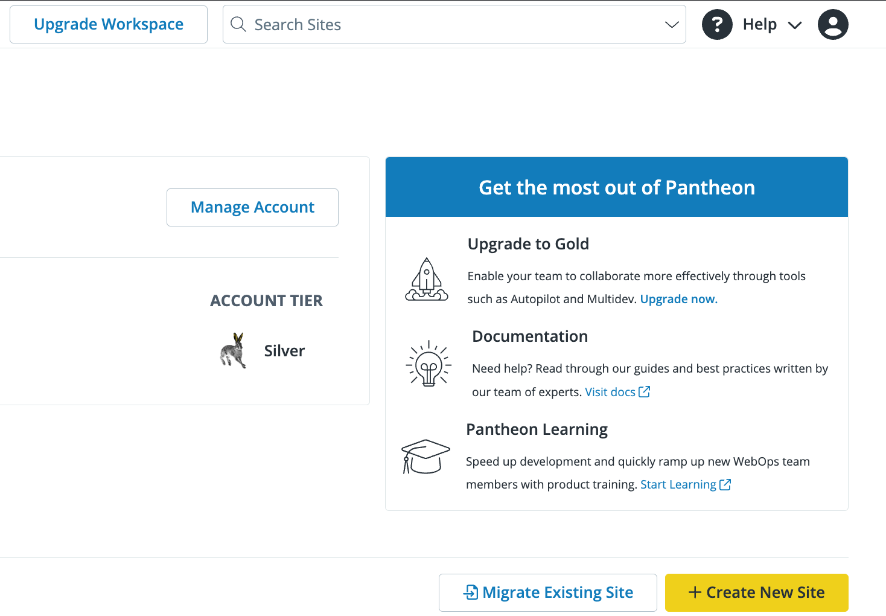

With a Professional Workspace, you can upgrade the associated [Account Plan](https://pantheon.io/plans/pricing) to gain additional features and enhanced support:

## Silver Account Plan

New Professional Workspaces start with a Silver Account Plan by default. The Silver Account Plan is free and offers basic WebOps tools and features. 

## Gold Account Plan 

Professional Workspaces with a Gold Account Plan provide additional collaboration tools such as [Multidev](/guides/multidev), [Custom Upstreams](/guides/custom-upstream), and [Autopilot](/guides/autopilot) with automated visual regression testing. 

To upgrade your Professional Workspace Account Plan to Gold:

1. Select the Professional Workspace, or [create one](http://localhost:8000/guides/account-mgmt/workspace-sites-teams/workspaces#create-a-professional-workspace).

  

1. Click **Upgrade Account Plan** in the banner at the top of the page, or click **Upgrade Account to Gold** on the right side of the page, under "Get the most out of Pantheon".

  

1. On the **Select Account Plan** page, click **Select Plan** under Gold, and follow the prompts to add a Payment Method.

1. Once your payment method is accepted, you will be redirected to a Billing page with your Account Subscription details.

  

<Alert title="Note"  type="info" >

Now that you have a Professional Workspace with a Gold Account Plan, you can [add it as a Supporting Workspace](/guides/account-mgmt/workspace-sites-teams/teams#add-a-supporting-organization-to-site) to your site to take advantage of your new features.

</Alert>

## Platinum & Diamond Account Plan

 Platinum and Diamond Account Plans offer all the tools and features of the Gold Account Plan, and include features that benefit large teams and enterprise organizations such as direct access to experts, dedicated support, and more. [Contact Sales](https://pantheon.io/contact-sales) for more information about upgrading to a Platinum or Diamond Account Plan.

## Partner Program

You will only be assigned a [Partner Program](https://pantheon.io/plans/partner-program) workspace if you are creating the workspace for a web agency. 

As a Pantheon Partner, you receive access to:

- Pantheon's Partner Portal
- A listing in our Agency Directory
- Sales playbooks, training, and [Gold Level Support](/guides/support/#support-features-and-response-times)
- Preferred Pricing on site hosting plans

**Partner Trial**: If you are creating a workspace for a web agency, you will be assigned a [Partner Trial Account](https://pantheon.io/partners/find-pantheon-partner) workspace that lets you try Gold Account Plan features free for 90 days.

**Registered Agency**: This is recommended for any professional website developer or agency that develops websites for clients. Registering as an agency will start your path to partnership with Pantheon. You'll receive access to Pantheon Partner benefits for 90 days. After your trial period, your account plan will become a Registered Agency, and you will lose access to Gold Account Plan benefits until you qualify as a Pantheon Partner.

For more information about our partner program and how to unlock higher partner tiers, check out our [Partner Program Guide](https://pantheon.io/resources/pantheon-partner-program-guide).

