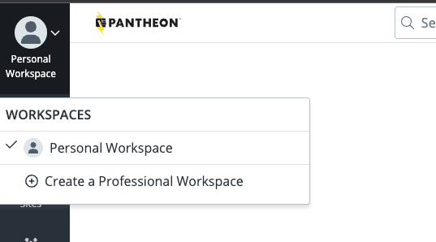

Workspaces are a home base for your WebOps. There are two types of workspaces:

<TabList>

<Tab title="Personal Workspace" id="personal-workspace" active={true}>

The Personal Workspace displays tools for the sites you own, or are a team member of, your account plan, and billing for sites you own.  You have only one personal workspace. Learn more about workspaces in the [Accounts](/guides/account-mgmt/account) guide.

- Every Pantheon user is assigned one Personal Workspace. 
- All the sites you have created, as well as individual sites from other organizations you've been invited to collaborate on, will be in your Personal Workspace. 
- You can use a Personal Workspace for your own projects, and for visibility into sites from other organizations you are working with.
- WebOps collaboration features such as [Multidev](/guides/multidev) and [Custom Upstreams](/guides/custom-upstream) are not available in Personal Workspaces. To access these features, you need a [Professional Workspace](/guides/account-mgmt/workspace-sites-teams/workspaces#create-a-professional-workspace). 

</Tab>

<Tab title="Professional Workspace" id="professional-workspace">

Professional workspaces bring together users and sites to allow administrators to effectively manage a large number of sites. Keep in mind, you can be a member of multiple professional workspaces at the same time.

You can create a Professional Workspace as the home for an organization’s sites and the teams working on them. 

- Creating a Professional Workspace is free. 
- Access to the collaboration features below are available to sites owned by Gold Workspaces or above:
	- [Multidev](/guides/multidev)
	- [Custom Upstreams](/guides/custom-upstream)
	- [Autopilot](/guides/autopilot)
- You can create any number of Professional Workspaces. 
	- You may be a member of more than one Professional Workspace, and can switch between your Personal and Professional Workspace at any time.

</Tab>

</TabList>

## Account Plans

With a Professional Workspace, you can upgrade the associated [Account Plan](https://pantheon.io/plans/pricing) to gain additional features and enhanced support:

<TabList>

<Tab title="Silver Account Plan" id="silver">

New Professional Workspaces start with a Silver Account Plan by default. The Silver Account Plan is free and offers basic WebOps tools and features. 

</Tab>

<Tab title="Gold Account Plan" id="gold" active={true}>

Professional Workspaces with a Gold Account Plan provide additional collaboration tools such as [Multidev](/guides/multidev), [Custom Upstreams](/guides/custom-upstream), and [Autopilot](/guides/autopilot) with automated visual regression testing. 

**To upgrade your Professional Workspace Account Plan to Gold**:

1. Click the Workspace Switcher located in the upper left corner of your Personal Workspace. If you already have a Professional Workspace, then select that Professional Workspace <Popover title="Account Plans" content="Account Plans are attached to Professional Workspaces. Select the Professional Workspace to which you'd like to attach the account plan, or create a Professional Workspace if you don't have one set up already." /> using the Workspace Switcher and skip ahead to Step 6.

  

1. Click on your gravatar and select `Create a Professional Workspace`.

  

1. Name your Professional Workspace, fill in the details, and click `Continue`.

  

1. Add any team members you would like to include in this Professional Workspace and click `Continue`. You will be automatically added as an Administrator of this Professional Workspace.

  

1. Your Professional Workspace is now ready. Click `Go to Workspace Home`.

  

1. To add a  Gold Account Plan to this workspace, click `Upgrade Account Plan` in the banner at the top of the page, or click `Upgrade Account to Gold` on the right side of the page, under `Get the most out of Pantheon`.

  

1. On the `Select Account Plan` page, click `Select Plan` under Gold, and follow the prompts to add a Payment Method.

1. Once your payment method is accepted, you will be redirected to a Billing page with your Account Subscription details.

  

<Alert title="Note"  type="info" >

Now that you have a Professional Workspace with a Gold Account Plan, you can [add it as a supporting organization](/guides/account-mgmt/workspace-sites-teams/teams#add-a-supporting-organization-to-site) to your site to take advantage of your new features.

</Alert>

</Tab>

<Tab title="Platinum & Diamond Account Plan" id="platinum-diamond">

 Platinum and Diamond Account Plans offer all the tools and features of the Gold Account Plan, and include features that benefit large teams and enterprise organizations such as direct access to experts, dedicated support, and more. [Contact Sales](https://pantheon.io/contact-sales) for more information about upgrading to a Platinum or Diamond Account Plan.

</Tab>

<Tab title="Partner Program" id="partner-program">

You will only be assigned a [Partner Program](https://pantheon.io/plans/partner-program) workspace if you are creating the workspace for a web agency. 

As a Pantheon Partner, you receive access to:

- Pantheon's Partner Portal
- A listing in our Agency Directory
- Sales playbooks, training, and [Gold Level Support](/guides/support/#support-features-and-response-times)
- Preferred Pricing on site hosting plans

**Partner Trial**: If you are creating a workspace for a web agency, you will be assigned a [Partner Trial Account](https://pantheon.io/partners/find-pantheon-partner) workspace that lets you try Gold Account Plan features free for 90 days.

**Registered Agency**: This is recommended for any professional website developer or agency that develops websites for clients. Registering as an agency will start your path to partnership with Pantheon. You'll receive access to Pantheon Partner benefits for 90 days. After your trial period, your account plan will become a Registered Agency, and you will lose access to Gold Account Plan benefits until you qualify as a Pantheon Partner.

For more information about our partner program and how to unlock higher partner tiers, check out our [Partner Program Guide](https://pantheon.io/resources/pantheon-partner-program-guide).

</Tab>

</TabList>

## Create a Professional Workspace

You can create as many workspaces as necessary. The following process will create a Professional Workspace with a free Silver Account Plan.

1. Click on your gravatar in the upper left corner, then select **Create New Workspace**.

1. Enter the information, upload a logo (optional), and click **Continue**.

1. Invite team members or skip this step by clicking **Continue**.

## Retrieve the Workspace UUID

Every entity (user, workspace, product, and site) is assigned a UUID which is internal to Pantheon. The UUID is found within the URL for the entity and resembles the following:

```none
de305d54-75b4-431b-adb2-eb6b9e546014
```

You can also use [Terminus](/terminus) to find the UUID of your workspaces:

```bash{promptUser: user}
terminus org:list
```


## Platform Email Notifications

### Platform Email Notifications

Pantheon platform email notifications are listed below. These notifications are non-configurable, and are generated by automated Pantheon monitoring or by user actions within the dashboard.

The emails listed below are received by all users, regardless of their assigned role. Refer to [Roles and Permissions](/guides/account-mgmt/workspace-sites-teams/teams#roles-and-permissions) for more information.

- **New membership:** a site admin-generated invitation to a user. The invited user is not required to have an account yet.

- **Password reset:** a user-generated email sent after submitting a request on the login form.

- **Payment invite:** a site admin-generated invitation to a user to pay for and take over ownership of a site. The invited user is not required to have an account yet.

- **Site deleted:** a site admin-generated notification sent to all site team members when a site is deleted.

- **Workspace invite:** a user-generated invitation to join a workspace. The invited user is not required to have an account yet.

The emails listed below are only received by users who have been assigned to the site admin role.

- **Site plan level change:** a Pantheon-generated notification sent to all site admins and workspace admins when a site's plan is upgraded or downgraded.

- **Site added as supporting organization:** a Pantheon-generated notification sent to all workspace admins when a site is added to an workspace as a supporting organization.

### Autopilot Email Notifications

You can configure email notifications for Autopilot alerts and activity digests. 

1. Navigate to your **Personal Workspace** settings.

1. Click **Notifications** and select which emails you want to receive in the **Autopilot Email Notifications** section:

   - **Weekly Activity Digest**: A weekly summary of Autopilot activity across all sites within the workspaces that have Autopilot enabled. Digests are sent each Monday with information about the previous seven days.

   - **Failed Visual Regression Tests**: Real-time email notifications for failed visual regression tests for a given site.

## Switch Between Workspaces

If you're a member of multiple workspaces, you can stay logged in, and switch between workspaces to work on different projects.

To switch between workspaces, click your gravatar in the upper left to switch between workspaces:


## Customize a Workspace

You can customize the following for a workspace:

- The name and icon of the workspace.

- Payment and terms of service information for Sites built in your workspace.

- [Upgrade](/guides/account-mgmt/workspace-sites-teams/workspaces#account-plans) a Silver Account Plan to a Gold Account Plan.

To customize a Professional Workspace, go to the workspace you wish to customize, then click the **Settings** tab.

## Delete a Workspace

Workspaces cannot be deleted.

## FAQ

### How do we add new sites to a Professional Workspace?

Refer to [Sites](/guides/account-mgmt/workspace-sites-teams/) for more information.

### Why do login attempts fail for all users across my workspace simultaneously?

Any large agency that has multiple developers who login frequently via username/password will trigger failed logins for everyone else who works on the site. This occurs despite everyone using the right password and even when one user logs in and out successfully 3 times.

As a workaround, we recommend following development best practice workflows by [authenticating via SSH key for passwordsless access](/ssh-keys).

### Why can't I access Multidev on my site when the Supporting Organization can use it?

Only workspace team members and administrators of a Supporting Organization with Multidev can use this feature. Site team members who are associated with the site but not the professional workspace can access Multidev environments via the unique URL, will not be able to commit code to them.

### Why can't my Agency workspace own a site?

Enterprise, Reseller, OEM, and EDU+ workspaces own sites. Registered Agencies, Pantheon Partners, Premier Pantheon Partners, Strategic Pantheon Partners, and EDU workspaces support sites. This is because an agency's role is to develop, service, and maintain a site on behalf of its owner. Read more about owning and supporting sites in [Workspaces, Sites, and Teams](/guides/account-mgmt/workspace-sites-teams).

### Can I add my own Agency as a Supporting Organization to a client's site?

No. Only the owner of the site can add an agency as a Supporting Organization. This action grants all members of the workspace access to the site. You should ask site owners to add your agency as a Supporting Organization if you are providing services to the site.

### What privileges and roles are granted when adding a Supporting Organization?

All members of the Supporting Organization receive the role assigned on the site, regardless of their role in the Supporting Organization.

### Can the site owner override privileges and access for team members of a Supporting Organization?

Yes, but only for sites owned by Enterprise or EDU+ workspaces. Roles designated on the Site Team modal will override any roles assigned within the workspace.

### As an Agency, how many sandbox sites do members of a workspace receive?

Each member of a workspace can create up to 10 Sandbox sites. When the limit of 10 is reached, take a site live or delete unused sites to free up additional Sandbox slots.
