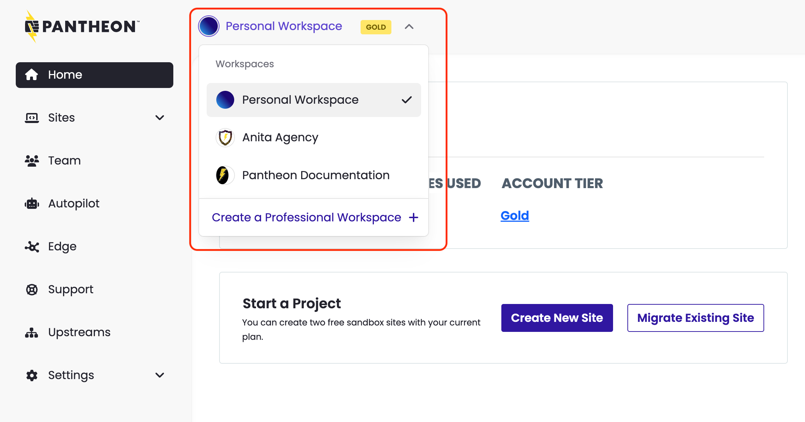

Workspaces are a home base for your WebOps.

## Types of Workspaces

- The **Personal Workspace** displays tools for the sites you own (or are a team member of), your account plan, and billing for sites you own. You have only one Personal Workspace.
  - Every Pantheon user is assigned one Personal Workspace.
  - All sites you have created, as well as individual sites from other Workspaces you've been invited to collaborate on, will be in your Personal Workspace.
  - WebOps collaboration features such as [Multidev](/guides/multidev) and [Custom Upstreams](/guides/custom-upstream) are not available in Personal Workspaces. To access these features, you need a [Professional Workspace](/guides/account-mgmt/workspace-sites-teams/workspaces#create-a-professional-workspace).
- **Professional workspaces** bring together users and sites to allow administrators to effectively manage a large number of sites.
  - You may be a member of more than one Professional Workspace, and can switch between your Personal and Professional Workspace at any time.
  - When you first create a Professional Workspace, it is created with a Silver Account plan, which gives you access to the basic capabilities of the Pantheon Platform.  To take advantage of features such as [Multidev](/guides/multidev), [Custom Upstreams](/guides/custom-upstream), and [Autopilot](/guides/autopilot), you'll want to [upgrade the Workspace to a Gold plan](/guides/account-mgmt/plans/workspace-plans).

  <Alert title="Important" type="danger" >

  Every Workspace that is upgraded to Gold or higher is billed as another plan/subscription.

  </Alert>

- Supporting Workspaces are Professional Workspaces that contain team members only. These workspaces can then be added to individual sites to allow those team members access to work on that site. Refer to [Add a Supporting Workspace to a Site](/guides/account-mgmt/workspace-sites-teams/teams#add-a-supporting-workspace-to-site) for details.

## Workspace Tools

The navigation bar on the left contains several additional tabs to help you manage your sites:

- **Home**: The home page of a Workspace contains information related to your workspace, such as the number of sites, sites recently added, and more.

- **Sites:** Add a new site, view sites you're a team member of, and check how many free sites you have remaining.

- **Team*:** Invite people to work on sites in this Workspace.

- **Autopilot:** [Autopilot](/guides/autopilot) is Visual Regression Testing (VRT) for every WordPress and Drupal Site within your workspace.

- **Edge*:** [Advanced Global CDN](/guides/agcdn) offers a suite of edge capabilities ensuring your sites are fast, reliable, and secure. Our specialists help you optimize your site performance for maximum uptime. Submit AGCDN configuration change requests on this tab.

- **Support:** View details of an open support request or create a new support request. Our chat-based support is available 24-hours a day.

- **Custom Upstreams*:** Create a new workspace-specific [Custom Upstream](/guides/custom-upstream) using a GitHub or Bitbucket repository. Custom Upstreams allow you to use an external repository as a template for your site.

- **Settings:** Modify the workspace name, logo, billing information, and if your Workspace is configured for it, billing terms and instructions for your team.

\* Not available in Personal Workspaces.

## Manage Workspaces

### Switch Between Workspaces

You can switch between Workspaces to work on personal projects or to switch between Professional Workspaces.  To do so:

- Click the Workspace Switcher (located to the right of the Pantheon logo on desktop devices, or in the top right mobile menu on mobile devices) to switch between Workspaces.

  Your Personal Workspace is at the top, followed by an Professional Workspaces in which you are a member.

  

### Create a Professional Workspace

You can create as many workspaces as necessary.

<Alert title="Warning" type="danger" >

If you are a contract customer, your contract is associated to one Professional Workspace, which is created for you when you sign up. You may still create additional Professional Workspaces, but they may not contain any sites.

</Alert>

The following process will create a Professional Workspace with a free Silver Account Plan.  To upgrade a Workspace to Gold, see [Workspace Plans](/guides/account-mgmt/plans/workspace-plans).

1. Click the [Workspace Switcher](/guides/account-mgmt/workspace-sites-teams/workspaces#switch-between-workspaces) (located to the right of the Pantheon logo on desktop devices, or in the top right mobile menu on mobile devices), then select **Create a Professional Workspace**.

1. Enter the information, upload a logo (optional), and click **Continue**.

1. Invite team members, or skip this step by clicking **Continue**.

### Retrieve the Workspace UUID

Every entity (user, workspace, product, and site) is assigned a UUID which is internal to Pantheon. The UUID is found within the URL for the entity and resembles the following:

```none
de305d54-75b4-431b-adb2-eb6b9e546014
```

You can also use [Terminus](/terminus) to find the UUID of your workspaces:

```bash{promptUser: user}
terminus org:list
```

### Customize a Workspace

You can customize the following for a workspace:

- The name and icon of the workspace.

- Payment and terms of service information for Sites built in your workspace.

- [Upgrade](/guides/account-mgmt/plans/workspace-plans) a Silver Account Plan to a Gold Account Plan.

To customize a Professional Workspace:

1. [Go to the workspace](/guides/account-mgmt/workspace-sites-teams/workspaces#switch-between-workspaces) you wish to customize.
1. Click the **Settings** tab.

### Change the Workspace Plan Type

Refer to [Account Plans](/guides/account-mgmt/plans/workspace-plans) for information.

### Delete a Workspace

Workspaces cannot be deleted.

## FAQ

### How do we add new sites to a Professional Workspace?

1. [Go to the workspace](/guides/account-mgmt/workspace-sites-teams/workspaces#switch-between-workspaces) you wish to add sites to.

1. Click **Migrate Existing Site** or **Create New Site**.  Refer to [Adding a Site to Pantheon](/guides/getstarted/addsite/) for more details.


### Why do login attempts fail for all users across my workspace simultaneously?

Any large agency that has multiple developers who login frequently via username/password will trigger failed logins for everyone else who works on the site. This occurs despite everyone using the right password and even when one user logs in and out successfully three times.

As a workaround, we recommend following development best practice workflows by [authenticating via SSH key for passwordsless access](/ssh-keys).

### Why can't I access Multidev on my site when the Supporting Workspace can use it?

Only workspace team members and administrators of a Supporting Workspace with Multidev can use this feature. Site team members who are associated with the site but not the professional workspace can access Multidev environments via the unique URL, will not be able to commit code to them.

### Why can't my Agency workspace own a site?

Enterprise, Reseller, OEM, and EDU+ workspaces own sites. Registered Agencies, Pantheon Partners, Premier Pantheon Partners, Strategic Pantheon Partners, and EDU workspaces support sites. This is because an agency's role is to develop, service, and maintain a site on behalf of its owner.

### Can I add my own Agency as a Supporting Workspace to a client's site?

No. Only the owner of the site can add an agency as a Supporting Workspace. This action grants all members of the workspace access to the site. You should ask site owners to add your agency as a Supporting Workspace if you are providing services to the site.

### What privileges and roles are granted when adding a Supporting Workspace?

All members of the Supporting Workspace receive the role assigned on the site, regardless of their role in the Supporting Workspace.

### Can the site owner override privileges and access for team members of a Supporting Workspace?

Yes, but only for sites owned by Enterprise or EDU+ workspaces. Roles designated on the Site Team modal will override any roles assigned within the workspace.

### As an Agency, how many sandbox sites do members of a workspace receive?

Each member of a workspace can create up to 10 Sandbox sites. When the limit of 10 is reached, take a site live or delete unused sites to free up additional Sandbox slots.
