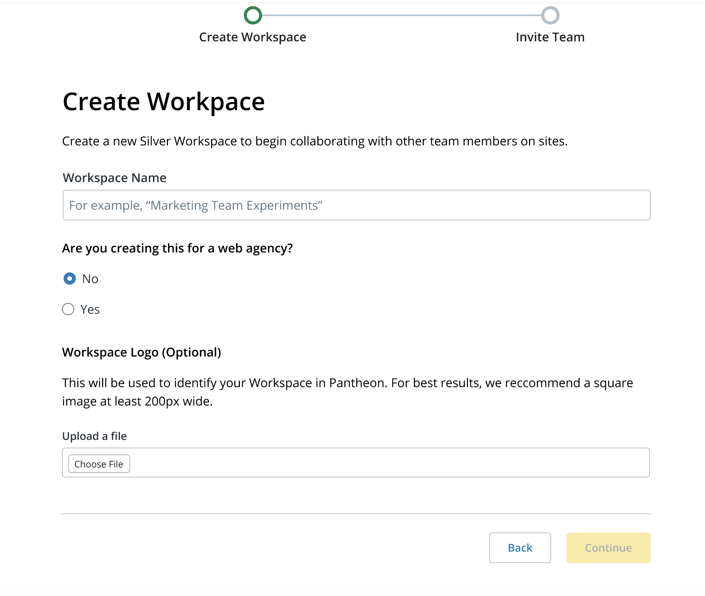

Workspaces are a home base for your WebOps.  There are two types of workspaces:

<dl>
    <dt>Personal Workspace</dt>
    <dd>The personal workspace displays tools for the sites to which you have access, your account tier, and billing for sites you own.  You have only one personal workspace.</dd>
    <dt>Professional Workspace</dt>
    <dd>Professional workspaces bring together users, sites, Custom Upstreams, Multidev, and support to provide administrators with the tools needed to effectively manage a large number of sites. You may be a part of no workspaces, or many workspaces, depending on your company setup.</dd>
</dl>

## Create a Workspace

To create a new Workspace from the Dashboard, click the Organization’s name and icon in the upper left of the Global Primary Navigation, and select **Create New Workspace** from the drop-down menu. 

If you are creating the Workspace for a web agency, you will be assigned a [Partner Trial Tier](https://pantheon.io/plans/partner-program). If the Workspace is not for an agency, you will be assigned a [Silver Tier Workspace](https://pantheon.io/plans/pricing).

## Switch Between Workspaces

If you're a member of multiple [Organizations](/organizations), you can stay logged in, and switch between Workspaces to work on personal projects or to work between Organizations.

Click the Organization’s name and icon in the upper left to switch between Workspaces:

## Customize a Workspace

You can change the name and icon of the organization workspace.

You can add optional payment and terms of service information for Sites built in your Workspace.

Users can purchase a site plan on a Sandbox site. Enter a site address in the **Customized Billing Instruction URL** field to direct users where they can view workspace billing instructions.

If a user attempts to update a site plan for any site that is not in a Sandbox, the user can view you administrators that can assist them. 

You can enter terms and conditions that are displayed to Workspace members.

## Delete a Workspace
