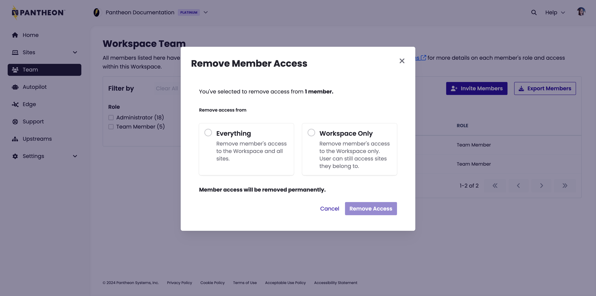
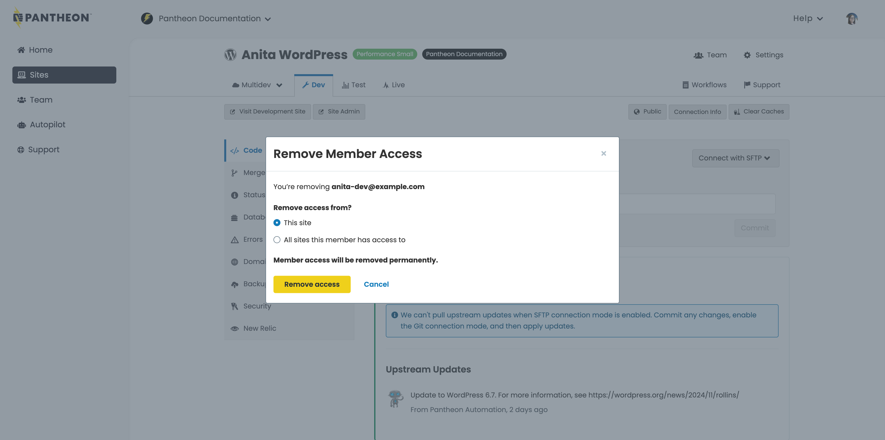

Offboarding a user is necessary following personnel changes in your organization. You can revoke their access following the process below. 

## Revoke Pantheon access
When a person with access to your site(s) on the platform leaves the company or project, it is important to immediately remove them from the team so that they no longer have access to make changes to your site.

The following operations are authenticated via SSH Keys, which are configured by the user in their account dashboard: 
* Git
* SFTP
* Terminus (Drush and WP-CLI)

Once a user is removed from a given Pantheon site, their SSH key will no longer authenticate these operations. 

<Alert title="Note" type="info">

All users can be removed except the site owner.

</Alert>

To remove a user:

<TabList>

<Tab title="From a Workspace" id="remws" active={true}>

1. [Go to the workspace](/guides/account-mgmt/workspace-sites-teams/workspaces#switch-between-workspaces) and select the **Team** tab.

1. Find and select the team member(s) you wish to remove.

1. Select **Actions**, then **Remove**.

1. Select **Yes, I am sure I want to remove this person**, then click **Yes, Remove**.

1. [Enterprise customers](/guides/account-mgmt/workspace-sites-teams#enterprise-customers-aka-contract-customers) with the Administrator role will instead be provided additional options to remove the user's access from associated sites. You will need to select one of the following and then click **Remove Access**:

   - **Everything**: removes the Pantheon user from the workspace and any site teams across all sites associated with the given workspace on Pantheon. This does not impact WordPress and Drupal user accounts, which need to be revoked separately by blocking or deleting the user account inside the CMS. 

   - **Workspace Only**: removes a member from this workspace only. Associated sites will not be impacted.

      

</Tab>

<Tab title="From a Site" id="remsite">

To remove a team member from a site:

1. [Go to the Site Dashboard](/guides/account-mgmt/workspace-sites-teams/sites#site-dashboard) for the site.

1. Click **Team**.

1. Select the '**x**' for each team member you wish to remove.

1. [Enterprise customers](/guides/account-mgmt/workspace-sites-teams#enterprise-customers-aka-contract-customers) with the Administrator role will instead be provided additional options to remove the user's access from associated sites and will need to select one of the following:

   - **This site**: removes the workspace from this site only.

   - **All sites workspace has access to**: removes the workspace from all sites it's currently associated with.

     

1. Click **Remove Access** with one of the selections provided. The team is removed based on the selection you made.

</Tab>

</TabList>

## Additional Steps (Recommended)
After a user is removed, in addition to the steps above, we recommend you:

1. [Contact Pantheon support](/guides/support/contact-support) to perform an internal workflow that will migrate your site's database, causing the MySQL credential details to be cycled.
   
   This step is necessary since [database credentials are printed in the dashboard](/guides/mariadb-mysql/mysql-access#access-your-database-directly) and do not depend on a user's site access for authentication. Make a note of your current credentials and compare them afterwards to ensure database access was properly revoked.

1. Delete or block the user's account in [Drupal](https://www.drupal.org/node/627158) or [WordPress](https://codex.wordpress.org/Users_Users_SubPanel).
1. Change any shared account passwords the user may have had access to.

