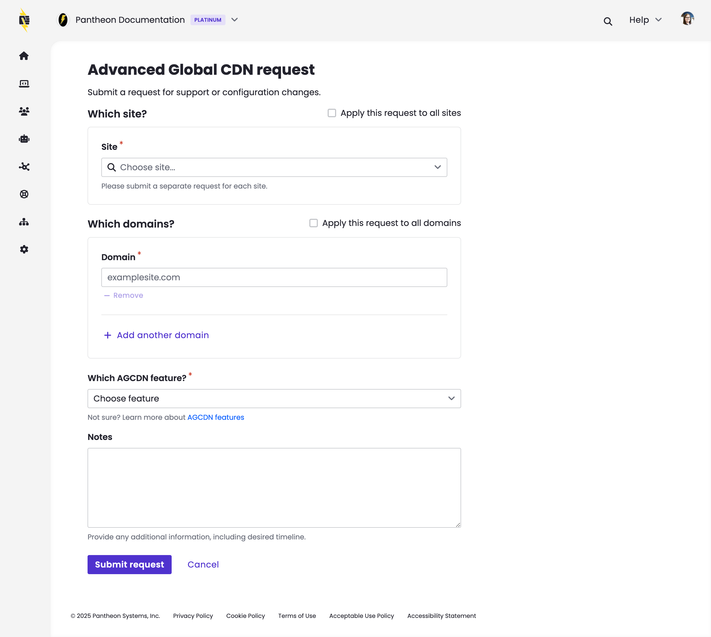

This section provides information on how to submit a configuration or support request for your AGCDN account.

## AGCDN Support

The Pantheon Professional Services (PS) team works closely with partners to provide customized solutions for the most complex technical challenges and ensure your success on Pantheon. Managed updates with AGCDN take care of a lot of developer work. You can submit a configuration request or a request for AGCDN support if you would like to change or update your configuration, or if you site is not behaving as expected.

## Submit a Change Request

Follow the steps below to submit a ticket for a configuration change or support request.

1. [Go to your professional Workspace](/guides/account-mgmt/workspace-sites-teams/workspaces#switch-between-workspaces), then go to the **Edge** tab.
1. Click the **Go to request form** button.
1. Complete the form with all relevant details about your request. 
1. Submit your request.

 

After submission, you will be switched to the **Support** tab of your professional workspace and the new AGCDN ticket will be open.

## More Resources

- [Support FAQs](/guides/support/faq/)

- [Professional Services](/guides/professional-services) - Learn all the great services our expert team can provide.
