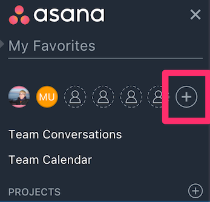
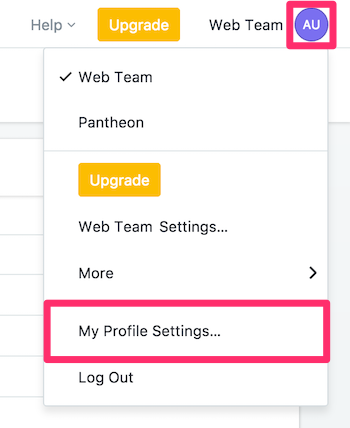
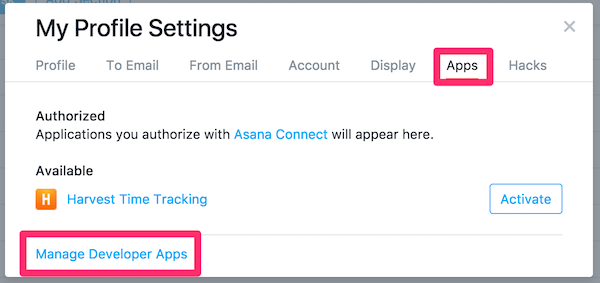
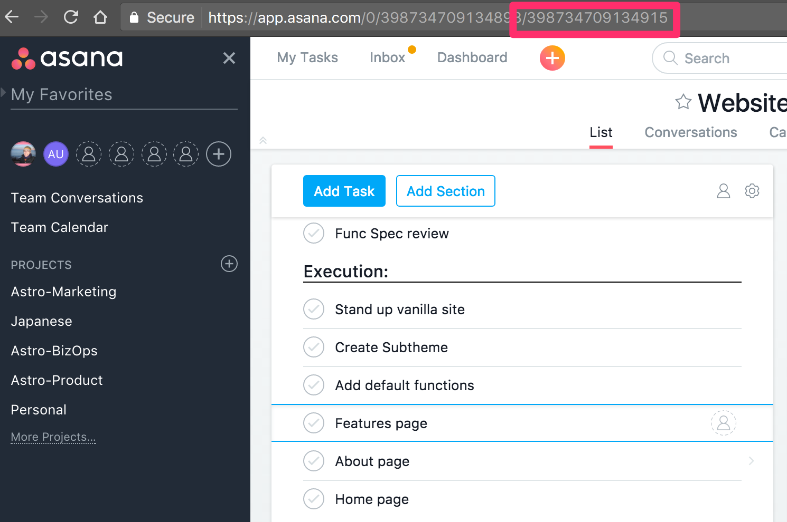
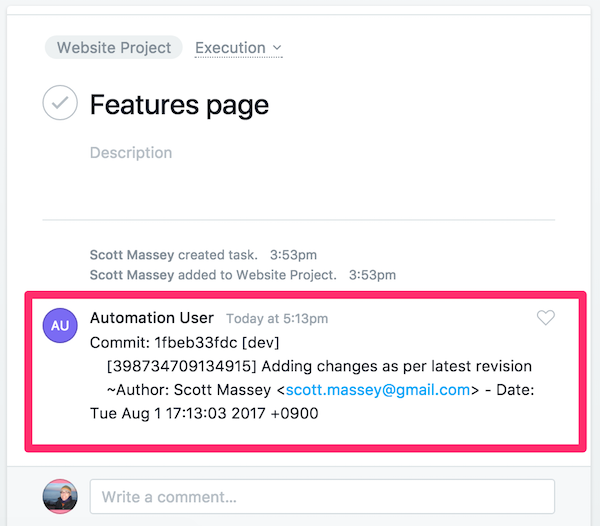

[Asana](https://asana.com) is a flexible project management tool which helps teams to collaborate on projects in either an waterfall or kanban framework. It allows for projects to be spun up and managed quickly and easily, and has an extremely well designed user interface.

In this guide, we are using Asana to manage a website project on Pantheon. When changes are pushed to Pantheon that include the Asana task's unique ID, the commit message will appear within the task.

## Before You Begin
Be sure that you:

- Have a Drupal or WordPress site on Pantheon
- Install [Terminus](/terminus):

        curl -O https://raw.githubusercontent.com/pantheon-systems/terminus-installer/master/builds/installer.phar && php installer.phar install
- [Generate a Machine Token](https://dashboard.pantheon.io/machine-token/create) from **User Dashboard** > **Account** > **Machine Tokens**, then authenticate Terminus:

        terminus auth:login --machine-token=‹machine-token›
- Install the [Terminus Secrets Plugin](https://github.com/pantheon-systems/terminus-secrets-plugin):

        curl https://github.com/pantheon-systems/terminus-secrets-plugin/archive/1.x.tar.gz -L | tar -C ~/.terminus/plugins -xvz
## Create a Machine User in Asana
Start by creating a new machine user in Asana. This user is referred to as a "machine user" because the account is used to automatically create comments out of commit messages on Pantheon using a PHP script.

1. Select **<span class="asana">+</span>** from the left hand menu, next to existing team members:

   

2. Enter a name and email address for the machine user, which acts as the intermediary between Asana and the Pantheon Site Dashboard. Then click **Send Invite**.

  We suggest naming machine users relative to their function, in this example we name our new user `Automation User`. The email needs to be an account you have access to:

   

3. Check the address used in the last step for an email from Asana. Click the **Accept Invite** button and follow prompts to set the machine user's password. You should be logged in as the machine user.

4. Click on your profile in the top right, and select **My Profile Settings**:

    


5. Select **Apps**, then **Manage Developer Apps**:

    

6. Scroll down to **Personal Access Tokens**, then click **+ Create New Personal Access Token**:

    

6. Give the token a name which denotes it's purpose and save the string generated for the next steps.

## Securely Store User Credentials on Pantheon
Next, we need to provide Pantheon with the credentials for our new machine user. We'll securely store these values in the [private path](/private-paths/#private-path-for-files) of Pantheon's filesystem.

We use the filesystem private path in this section because we don't want to track sensitive data like passwords in the codebase with git.

In the commands below, replace `<site>` with your site name, `<user>` with your Asana machine account username, and `<password>` with its password.

1. First, let's check for existing secrets using Terminus:

        SITE=<site_name>
        terminus secrets:list $SITE.dev

  If no existing keys are found, execute the following to create a new `secrets.json` file and upload it to Pantheon:

        $ echo '{}' > secrets.json
        $ `terminus connection:info $SITE.dev --field=sftp_command`
        sftp> put ./files/private secrets.json
        sftp> bye
        $ rm secrets.json

  Otherwise, continue to the next step.

3. Write the machine user's token to the private `secrets.json` file:

        terminus secrets:set $SITE.dev asana_access_token '<API token>'

<Alert title="Note" type="info">

When it comes to keeping production keys secure, the best solution is to use a key management service like [Lockr](/guides/lockr) to automatically encrypt and secure keys on distributed platforms such as Pantheon.

</Alert>

## Configure Quicksilver Integration
Next we'll add Pantheon's example [Quicksilver](/quicksilver) integration script for Asana to the [private path](/private-paths/#private-path-for-code) of your site's codebase. The private path within the codebase is tracked in version control and is accessible by PHP, but not the web.

1. If you haven't done so already, [clone your Pantheon site repository](/git/#clone-your-site-codebase) and navigate to the project's root directory:

        `terminus connection:info $SITE.dev --fields='Git Command' --format=string`
        cd $SITE

2. Set the connection mode to Git:

        terminus connection:set $SITE.dev git

3. Create a copy of [Pantheon's `asana_integration.php`](https://github.com/pantheon-systems/quicksilver-examples/tree/master/asana_integration) in the project's private path:

    ``` bash
    mkdir private
    mkdir private/scripts
    curl https://raw.githubusercontent.com/pantheon-systems/quicksilver-examples/master/asana_integration/asana_integration.php --output ./private/scripts/asana_integration.php
    ```

4. Create a `pantheon.yml` file if one doesn't already exist in your root directory.

5. Add the following workflow into your `pantheon.yml` file to hook into the platform upon code being pushed to fire off the Asana integration script:

        #always include the api version
        api_version: 1

        workflows:
          sync_code:
            after:
              - type: webphp
                description: Asana Integration
                script: private/scripts/asana_integration.php

    <Alert title="Note" type="info">

    `api_version` should be set once in [`pantheon.yml`](/pantheon-yml). If you have an existing `pantheon.yml` with this line, don't add it again.

    </Alert>

6. [Commit and push](/git/#push-changes-to-pantheon) changes to the Dev environment:

        git add .
        git commit -m "Create private/scripts/asana_integration.php and configure platform hooks"
        git push origin master


## Test Asana Integration on Pantheon

1. Grab the ID for a task you're working on, which is last part of the open task's URL:

    

3. Push a code change to Pantheon containing the Asana task ID in the commit message in brackets (e.g., [398734709134915]). This workflow will trigger `asana_integration.php` script, which will search commits for possible task IDs and comment in Asana when found.

        git commit -m "[398734709134915] Adding changes as per latest revision"

4. Return to the issue in Asana to see a message from our machine user:

    

## Conclusion
In this guide, we covered a simple integration between Asana and Pantheon. Feel free to expand our example. Additionally, if you use [GitHub](https://github.com) with Asana, you can further integrate with [Unito](https://unito.io/sync/asana/github/), a free integration service. This should reduce a few steps in the development process for your team by letting the robots handle the communication.
