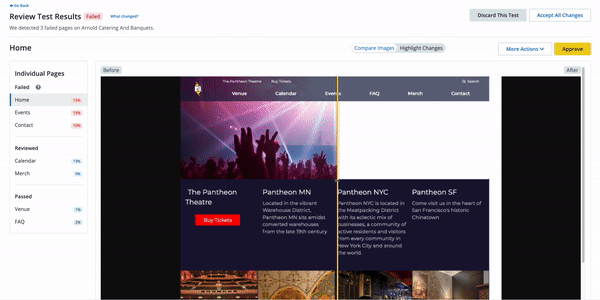

[Autopilot](https://pantheon.io/autopilot?docs) automatically detects, performs, and deploys updates for WordPress and Drupal. Autopilot also features automated visual regression testing (VRT) to ensure that your site's user experience (UX) is consistent while securing your site and implementing new features.

<Wistia src="g6syd1p6ed" />

## What Autopilot Does

Pantheon's Autopilot:

- Automatically detects when new updates are available
- Performs the updates in an isolated [Multidev](/guides/multidev) environment
- Tests the updates with automated visual regression testing (VRT)
- Optionally deploys the updates

## Get Autopilot

Autopilot is available for the following accounts:

 - Gold
 - Platinum
 - Diamond
 - Agency partners

Check out our [pricing page](https://pantheon.io/plans/pricing?docs) and contact [Sales](https://pantheon.io/contact-sales?docs) to discuss which plan is best for your needs.

## Who is Autopilot for?

Autopilot is for you if you build or maintain WordPress and Drupal sites.

Site upkeep can be tedious with constant monitoring, building, maintaining websites, and working cross-functionally to deliver digital experiences for customers. Autopilot relieves you of the continual maintenance work it takes to keep sites updated.

Autopilot requires [Multidev](/guides/multidev), and is available to Pantheon [Gold Accounts or higher](/guides/account-mgmt/workspace-sites-teams/workspaces#account-plans).

Autopilot is enabled for Pantheon sites at the organization level.

## Autopilot Requirements

Autopilot requires the following:

- A Gold, Platinum, or Diamond account
- [Multidev](/guides/multidev)
- A compatible version of Drush (if you are not using Integrated Composer)
- A compatible site framework (refer to [Autopilot Site Compatibility](/guides/autopilot#autopilot-site-compatibility) for more information.

### Autopilot Site Compatibility

<Partial file="autopilot/autopilot-compatibility.md" />

## Autopilot for Agencies

Agency users can navigate to the Agency Workspace to see sites that have been granted agency access. The Agency Workspace also shows client sites for which the agency is a supporting or owning workspace.

Agency users can only access Autopilot through the Agency Workspace.

## Autopilot Terminus Plugin

You can use the [Autopilot Terminus plugin](https://github.com/pantheon-systems/terminus-autopilot-plugin#readme) to perform several Autopilot actions from your terminal. The Autopilot Terminus plugin does not provide the full range of functions available through the dashboard at this time.

## More Resources

- [Autopilot Pre-Configuration Checklist](/guides/autopilot/autopilot-preconfiguration/)
- [Autopilot Custom Upstream Guide](/guides/autopilot-custom-upstream)
- [Autopilot Product Page](https://pantheon.io/autopilot?docs)
- [Webinar: Put CMS Updates on Cruise Control with Autopilot](https://pantheon.io/put-cms-updates-on-cruise-control-with-autopilot-webinar)
- [Autopilot Makes Open Source CMS a Reality at Scale](https://pantheon.io/blog/open-source-cms-scale-autopilot)
- [Robots, Autopilot, and The Holy Grail of WebOps](https://pantheon.io/blog/robots-autopilot-and-holy-grail-webops)
