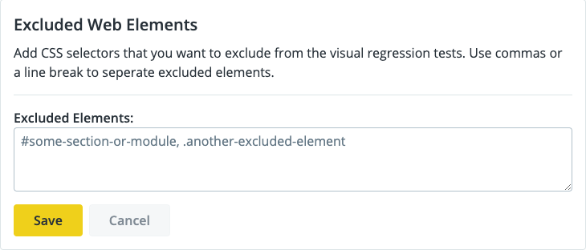

There are several things you can do to prepare your site and your team are for Autopilot before it is enabled.

## Pre-define Your URLs for Virtual Regression Testing

Autopilot allows you to define specific URLs for individual regression tests. You can define as many URLs for individual regression testing as you want during the [Visual Review](/guides/autopilot/enable-autopilot/#visual-review) section of the Autopilot Wizard.

You can pre-define these URLs when you begin preparing your site for Autopilot. 

 We recommend that you include pages that:

- Receive frequent changes

- Contain key information that should be thoroughly reviewed

- Appear as top links on your homepage

- Receive major content updates 

## Consider What Web Elements You Want to Exclude

Certain [web elements can be excluded](/guides/autopilot/enable-autopilot/#excluded-web-elements) from your visual regression testing. We recommend creating a list of web elements that you can exclude from testing before you begin to configure Autopilot. 

Dynamic elements are created by your browser and only exist during runtime. Consider excluding the following dynamic web elements from your tests:

- Banner images

- Elements created using JavaScript

- CSS and Pseudo-Elements

- Static Elements with Dynamic Parts 

    - You can have static elements defined in your source code, but the attributes and data inside this element could be modified or set by JavaScript. An example of this situation might be using setAttribute to change an attribute on a static element.

## Adjust the Threshold for Dynamic Content

## Consider Stakeholders for Your VRT Feedback Loop

## Pay Special Attention to Backend Changes that Autopilot Won't Test

## Review Exclusions for Composer with Extra Care

## More Resources

- [Autopilot FAQs](/guides/autopilot/autopilot-faq)

- [Composer Fundamentals and WebOps Workflows](/guides/composer)