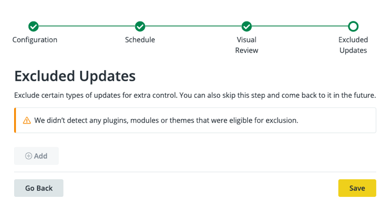

## Enable Autopilot

Autopilot can be enabled for individual sites within each eligible Workspace.

To work with Autopilot, [switch to the Workspace](/guides/new-dashboard/workspaces#switch-between-workspaces) for the site's Organization before you continue.

1. If the site is in [SFTP mode](/sftp) with staged changes that haven't been committed yet, [commit those changes](/sftp#committing-sftp-changes) first.

1. In the left bar, click **<i className="fa fa-robot"></i> Autopilot**.

1. Sites for which Autopilot is available are listed on the **Autopilot Overview** page.

1. Click **Actions**, **Manage Autopilot Settings**, then **Get Started** to start Autopilot setup.

  During setup, use the buttons at the bottom to navigate between steps. If you use the browser's back button instead of **Go Back**, you'll lose the unsaved changes.

## Configure Autopilot to Track Changes and Deploy to Dev, Test, or Live

1. On the **Configuration** page, use the **On**/**Off** toggles to choose which features and elements should be tracked for updates then click **Continue** to set a schedule for Autopilot:

  

1. Schedule Autopilot to run:

   - Never (Update Manually)
   - Weekly
   - Monthly

   Then use the dropdown menu to choose the deployment destination:

   - Dev
   - Test
   - Live

   

   Click **Continue** to choose pages for screenshot comparison tests.

1. Add pages to track for visual regression testing:

  

  Click **Continue** to choose updates to exclude.

1. Autopilot checks for plugins, modules, and themes that are eligible for exclusion.

  If any are shown on the **Excluded Updates** screen, select any that should be excluded:

   

  Click **Save** to initialize Autopilot on the Site.

## Autopilot Configuration - Manage Autopilot Settings

From the **<i className="fa fa-robot"></i> Autopilot** page of the Workspace, click **Actions** <i className="fa fa-chevron-down fa-w-14"></i>, then **Manage Autopilot Settings**.

The Autopilot Configuration page shows all the steps from the initial setup on one page.

### Acceptable Change

Autopilot allows you to configure a threshold of acceptable change so that small, expected changes don't trigger false positives. This is useful for common changes like:

- Randomized testimonials feeds
- Sliders
- Social (Twitter, Facebook, Pinterest, etc.) feeds
- Advertising

Additional DOM element exclusion is in active development.

1. In the **Visual Test Screenshots** section, add the page URLs to track and the amount of Acceptable Change.

  For percent change, consider that a 1% change is like a 1000 pixel wide image shifting 10 pixels over.
  
  You can adjust this setting later for individual tests.

  Click **<i class="fa fa-plus-circle"></i> Add** to add more pages.

1. Click **Continue** to choose updates to exclude. If no eligible updates are available, or once you've added all the things to exclude, click **Save** to start testing.

1. Wait while Autopilot performs its tests and updates. This will take a while.

## Configure Autopilot for Premium and Paid Plugins and Modules

Configure Autopilot for each individual premium and paid plugins and modules. Depending on the plugin, you may need to provide Autopilot with access or configure the plugin or module to work with Autopilot.

## Enable Autopilot Email Notifications

<Partial file="autopilot/autopilot-email-notifications.md" />
