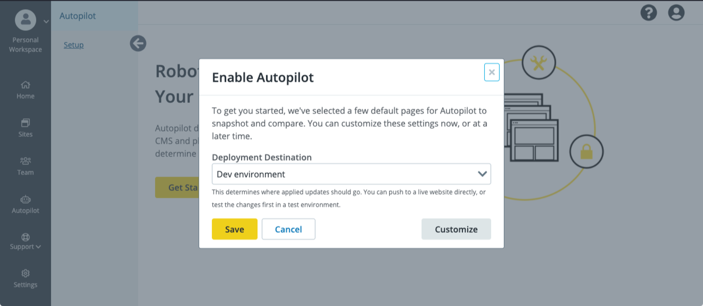
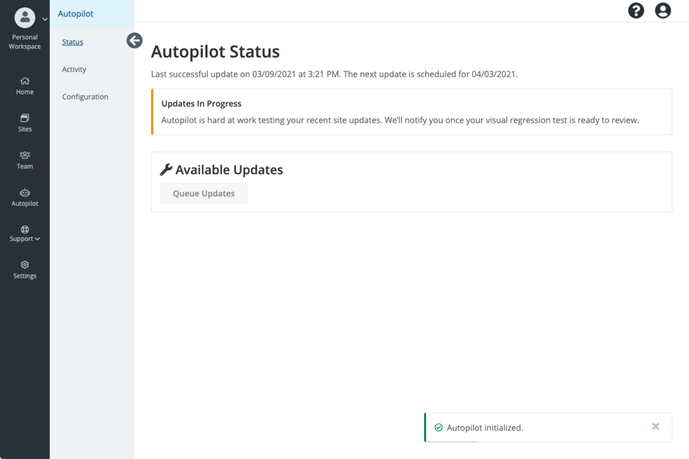

## Enable Autopilot

Autopilot can be enabled for individual sites within each eligible Workspace.

1. In the left bar, click **<i className="fa fa-robot"></i> Autopilot**

1. Sites for which Autopilot is available are listed on the **Autopilot Overview** page.

1. Click **Actions**, **Manage Autopilot Settings**, the **Get Started** to start Autopilot setup.

  During setup, use the buttons at the bottom to navigate between steps. If you use the browser's back button instead of **Go Back**, you'll lose the unsaved changes.

## Set Autopilot to Deploy Successful Changes to Dev, Test, or Live

1. Select the **Deployment Destination**. This determines the environment to which Autopilot can automatically apply changes.

  For example, if you select **Test environment**, Autopilot will stage the changes in Dev, then deploy them to Test automatically if the changes pass VRT.

  

1. Click **Customize** to choose which aspects of the site Autopilot should manage and how frequently Autopilot should make updates.

  

  Click **Continue** to choose pages for screenshot comparison tests and acceptable change.

## Acceptable Change

Autopilot allows you to configure a threshold of acceptable change so that small, expected changes don't trigger false positives. This is useful for common changes like:

- Randomized testimonials feeds
- Sliders
- Social (Twitter, Facebook, Pinterest, etc.) feeds
- Advertising

Autopilot has AI to detect autoplay videos and reset frames for consistent screenshots, to avoid false positives. Additional DOM element exclusion is in active development.

1. On the Visual Test Screenshots page, add the page URLs to track and the amount of Acceptable Change.

  For percent change, consider that a 1% change is like a 1000 pixel wide image shifting 10 pixels over. You can adjust this setting later for individual tests.

  Click **<i class="fa fa-plus-circle"></i> Add** to add more pages.

1. Click **Continue** to choose updates to exclude. If no eligible updates are available, or once you've added all the things to exclude, click **Save** to start Autopilot.

