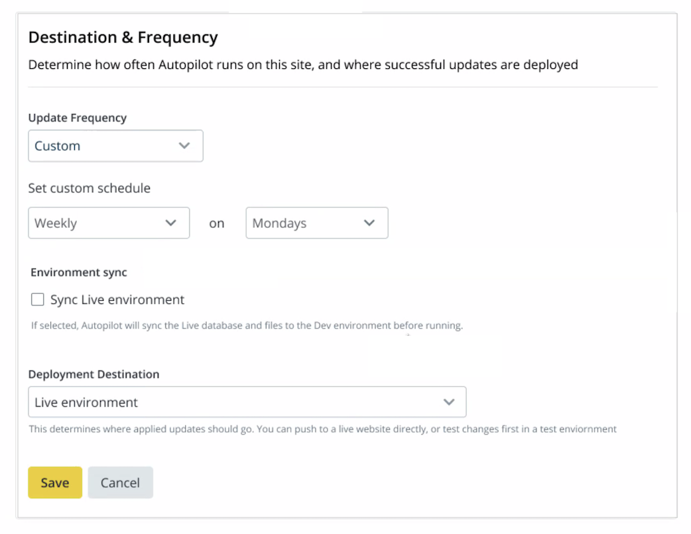

## Enable Autopilot

Autopilot can be enabled for individual sites within each eligible Workspace.

[Switch to the Workspace](/guides/new-dashboard/workspaces#switch-between-workspaces) for the site's Organization to work with Autopilot before you continue.

1. [Commit any staged changes](/sftp#committing-sftp-changes) that have not been committed before you continue if the site is in [SFTP mode](/sftp).

1. Click the <i className="fa fa-robot"></i> **Autopilot** icon in the Global Primary Navigation.

1. View the list of sites for which Autopilot is available in the **All Sites** column of the **Sites** table.

1. Click **Activate** in the Site's row.

   During setup, use the buttons at the bottom to navigate between steps. If you use the browser's back button instead of **Go Back**, you'll lose any unsaved changes.

## Autopilot Setup Wizard   

The Autopilot setup wizard automatically displays after you activate Autopilot for a site. You must complete all items in the Configuration, Schedule, and Visual Review steps. 

### Configuration

1. Use the **On**/**Off** toggles to choose which features and elements should be tracked or excluded from updates.

   Any elements that Autopilot detects as available for exclusion will be listed in each category (Modules, Plugins, Themes). 

1. Click **Manage Excluded Updates** then the **Exclude** button on the element's row to exclude it from Autopilot updates.

1. Click **Continue**.
  
   

### Schedule

1. Set the **Deployment Destination** to the desired environment: 

    - Dev
    - Test
    - Live

1. Set the **Update Frequency** to schedule Autopilot to run:

    - Never (Update Manually)
    - Weekly
    - Monthly

1. Select the **Sync Live Environment** checkbox to sync environments.

   The **Sync Environment** feature syncs your Live environment to your Dev environment. Your databases and files will be synced, but not your code. If the Dev code does not match the Live code, Autopilot will use the code in the Dev environment.

   

1. Click **Continue** to choose pages for screenshot comparison tests.

### Visual Review

1. Add pages to track for visual regression testing. 

   Autopilot automatically suggests up to ten URL paths during setup:

  

1. Click **Save** to initialize Autopilot on the Site.

1. Click **Status** in the Autopilot sidebar for the current status of the testing. This process might take a while:

  

## Autopilot Configuration - Manage Autopilot Settings

1. Navigate to the **<i className="fa fa-robot"></i> Autopilot** page of the Workspace > click **Actions** <i className="fa fa-chevron-down fa-w-14"></i> > **Manage Autopilot Settings**.

   The Autopilot Configuration page shows all the steps from the initial setup on one page.

   If the Site uses [Integrated Composer](/guides/integrated-composer) (including all Drupal 9 sites), Autopilot will show warnings in the sections where Composer manages updates.

1. Click **Save** for each section of the configuration in which you make changes.

### Update Scope

Use the **On**/**Off** toggle to choose which features and elements should be tracked for updates then click **Save**.

### Update Destination & Frequency

1. Set the **Deployment Destination** to the desired environment: 

You can determine how often Autopilot runs and select where you want successful updates deployed in the Destination and Frequency section. 

Some selection options are grayed out for customers with Gold plans. Only customers with Platinum and Diamond plans have the ability to choose a setting for each option.

1. Use the **Deployment Destination** dropdown menu to choose which environment Autopilot should deploy up to:

    - Dev
    - Test
    - Live

1. Set the **Update Frequency** to schedule Autopilot to run:

    - Never (Update Manually)
    - Weekly
    - Monthly

1. Select the **Sync Live Environment** checkbox to sync environments.

   The **Sync Environment** feature syncs your Live environment to your Dev environment before Autopilot performs updates. Your databases and files will be synced, but not your code. If the Dev code does not match the Live code, Autopilot will use the code in the Dev environment.

1. Click **Save** to save the changes.

### Update Visual Test Screenshots

You can add pages to track for visual regression testing, along with a percent of acceptable change.

1. Click **<i class="fa fa-plus-circle"></i> Add** to add more pages.

1. Click **Save** to save changes.

#### Acceptable Change

Autopilot allows you to configure a threshold of acceptable change so that small, expected changes don't trigger false positives. This is useful for common changes like:

- Randomized testimonials feeds
- Sliders
- Social (Twitter, Facebook, Pinterest, etc.) feeds
- Advertising

For percent change, consider that a 1% change is like a 1000 pixel wide image shifting 10 pixels over.

You can adjust this setting later for individual tests.

Additional DOM element exclusion is in active development.

### Excluded Updates

Autopilot checks for plugins, modules, and themes that are eligible for exclusion. You can choose what you would like to be excluded.

1. Click <i class="fa fa-sync-alt"></i>**Refresh Updates** to scan for available updates that can be excluded from Autopilot.

1. Select updates that should be excluded and then click **Save**.

### Excluded Web Elements

You can add any CSS selectors that you want to exclude from the visual regression tests.

1. List the CSS selectors you want to exclude from VRT, using a comma or line break to separate elements in the list.

1. Click **Save**.

## Configure Autopilot for Premium and Paid Plugins and Modules

Configure Autopilot for each individual premium and paid plugins and modules. Depending on the plugin, you may need to provide Autopilot with access or configure the plugin or module to work with Autopilot.

## Enable Autopilot Email Notifications

<Partial file="autopilot/autopilot-email-notifications.md" />
