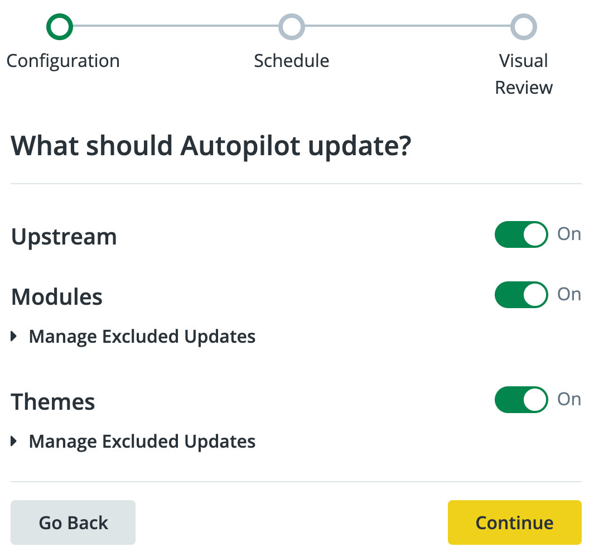
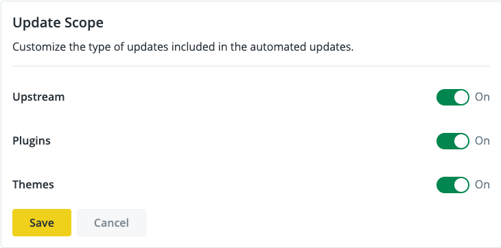
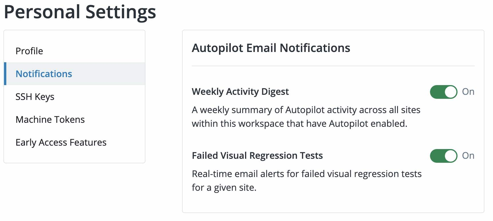

## Enable Autopilot

Autopilot can be enabled for individual sites, or in bulk, within each eligible Workspace.

<Wistia src="c15eoj3eca" />

1. [Switch to the Workspace](/guides/new-dashboard/workspaces#switch-between-workspaces) for the site's Organization to work with Autopilot before you continue.

   

1. [Commit any staged changes](/guides/sftp/sftp-development) that have not been committed before you continue if the site is in [SFTP mode](/guides/sftp).

1. Click the <Icon icon="robot"/> **Autopilot** icon in the Global Primary Navigation.

1. View the list of sites for which Autopilot is available in the **Site** column of the **Other Sites** table.

   To activate Autopilot for a single site, select the checkbox next to that site and click the **Activate Autopilot** button. There, you can update settings for the Schedule you'd like Autopilot to run and the Deployment Destination.

   

   To activate Autopilot for sites in bulk, select the checkboxes for the sites you want to activate, and then click the **Activate Autopilot** button. You can update settings for the Schedule you'd like Autopilot to run and the Deployment Destination. You can select up to 100 sites. Please note that you cannot access the Autopilot Setup Wizard when enabling in bulk.

1. Select the deployment destination: Dev, Test, Live, or Do Not Deploy <Popover title="Do Not Deploy" content="Your updates will be tested but not deployed to any environment if you select this option. This stops updates at the Autopilot Multidev. Refer to <a class='external' href='https://docs.pantheon.io/guides/autopilot/enable-autopilot/#update-destination--frequency'>Update Destination & Frequency</a>for more information." />

   <Alert title="Note" type="info" >

   Autopilot will pre-select a few pages for visual regression testing and will set the frequency to weekly by default.

   </Alert>

   During setup, use the buttons at the bottom to navigate between steps. If you use the browser's back button instead of **Go Back**, you'll lose any unsaved changes.

## Autopilot Setup Wizard

The Autopilot setup wizard automatically displays after you click **Customize** when you activate Autopilot for a single site. You must complete all items in the Configuration, Schedule, and Visual Review steps.

### Configuration
<Wistia src="158bo3jnms" />

1. Use the **On**/**Off** toggles to choose which features and elements should be tracked or excluded from updates.

   Any elements that Autopilot detects as available for exclusion will be listed in each category (Modules, Plugins, Themes).

1. Click **Manage Excluded Updates** then the **Exclude** button on the element's row to exclude it from Autopilot updates.

1. Click **Continue**.

   

### Schedule

1. Set the **Deployment Destination** to the desired environment:

   - Dev
   - Test
   - Live
   - Do Not Deploy <Popover title="Do Not Deploy" content="Your updates will be tested but not deployed to any environment if you select this option. This stops updates at the Autopilot Multidev. Refer to <a class='external' href='https://docs.pantheon.io/guides/autopilot/enable-autopilot/#update-destination--frequency'>Update Destination & Frequency</a> for more information." />

1. Set the **Update Frequency** to schedule Autopilot to run:

   - Never (Update Manually)
   - Monthly
   - Weekly
   - Daily
   - Custom

   <Alert title="Note"  type="info" >

   Daily and Custom options are available to sites owned by Platinum and Diamond Workspaces.

   </Alert>

   <Partial file="autopilot/custom-scheduling.md" />

1. Select the **Sync Live Environment** checkbox to sync environments.

   The **Sync Environment** feature syncs your Live environment to your Dev environment before Autopilot performs updates. Your databases and files will be synced, but not your code. If the Dev code does not match the Live code, Autopilot will use the code in the Dev environment.

   

1. Click **Continue** to choose pages for screenshot comparison tests.

### Visual Review

1. Add pages to track for visual regression testing.

   Autopilot automatically suggests up to ten URL paths during setup:

1. Click **Save** to initialize Autopilot on the Site.

1. Click **Status** in the Autopilot sidebar for the current status of the testing. This process might take a while:

## Autopilot Configuration - Manage Autopilot Settings

You can configure a single site or use the bulk feature to configure multiple sites at the same time.

### Configure a Single Site

1. Navigate to the **<Icon icon="robot"/> Autopilot** page of the Workspace, click **Actions** <Icon icon="angleDown" />, and then click **Manage Autopilot Settings**.

   The Autopilot Configuration page shows all the steps from the initial setup on one page.

   If the Site uses [Integrated Composer](/guides/integrated-composer) (including all Drupal sites), Autopilot will show warnings in the sections where Composer manages updates.

1. Click **Save** for each section of the configuration in which you make changes.

### Configure Sites in Bulk

1. Navigate to the **<Icon icon="robot"/> Autopilot** page of the Workspace.

1. Select the checkboxes for the sites you wish to activate in the **Site** column.

1. Click the **Bulk Actions** button and then select **Manage Settings**.

   Manage Settings allows you to set the Schedule you'd like Autopilot to run on, the Environment Sync, and the Deployment Destination.

   

   Please note that you can still access these settings, and more advanced settings, for individual sites if you select an individual site and click **Configuration** on the left-hand menu.

### Update Scope

Use the **On**/**Off** toggle to choose which features and elements should be tracked for updates then click **Save**.

### Update Destination & Frequency

You can determine how often Autopilot runs and select where you want successful updates deployed in the Destination and Frequency section. Some selection options are grayed out for customers with Gold plans. Only customers with Platinum and Diamond plans have the ability to choose a setting for each option.

1. Set the **Update Frequency** to schedule Autopilot to run:

   - Never (Update Manually)
   - Monthly
   - Weekly
   - Daily
   - Custom

   <Alert title="Note"  type="info" >

   Daily and Custom options are available to sites owned by Platinum and Diamond Workspaces.

   </Alert>

   <Partial file="autopilot/custom-scheduling.md" />

1. Select the **Sync Live Environment** checkbox to sync environments.

   The **Sync Environment** feature syncs your Live environment to your Dev environment before Autopilot performs updates. Your databases and files will be synced, but not your code. If the Dev code does not match the Live code, Autopilot will use the code in the Dev environment.

1. Use the **Deployment Destination** dropdown menu to choose which environment Autopilot should deploy up to:

   - Dev
   - Test
   - Live
   - Do Not Deploy
     - Your updates will be tested but not deployed to any environment if you select this option. This stops updates at the Autopilot Multidev. Your updates will appear under **Ready to Deploy** if the updates pass VRT. Your updates will appear under **Needs Review** if the updates fail VRT. The updates must be deployed manually from either location.

1. Click **Save** to save the changes.

### Update Visual Test Screenshots

You can add pages to track for visual regression testing, along with a percent of acceptable change.

1. Click **<Icon icon="circlePlus" /> Add** to add more pages.

1. Click **Save** to save changes.

#### Acceptable Change

Autopilot allows you to configure a threshold of acceptable change so that small, expected changes don't trigger false positives. This is useful for common changes like:

- Randomized testimonials feeds
- Sliders
- Social (Twitter, Facebook, Pinterest, etc.) feeds
- Advertising

For percent change, consider that a 1% change is like a 1000 pixel wide image shifting 10 pixels over.

You can adjust this setting later for individual tests.

Additional DOM element exclusion is in active development.

### Excluded Updates

Autopilot checks for plugins, modules, and themes that are eligible for exclusion. You can choose what you would like to be excluded.

1. Click <Icon icon="rotate" />**Refresh Updates** to scan for available updates that can be excluded from Autopilot.

1. Select updates that should be excluded and then click **Save**.

### Excluded Web Elements

You can add any CSS selectors that you want to exclude from the visual regression tests.

1. List the CSS selectors you want to exclude from VRT, using a comma or line break to separate elements in the list.

1. Click **Save**.

## Configure Autopilot for Premium and Paid Plugins

Autopilot supports the use of premium and paid WordPress plugins. It is important to note that premium and paid plugin configuration varies case-by-case depending on how individual plugins handle their licensing.

Before you begin:

1. Review the [WordPress Plugins and Themes with Known Issues](/plugins-known-issues) document.

1. Ensure that the plugins or themes are compatible with Pantheon. Plugins and themes will not work on Pantheon if they:

   - Require Apache
   - Require customized `.htaccess` files
   - Require modifications to Nginx configuration files
   - Require PostgreSQL or other non-MySQL compatible databases

1. Review the [Install Plugins section](/guides/wordpress-git/plugins/) of the [Using Git with SFTP and WordPress](/guides/wordpress-git/) guide to ensure that you install your plugins correctly.

### General Paid and Premium Plugin Autopilot Configuration

In general, if the paid or premium plugin's license is active on your Dev environment before the Autopilot environment is created/converged, it should be active on your Autopilot environment at update time.

### License Activation Required on Individual Environments

Some premium and paid plugins require the license to be explicitly activated on each environment, for example, if you are registering the site for a per-domain license.

1. Ensure that the plugin updates work with WP-CLI (99% plugins work with WP-CLI).

1. Ensure that the license is active on your Dev environment.

1. Activate the license on your Autopilot environment. **Do not** remove the license on the Dev environment.

1. Provide Autopilot with access if the plugin requires it (this varies by plugin) and/or configure the plugin as needed.

## Enable Autopilot Email Notifications
<Wistia src="7o76jael2w" />

Configure email notifications for Autopilot alerts and activity digests in your Personal Workspace settings:

<Partial file="autopilot/autopilot-email-notifications.md" />

1. Click the <Icon icon="user" /> avatar in the upper right corner and click <Icon icon="userGear" /> **Personal Settings**.

1. Click **Notifications** and select your desired settings in the **Autopilot Email Notifications** section.

## More Resources

- [Autopilot Pre-Configuration Checklist](/guides/autopilot/autopilot-preconfiguration/)

- [Autopilot FAQs](/guides/autopilot/autopilot-faq)

- [Autopilot for Custom Upstreams Guide](/guides/autopilot-custom-upstream)

- [Deactivate Autopilot](/guides/autopilot/autopilot-deactivate)
