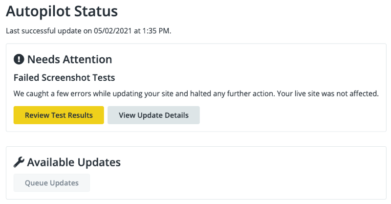
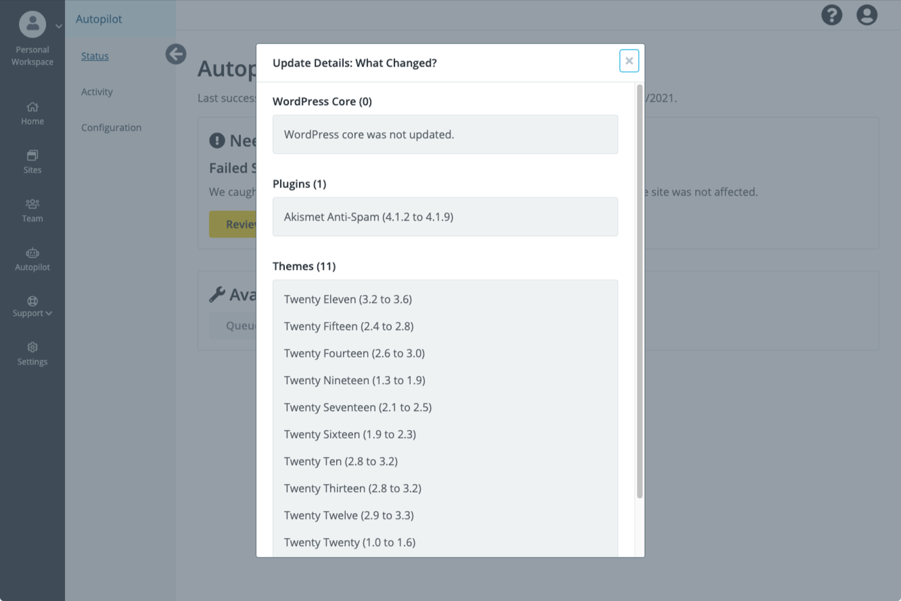
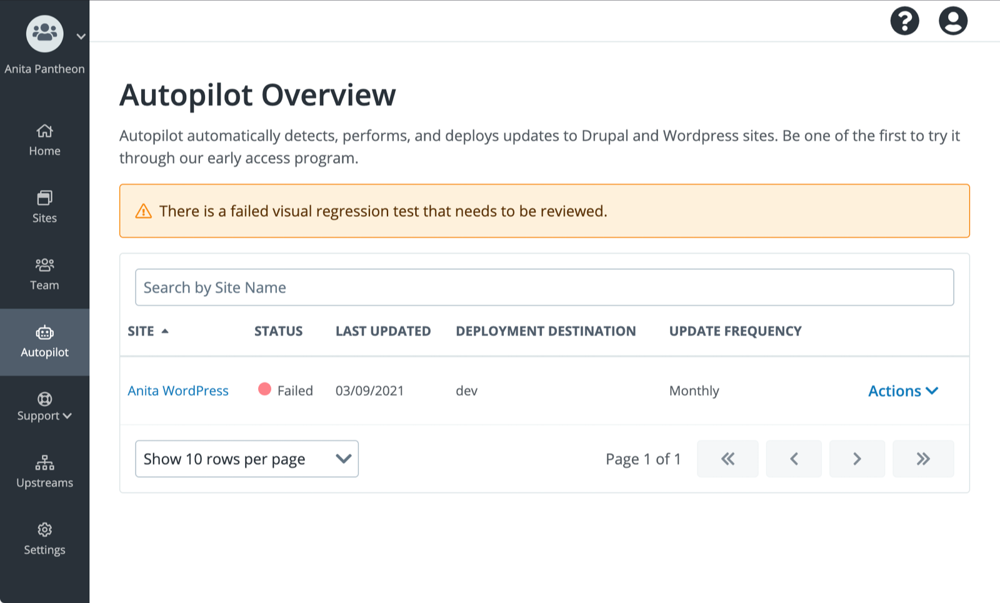

Autopilot updates and visually tests a copy of your site on a [Multidev](/multidev) so it can detect issues before applying them.

## Successful Tests

If you’re not comfortable with Autopilot deploying all the way to the Live environment, you can have Autopilot only deploy updates to Dev or Test and stop. You can proceed with other manual or automated QA processes, and deploy from the Test to Live environment when ready.

You can specify the environments to which Autopilot deploys. When all tests pass, it can deploy to the:

- Dev environment only: A good choice for a site under continual active development
- Test environment (after Dev): A good choice for a high traffic site that needs an extra level of manual quality assurance (QA) or automated CI
- Live environment (after Dev and Test)

## Failing Tests

Autopilot can report failures via email or [Quicksilver hooks](/quicksilver#hooks) immediately, and send a weekly email report summarizing all Autopilot activity.

If an error is detected during an update attempt, the **Autopilot Status** shows **Needs Attention** with two options to **Review Test Results** or to see **What Changed**.

Click **What Changed?** for **Update Details**:

You may need to investigate the error in the Autopilot Multidev.

From the **Autopilot Overview**:

### Acknowledge All Failed Test Results Before You Run Another Test

When a failed test requires review, no new tests can be run on the site until the results have been approved or discarded through Autopilot.

## FAQ

### Is there a limit to the number screenshots Autopilot will take?

Yes. Depending on your [Account](/support#support-features-and-response-times), Autopilot can be set for up to 25 pages on each site. It will check for updates once a week, and can also be run on demand.
