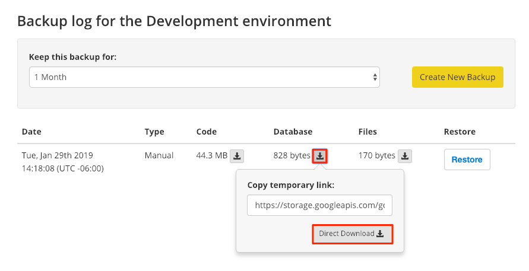

This section provides information on how to access your backups from your Pantheon dashboard and the command line.

Pantheon backups are stored offsite on Google Cloud Storage instances. We recommend a full-fledged backup solution for retention. For example, the following script can be executed from an external cron job to send backups to your own Amazon S3 instance:

<Download file="pantheon-backup-to-s3.sh" />

GITHUB-EMBED https://github.com/pantheon-systems/documentation/blob/main/source/scripts/pantheon-backup-to-s3.sh.txt bash GITHUB-EMBED

## Access Backups Via the Dashboard

The jobs indicator returns to its start state to let you know that the task is complete when the backup finishes. A new backup appears in your Backup Log with three separate archives (code, database, and files).

The newest backup appears at the top of the list. A backup will no longer be in the list of available archives when the retention period expires.

1. Navigate to your site's dashboard.

1. Click **Backups** and then click **Backup Log**.

1. Click the down arrow next to **Code**, **Database**, or **Files** to access the link for the offsite backup.



<Alert title="Note" type="info">

Some older versions of Google Chrome can cause database backups to be downloaded with incorrect file extensions (e.g. `.sql` instead of `sql.gz`). You can resolve this problem by updating Google Chrome or by renaming the file using the correct extension.

</Alert>

## Access Backups Via the Command Line

You can copy the temporary URL provided via the Dashboard and download your backups from the command line using [`Wget`](https://www.gnu.org/software/wget/) or [Terminus](/terminus). Links to backups are assigned URLs directly from Google Cloud Storage and expire. Return to the Dashboard and get a new link to the archive if a link has expired.

### Unix/MacOS

```bash{promptUser: user}
wget https://storage.googleapis.com/gcs-pantheon-backups/...
```

### Windows

Wrap the URL in double quotes (`"`) when using Wget in the Windows Powershell. The shell doesn't return any output until the download completes:

```bash{promptUser: winshell}
wget "https://storage.googleapis.com/gcs-pantheon-backups/..."
```

### Terminus

Note that `--element=all` is only available when creating backups and not when downloading:

```bash{promptUser: user}
terminus backup:get $site.$env --element=<code|files|db> --to=path/to/file.tar.gz
```

File and code backups are saved as `.tar.gz`, while database backups are saved as `.sql.gz`. Be sure to use the correct extension when specifying the file path for `--to`.

Select an older archive by running `terminus backup:list $site.$env`, copying the filename, and pasting it in the `--file=<filename>` option when downloading:

```bash{promptUser: user}
terminus backup:get $site.$env --file=<filename> --to=path/to/file.tar.gz
```

## More Resources

- [Terminus](/terminus)
- [AWS S3 Setup for WordPress](/guides/wordpress-developer/wordpress-s3)
- [AWS S3 Setup for Drupal](/drupal-s3)
