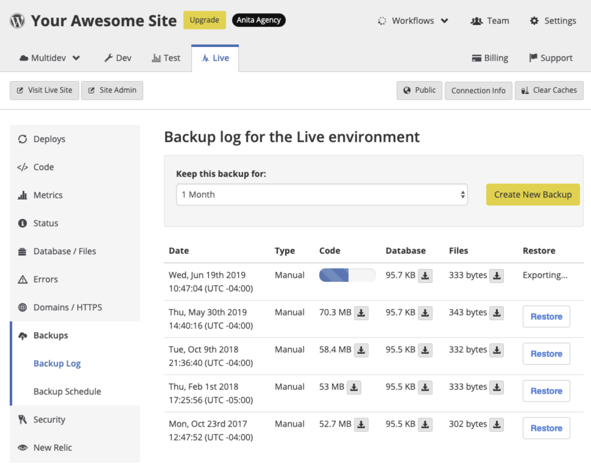

This section provides information on how to create new backups. We strongly urge you to back up your site regularly.

<Alert title="Exports" type="export">

This section offers [Terminus](/terminus) commands, using the variables `$site` and `$env`. Export these variables in your terminal session to match your site name and the correct environment:

```bash{promptUser: user}
export site=yoursitename
export env=dev
```

</Alert>

## Create a Backup in the Dashboard

You can create a new backup and set the length of time a backup is kept. You must set this for every environment (Dev, Test, and Live).

1. [Go to the Site Dashboard](/guides/account-mgmt/workspace-sites-teams/sites#site-dashboard).

1. Click **Backups** and then click **Create New Backup**. The status of the new backup is shown in the progress bar. The jobs workflow shows the number of active jobs. You can continue on with development while the backup is in progress.


<Alert title="Warning" type="danger">

Run backups separately for each environment (Dev, Test, and Live). Changes will be lost and unrecoverable if you have changes in SFTP mode that you have not committed. All backups are based on the code currently in the Git log.

</Alert>



## Create a Backup in Terminus

You can use [Terminus](/terminus) to create a backup:

```bash{promptUser: user}
terminus backup:create $site.$env --element=<element> --keep-for=<days>
```

## More Resources

- [terminus backup:create Command](/terminus/commands/backup-create)
- [SFTP on Pantheon](/guides/sftp)
- [Git on Pantheon](/guides/git)