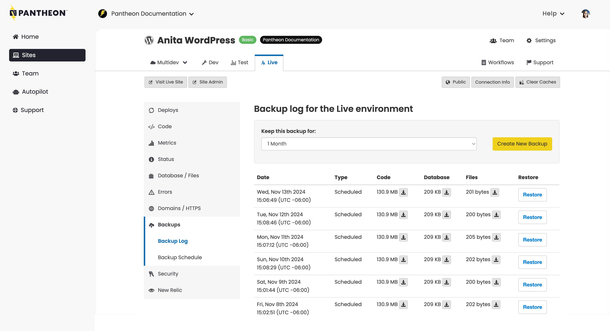

This section provides information on how to restore environments from a backup.

Pantheon's Backups Tool and unique [environment configuration](/guides/environment-configuration) allows you to perform complex environmental restorations. This section covers the most common Backups restoration process. Consult the links below if you require a more complex restoration process.

- [Restore an Environment From Another Environment's Backup](/guides/environment-configuration/restore-environment-backup#restore-an-environment-from-another-environments-backup)
- [Restore Databases and Files](/guides/environment-configuration/restore-environment-backup#restore-database-and-files)
- [Restore the Live Environment](/guides/environment-configuration/restore-environment-backup#restore-the-live-environment)
- [Restore Large Sites](/guides/environment-configuration/restore-environment-backup#restoring-large-sites)

## Before you Begin the Restoration Process

It is important that you and your team know that this is a **destructive** process that will **wipe** your database and files, and restore them from the backup. This process also restores the codebase to the state the environment was in when backed up.

Your restore is placed in a queue and then executed when you select this process. Depending on the size of the site, this operation may take some time. Be patient and do not attempt to restart the restore unless you are confident that it completed. During the restore process, files might show as missing and the site as unavailable. [Contact support](/guides/support/contact-support/) if you have questions.



## Restore an Environment From Backup

Each manual and automatic backup can be directly restored to that environment within the Pantheon Dashboard. Refer to [Restoring an Environment From a Backup](/guides/environment-configuration/restore-environment-backup) for more information.

1. [Go to the Site Dashboard](/guides/account-mgmt/workspace-sites-teams/sites#site-dashboard).

1. Click **Backups** and then click **Backup Log**.

1. Click **Restore** next to the desired backup to restore a manual or automatic backup (Code, Database, and Files).

<Alert title="Note" type="info">

The **Restore** button is only available when your **Development Mode** is set to **Git** in your Dev or Multidev environments. This does not apply to production environments (Test and Live). Refer to [The Site Dashboard](/guides/account-mgmt/workspace-sites-teams/sites) for more information.

</Alert>


## Restore Process Time

Three separate workflow processes are triggered in the dashboard when the **Restore** button is clicked. A process runs for code, database, and files (assets such as media files, images, or other attachments). The workflows may complete at different times.

There is no way to determine specifically how long any one restore job will take, as it varies per site. The usual factor that extends the restore process is the *count*, or number of files in the codebase or files backup. Sites with 10,000 files or more can take over an hour to restore, though this is not a strict ratio as individual file sizes also affect process time.

You can check the last backup duration to estimate the potential restore process time. The Terminus `workflow:list` command displays workflow duration in seconds within the **Time Elapsed** field.

```bash{outputLines: 2-9}
terminus workflow:list yoursite-name --fields id,env,workflow,time --format table
 -------------------------------------- ------------- --------------------------------------------- --------------
  Workflow ID                            Environment   Workflow                                      Time Elapsed
 -------------------------------------- ------------- --------------------------------------------- --------------
  31442e94-9e34-11e9-b40b-42010a800275   dev           Automated backup for the "dev" environment    2292s
  cce72480-9e2c-11e9-bece-42010a8001a4   live          Automated backup for the "live" environment   1290s
  cdb6df62-9d6a-11e9-85d1-42010a800117   dev           Automated backup for the "dev" environment    4328s
  f194a2fa-9d62-11e9-b1a0-42010a800117   live          Automated backup for the "live" environment   5152s
  de32c0fa-9ca1-11e9-a9aa-42010a800117   dev           Automated backup for the "dev" environment    2335s
```

## More Resources

- [Environment Configuration](/guides/environment-configuration)
- [Pantheon WebOps Workflow](/pantheon-workflow)