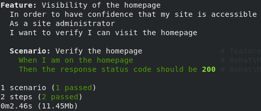

[Behat](https://behat.org) is a PHP framework for automated testing. In our [blog](https://pantheon.io/blog/behat-web-developers) we discuss the advantages of using Behat to continuously test your site. This guide demonstrates how to install Behat and [Mink](http://mink.behat.org/en/latest/), and how to write simple tests.

## Before You Begin

This guide requires:

- A local installation of [Composer](https://getcomposer.org/).
- A locally running dev site or remote site URL to point tests to.
- An empty project directory. In the commands below we assume the directory `~/projects/simple-behat-test`.

<Alert title="Note" type="info">

As packages pulled by Composer are updated (along with their dependencies), version compatibility issues can pop up. Sometimes you may need to manually alter the version constraints on a given package within the `require` or `require-dev` section of `composer.json` in order to update packages. See the [updating dependencies](https://getcomposer.org/doc/01-basic-usage.md#updating-dependencies-to-their-latest-versions) section of Composer's documentation for more information.

As a first troubleshooting step, try running `composer update` to bring `composer.lock` up to date with the latest available packages (as constrained by the version requirements in `composer.json`).

</Alert>

## Install Behat and Mink

1. Behat and Mink are both written in PHP, so it makes sense that they are managed with Composer. That means installing them in a project is quick and easy:

  ```bash{promptUser: user}
  cd ~/projects/simple-behat-tests
  composer require --dev behat/behat behat/mink-extension behat/mink-goutte-driver behat/mink-selenium2-driver
  ```

1. Now that we've downloaded Behat, Mink, and a browser driver, we need to initialize Behat:

  ```bash{promptUser: user}
  ./vendor/bin/behat --init
  ```

  The output should read:

   ```none
   +d features - place your *.feature files here
   +d features/bootstrap - place your context classes here
   +f features/bootstrap/FeatureContext.php - place your definitions, transformations and hooks here
   ```

## Configure Behat

1. Behat is configured with the file `behat.yml`. If you haven't used [**YAML**](https://yaml.org/) before, there is a good [YAML quickstart guide](https://yaml.org/start.html). Make the new file, and add contents below. Remember to replace `https://your-site-url/` with the actual URL to your site:

   ```yml:title=behat.yml
   default:
     suites:
       default:
         contexts:
           - FeatureContext
           - Behat\MinkExtension\Context\MinkContext

     extensions:
       Behat\MinkExtension:
         base_url: https://your-site-url/
         goutte: ~
         selenium2: ~
   ```

1. Now, let's check out what step definitions are available to us:

   ```bash{promptUser: user}
   ./vendor/bin/behat -dl
   ```

   This command will return a list of available step definitions. Don't worry about parsing through the list now.

## Write and Run Tests

Next, we can take some of the steps we listed above, most of which are provided by Mink, and write our first test. Behat tests have the `.feature` extension and are located in the `features` directory by default.

1. Create a file named `visit-homepage.feature` inside the `features` directory, with the following contents:

   ```gherkin
   Feature: Visibility of the homepage
     In order to have confidence that my site is accessible
     As a site administrator
     I want to verify I can visit the homepage

     Scenario: Verify the homepage
       When I am on the homepage
       Then the response status code should be 200
   ```

1. Now that we have things setup and created our first test, let's run Behat:

   ```bash{promptUser: user}
   ./vendor/bin/behat --strict --colors  --format-settings='{"paths": false}'.
   ```

   You should see output like this:

   

   **Note:** The extra parameters are not required, just a common set of preferences. Here's what they do:

    - `--strict`: Makes Behat run in strict mode, meaning proper exit codes are thrown if tests pass/fail. This is critical for use on Continuous Integration so that jobs there will pass or fail along with the Behat tests.
    - `--colors`: Ensures a colorized output, making the tests a bit more legible.
    - `--format-settings='{"paths": false}'`: Stops Behat from printing file paths and line numbers next to each step in the test, which can get noisy. If tests are failing, this can be re-enabled to help debug.

## Next Steps

Review the available step definitions again by running `./vendor/bin/behat -dl`, and create more tests by adding additional `.feature` files to the features directory.

If you find you are repeating the same things over and over, such as logging into WordPress or Drupal, try framework extensions. Each one adds additional steps, specific to their corresponding framework:

- [Behat WordPress Extension](https://wordhat.info/)
- [Behat Drupal Extension](https://www.drupal.org/project/drupalextension)

## See Also

- [Composer Fundamentals and Workflows](/composer)
- [Behat.org](http://behat.org)
