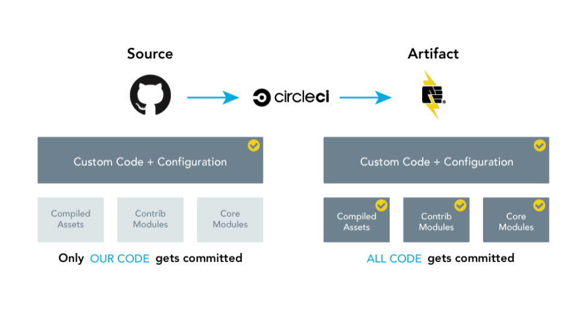

## What Is Build Tools?

Build Tools is a project that encompasses multiple Pantheon-maintained repositories that work together to connect the tools and automation necessary for an advanced [WebOps workflow](https://pantheon.io/webops).

The main goals of the Build Tools project are to:

1. Ease the creation of new projects on Pantheon, making use of an external Git provider and a Continuous Integration (CI) service.
1. Add additional commands to Terminus to make tasks common in an automated workflow easier.

### Pantheon Build Tools Repositories

The repositories that are a part of Build Tools are:

- [**Terminus Build Tools Plugin**](https://github.com/pantheon-systems/terminus-build-tools-plugin) - Extends Pantheon's Terminus command-line interface with a collection of commands useful for projects with an external Git provider and a CI.
- **Template Repositories** - Repositories for [WordPress](https://github.com/pantheon-systems/example-wordpress-composer) and [Drupal 8](https://github.com/pantheon-systems/example-drops-8-composer) that include an opinionated set of workflows and deployment scripts. These are templates or examples; not frameworks. They are meant to be a one-time starting point for new projects and customized as needed.
  - By default, when creating a new Build Tools project one of these example repositories is used as a starting point. Custom starters are also supported.
- [**Build Tools CI Dockerfile**](https://github.com/pantheon-systems/docker-build-tools-ci/) - A Dockerfile, which is deployed to [quay.io](https://quay.io/repository/pantheon-public/build-tools-ci?tab=tags), for use in CI environments. It contains common tools such as Terminus and the Terminus Build Tools plugin.

These tools work together to help you create and manage your own projects that follow the Build Tools workflow.

### A Build Tools Project's Components

There are three main components to a project created with Build Tools:

1. [Composer](/composer)
1. [Terminus](/terminus)
1. A supported Git and CI combination:
   - [<em class="fa fa-github" /> GitHub](https://github.com) and [CircleCI](https://circleci.com/)
   - [<em class="fa fa-gitlab" /> GitLab](https://about.gitlab.com) with [GitLabCI](https://about.gitlab.com/product/continuous-integration/)
   - [<em class="fa fa-bitbucket" /> BitBucket](https://bitbucket.org/product/) with [BitBucket Pipelines](https://bitbucket.org/product/features/pipelines)

### Component Overview

This is an overview of how Build Tools works while using Github and Circle CI:

<Enablement title="Automation Training" link="https://pantheon.io/agencies/learn-pantheon?docs">

Master Composer, automated testing, and other advanced workflow concepts with help from our experts. Pantheon delivers custom workshops to help teams master our platform and improve their [WebOps](https://pantheon.io/webops) workflow.

</Enablement>

## Build Tools Workflow

Build Tools projects extend the [Pantheon workflow](/pantheon-workflow) by adding an external Git provider and a CI service.

In this workflow, only files unique to the project are tracked as part of the external Git repository. The CI then builds a production artifact, deploys the fully built site to Pantheon, and runs a suite of automated tests.

This is quite different than working with the Pantheon-hosted Git repository for each site, where all code must be committed.

## Is Build Tools The Right Tool?

It's easy to create a Build Tools project, but you should also understand what all of the components are doing and how they work together. This is not a "set it and forget it workflow," but rather an entry point for projects requiring automated workflows.

Build Tools projects have many benefits. However, there is also added complexity and maintenance. You and your team, must decide when the benefits outweigh the additional complexity and maintenance.

In general, Build Tools is a good fit for a project if the project needs are complex enough to require a more complex workflow, and you and your team are comfortable with command-line tools and bash scripts and wish to use a CI to automate the build, deploy, and test the project workflow.

<Alert title="Note" type="info">

Pantheon's [support team](/support) cannot troubleshoot issues with third-party services like GitHub or CircleCI.

If you need help configuring external systems, consider joining the [Community Forum](https://discuss.pantheon.io/) or posting in our [Pantheon Community Slack Instance](https://slackin.pantheon.io/) in the `#composer-workflow` channel.

</Alert>

<Accordion title="Build Tools Changelog" id="changelog" icon="newspaper">

<BuildToolsChangelog />

</Accordion>

<Alert title="Note" type="info">

We just released Build Tools 2.0. If you need help troubleshooting issues or getting set up, please reach out via the [Build Tools issue queue](https://github.com/pantheon-systems/terminus-build-tools-plugin/issues) and the maintainers would be happy to help you.

</Alert>

## Considerations

As Terminus does not support Windows, Build Tools does not either. You can install Terminus Build Tools on macOS or Linux. Windows 10 users can install the [Windows Subsystem for Linux](https://docs.microsoft.com/en-us/windows/wsl/install-win10).