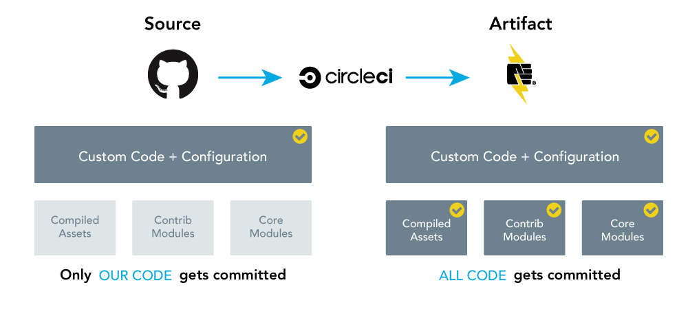

<Alert type="danger" title="Warning">

The current version of the Build Tools plugin is designed for Terminus 1.x, and is not yet compatible with [current versions](/terminus/updates) of Terminus. We are working on a new version of the Terminus Build Tools plugin with Terminus 2 support and will update this guide once it is released. In the meantime, you can test the [beta release](https://github.com/pantheon-systems/terminus-build-tools-plugin/releases/latest).

</Alert>

This guide describes how to use build tools such as GitHub and CircleCI with Composer to implement a collaborative, team-based Continuous Integration workflow using Pull Requests for Drupal 8 sites on Pantheon. While this guide demonstrates [Drupal 8](https://github.com/pantheon-systems/example-drops-8-composer), the same workflow can be applied to [WordPress](https://github.com/pantheon-systems/example-wordpress-composer) and [Drupal 7](https://github.com/pantheon-systems/example-drops-7-composer) sites.

<BuildTools />

<Enablement title="Automation Training" link="https://pantheon.io/agencies/learn-pantheon?docs">

Master Composer concepts with help from our experts. Pantheon delivers custom workshops to help development teams master the platform and improve internal WebOps.

</Enablement>

## Artifact Deployment
Only files unique to the project are tracked as part of the project's main "source" repository on GitHub, which requires an abstraction layer to compile dependencies and deploy an entire "artifact" to the site repository on Pantheon. The abstraction layer is facilitated by CircleCI in the Pantheon maintained examples, but the principles are the same for other continuous integration service providers.

Composer is used to fetch dependencies declared by the project as part of a CircleCI build step. This ensures that the final composed build results are installed on Pantheon:



<Accordion title="Pull Requests" id="understand-pr" icon="lightbulb">

One advantage of managing code this way is that it keeps the change sets (differences) for pull requests as small as possible. If a pull request upgrades several dependencies, only the dependency metadata file will change; the actual code changes in the upgraded dependencies themselves are not shown.

GitHub pull requests (PRs) are a formalized way of reviewing and merging a proposed set of changes to the source repository. When one member of a development team makes changes to a project, all of the files modified to produce the feature are committed to a separate branch, and that branch becomes the basis for the pull request. GitHub allows other team members to review all of the differences between the new files and their original versions, before merging the PR to accept changes.

</Accordion>

## Before You Begin

1. Install [Composer](https://getcomposer.org).
2. Install the most recent release of [Terminus](/terminus):

    ```bash
    curl -O https://raw.githubusercontent.com/pantheon-systems/terminus-installer/master/builds/installer.phar && php installer.phar install
    ```

3. [Add an SSH key](/ssh-keys) within your User Dashboard to enable passwordless access and avoid authentication prompts. Otherwise, provide your Pantheon Dashboard credentials when prompted.

4. [Generate a Machine Token](https://dashboard.pantheon.io/machine-token/create), then authenticate Terminus:

      ```bash
      terminus auth:login --machine-token=<machine-token>
      ```

5. Create the `$HOME/.terminus/plugins` directory if it does not already exist:

      ```bash
      mkdir -p $HOME/.terminus/plugins
      ```

6. Install the [Terminus Composer Plugin](https://github.com/pantheon-systems/terminus-composer-plugin):

    ```bash
    composer create-project -n --no-dev -d $HOME/.terminus/plugins pantheon-systems/terminus-composer-plugin:~1
    ```

7. Install the [Terminus Drupal Console Plugin](https://github.com/pantheon-systems/terminus-drupal-console-plugin):

    ```bash
    composer create-project -n --no-dev -d $HOME/.terminus/plugins pantheon-systems/terminus-drupal-console-plugin:~1
    ```

8. Install the [Terminus Build Tools Plugin](https://github.com/pantheon-systems/terminus-build-tools-plugin). Update the version number in this example from `2.0.0-beta12` to the current version:

    ```bash
    composer create-project --no-dev -d $HOME/.terminus/plugins pantheon-systems/terminus-build-tools-plugin:^2.0.0-beta12
    ```

  <Alert title="Note" type="info">

  The Terminus Build Tools Plugin does not support private repositories.

  </Alert>

9. [Authorize CircleCI on GitHub](https://github.com/login/oauth/authorize?client_id=78a2ba87f071c28e65bb).

    If you are redirected to the CircleCI homepage, you have already authorized the service for your GitHub account. Nice! Way to be ahead of the game.

<Alert title="Note" type="info">

Pantheon's [support team](/support) cannot troubleshoot issues with third-party services like GitHub or CircleCI.

If you need help configuring external systems, consider joining the [Community Forum](https://discuss.pantheon.io/) or posting in our [Pantheon Community Slack Channel](https://slackin.pantheon.io/).

</Alert>


### Access Tokens (Optional)

The Build Tools plugin will prompt you to create access tokens for both [GitHub](https://github.com/settings/tokens) and [CircleCI](https://circleci.com/account/api), which are stored as environment variables. The GitHub token needs the **repo** (required) and **delete-repo** (optional) scopes. You may optionally generate these tokens ahead of time and manually export them to the local variables `GITHUB_TOKEN` and `CIRCLE_TOKEN`, respectively:

```bash
export GITHUB_TOKEN=yourGitHubToken
export CIRCLE_TOKEN=yourCircleCIToken
```

If you need to replace a token, navigate to your [project settings page in CircleCI](https://circleci.com/docs/2.0/env-vars/#adding-environment-variables-in-the-app).
