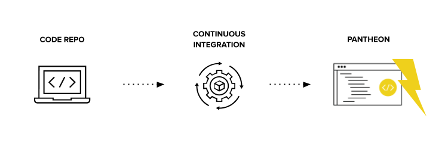
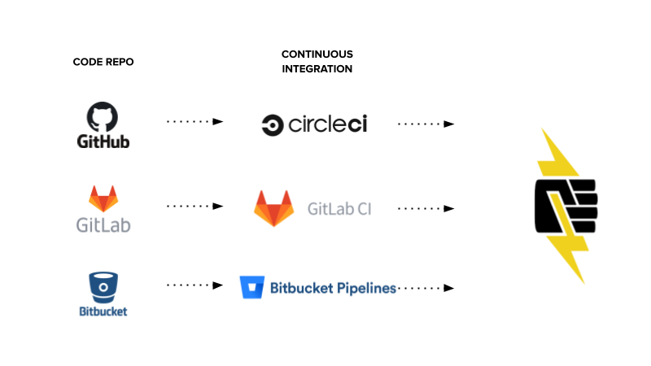

## What Is Build Tools?

Build Tools connects Pantheon with your CI service and external Git provider. It also includes Composer support, Automated Testing, and best practice recommendations for your advanced [WebOps workflow](https://pantheon.io/webops). This is an extension of the [Pantheon WebOps workflow](/pantheon-workflow).

Build Tools helps you create new projects that:

1. Allow customization with your choice of Git provider and Continuous Integration (CI) service.

1. Provides extra Terminus commands and customization options for common workflow tasks and to customize your build.

1. Includes templates and best practices to help level up WebOps teams with automated testing, composer updates, and more.

1. Avoid the complexity of combining multiple Pantheon start-state repositories on your own.

### A Build Tools Project's Components

Build Tools currently supports the following combinations of Git and CI services:

1. [<em class="fa fa-github" /> GitHub](https://github.com) and [CircleCI](https://circleci.com/)

1. [<em class="fa fa-gitlab" /> GitLab](https://about.gitlab.com) with [GitLabCI](https://about.gitlab.com/product/continuous-integration/)

1. [<em class="fa fa-bitbucket" /> BitBucket](https://bitbucket.org/product/) with [BitBucket Pipelines](https://bitbucket.org/product/features/pipelines)

## Is Build Tools Right For You?

It's quick to get started with a Build Tools project, but it’s also helpful to understand the components and how they work together.

In general, Build Tools might be a good fit if your team is comfortable with:

- command-line tools,
- creating a bash script with Terminus commands,
- CI to automate the deployments.

<Enablement title="Developer Resources" link="https://pantheon.io/learn-pantheon">

Pantheon's Developer Advocacy team holds trainings and Office Hours, and monitors posts in our community forum. Join us to learn about Terminus, automations, advanced workflows like Build Tools, and more.

</Enablement>

## Changelog

You can view the most recent Build Tools release and changelogs in [Pantheon's Build Tools repository](https://github.com/pantheon-systems/terminus-build-tools-plugin/releases).

## More Resources

- [Integrated Composer](/guides/integrated-composer) for another way to manage deployments and dependencies if you don't need a CI.
