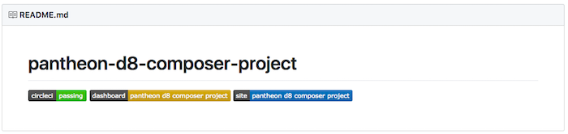

In this section we'll use the Terminus Build Tools Plugin to create a new Pantheon Site, a corresponding GitHub repository, and configure CircleCI to run tests.

1. Create a new project (replace `pantheon-d8-composer-project` with the name of your new site):

  ```bash
  terminus build:project:create d8 pantheon-d8-composer-project
  ```

  <Alert title="Note" type="info">

  Pantheon also maintains Composer based examples for [WordPress](https://github.com/pantheon-systems/example-wordpress-composer) and [Drupal 7](https://github.com/pantheon-systems/example-drops-7-composer) that are currently in alpha, requiring `--stability=alpha` in the command line options. While this guide demonstrates Drupal 8, the same workflow can be achieved on all frameworks.

  </Alert>

  Provide additional information as prompted, such as Organization (if any), and tokens for GitHub and CircleCI access:

  

  This process will create a secure keypair, with the public key going to Pantheon and the private key stored in CircleCI. If you remove either key, you will need to [generate a new pair](/ssh-keys) manually to fix the build process.

  <Accordion title="Troubleshooting" id="troubleshoot-install" icon="wrench">

  <Alert title="Note" type="info">

  As packages pulled by Composer are updated (along with their dependencies), version compatibility issues can pop up. Sometimes you may need to manually alter the version constraints on a given package within the `require` or `require-dev` section of `composer.json` in order to update packages. See the [updating dependencies](https://getcomposer.org/doc/01-basic-usage.md#updating-dependencies-to-their-latest-versions) section of Composer's documentation for more information.

  As a first troubleshooting step, try running `composer update` to bring `composer.lock` up to date with the latest available packages (as constrained by the version requirements in `composer.json`).

  </Alert>

  ### Composer Content-Length Mismatch and/or Degraded Mode
  If you encounter an issue such as:

  ```php
  The "https://packagist.org/packages.json" file could not be downloaded: failed to open stream: Operation timed out
  Retrying with degraded mode, check https://getcomposer.org/doc/articles/troubleshooting.md#degraded-mode for more info
  The "https://packagist.org/packages.json" file could not be downloaded: failed to open stream: Operation timed out
  https://packagist.org could not be fully loaded, package information was loaded from the local cache and may be out of date

  [Composer\Downloader\TransportException]
  Content-Length mismatch

  create-project [-s|--stability STABILITY] [--prefer-source] [--prefer-dist] [--repository REPOSITORY] [--repository-url REPOSITORY-URL] [--dev] [--no-dev] [--no-custom-installers] [--no-scripts] [--no-progress] [--no-secure-http] [--keep-vcs] [--no-install] [--ignore-platform-reqs] [--] [<package>] [<directory>] [<version>]

  [error]  Command `composer create-project --working-dir=/private/var/folders/lp/7_1gh83s5mn9lwfjvqqlf1lm0000gn/T/local-sitevPumRP pantheon-systems/example-wordpress-composer pantheon-wp-composer-project -n --stability dev` failed with exit code 1
  ```

  This indicates a network level issue. We recommend contacting your Internet Service Provider (ISP) for support. One way to reduce connection woes is to use a non-standard channel with less activity/noise on wireless modems.

  ### Your requirements could not be resolved to an installable set of packages
  Check the output for the recommended fix. For example, PHP 7.0 is required for WordPress. Once you have resolved the issues as suggested by Composer try the command again.

  ### The site name is already taken on Pantheon
  The following error occurs when running `terminus build:project-create` before authenticating your session with Terminus:

  ```
  BuildToolsCommand.php line 166:
      The site name exampleuniquesitename is already taken on Pantheon.
  ```

  To resolve, [generate a Machine Token](https://dashboard.pantheon.io/machine-token/create), then authenticate Terminus and try the build command again:

  ```bash
  terminus auth:login --machine-token=<machine-token>
  ```

  ### Additional Support
  Pantheon's composer based example repositories are maintained and supported on GitHub. After browsing existing issues, report errors in the appropriate repository's issue queue:

    * [Drupal 8](https://github.com/pantheon-systems/example-drops-8-composer/issues)
    * [Drupal 7 (Alpha)](https://github.com/pantheon-systems/example-drops-7-composer/issues)
    * [WordPress (Alpha)](https://github.com/pantheon-systems/example-wordpress-composer/issues)

  </Accordion>

2. Once your site is ready, the URL to your project page will be printed to your terminal window. Copy this address and paste it into a browser to visit your new project on GitHub:

  

  The badges on your project page provide quick access to the different components used to manage your site:

    - The CircleCI page for your project
    - Your Pantheon dashboard
    - Your test site

  If you click on the CircleCI badge, you can watch your project's initial test run. Once your tests successfully complete, the orange CircleCI "no builds" badge will become a green "passing" badge:

  
