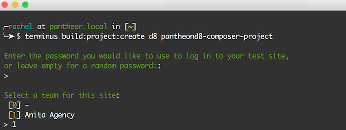

In this section, we will use the Terminus Build Tools Plugin to create a new project consisting of a <GitProvider /> repository, <CIProvider />, and a Pantheon site.

Before beginning, make sure you have the latest versions of Terminus and the Terminus Build Tools plugin installed. If you need help installing either, expand the installation instructions below.

<InstallBuildTools />

## Create a Build Tools Project

Use the options below to configure your project, then run the generated `terminus build:project:create` command.

**Note:** For all available command options, see [the Build Tools Project README](https://github.com/pantheon-systems/terminus-build-tools-plugin/blob/master/README.md#buildprojectcreate)

<BuildProjectCreateCommandGenerator />

1. Create a new project using the command generated above

  Provide additional information as prompted, such as tokens/credentials for <GitProvider /> and <CIProvider />:

  

  This process will create a secure SSH keypair, with the public key going to Pantheon and the private key stored in <CIProvider />. If you remove either key, you will need to run `build:project:repair` to fix the build process. See `build:project:repair -h` for details.

  The project creation process will also set the necessary environment variables, such as the UUID of your the Pantheon site, in <CIProvider />.

  <Accordion title="Troubleshooting" id="troubleshoot-install" icon="wrench">

  <Alert title="Note" type="info">

  As packages pulled by Composer are updated (along with their dependencies), version compatibility issues can pop up. Sometimes you may need to manually alter the version constraints on a given package within the `require` or `require-dev` section of `composer.json` in order to update packages. See the [updating dependencies](https://getcomposer.org/doc/01-basic-usage.md#updating-dependencies-to-their-latest-versions) section of Composer's documentation for more information.

  As a first troubleshooting step, try running `composer update` to bring `composer.lock` up to date with the latest available packages (as constrained by the version requirements in `composer.json`).

  </Alert>

  ### Composer Content-Length Mismatch and/or Degraded Mode
  If you encounter an issue such as:

  ```php
  The "https://packagist.org/packages.json" file could not be downloaded: failed to open stream: Operation timed out
  Retrying with degraded mode, check https://getcomposer.org/doc/articles/troubleshooting.md#degraded-mode for more info
  The "https://packagist.org/packages.json" file could not be downloaded: failed to open stream: Operation timed out
  https://packagist.org could not be fully loaded, package information was loaded from the local cache and may be out of date

  [Composer\Downloader\TransportException]
  Content-Length mismatch

  create-project [-s|--stability STABILITY] [--prefer-source] [--prefer-dist] [--repository REPOSITORY] [--repository-url REPOSITORY-URL] [--dev] [--no-dev] [--no-custom-installers] [--no-scripts] [--no-progress] [--no-secure-http] [--keep-vcs] [--no-install] [--ignore-platform-reqs] [--] [<package>] [<directory>] [<version>]

  [error]  Command `composer create-project --working-dir=/private/var/folders/lp/7_1gh83s5mn9lwfjvqqlf1lm0000gn/T/local-sitevPumRP pantheon-systems/example-wordpress-composer pantheon-wp-composer-project -n --stability dev` failed with exit code 1
  ```

  This indicates a network level issue. We recommend contacting your Internet Service Provider (ISP) for support. One way to reduce connection woes is to use a non-standard channel with less activity/noise on wireless modems.

  ### Your requirements could not be resolved to an installable set of packages
  Check the output for the recommended fix. For example, PHP `7.0` is required for WordPress. Once you have resolved the issues as suggested by Composer try the command again.

  ### The site name is already taken on Pantheon
  The following error occurs when running `terminus build:project-create` before authenticating your session with Terminus:

  ```
  BuildToolsCommand.php line 166:
      The site name exampleuniquesitename is already taken on Pantheon.
  ```

  To resolve, [generate a Machine Token](https://dashboard.pantheon.io/machine-token/create), then authenticate Terminus and try the build command again:

  ```bash
  terminus auth:login --machine-token=<machine-token>
  ```

  ### Additional Support
  Pantheon's composer based example repositories are maintained and supported on GitHub. After browsing existing issues, report errors in the appropriate repository's issue queue:

    * [Drupal 8](https://github.com/pantheon-systems/example-drops-8-composer/issues)
    * [WordPress](https://github.com/pantheon-systems/example-wordpress-composer/issues)

  </Accordion>

2. Once your site is ready, the URL to your project page will be printed to your terminal window. Copy this address and paste it into a browser to visit your new project on <GitProvider />:

  

3. Congratulations! You now have a new <GitProvider /> repository and a new Pantheon site connected together with <CIProvider />. Read on to learn more about the Build Tools workflow in practice.
