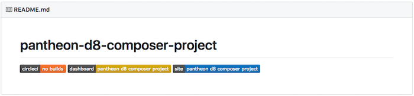

In this section, we will use the Terminus Build Tools Plugin to create a new project consisting of a Git repository, a Continuous Integration service, and a Pantheon site.

<Alert title="Note" type="info">

These instructions are written with GitHub as the Git provider repository, CircleCI as the CI, and a Pantheon site.

Substitute your chosen Git Provider and CI service in these instructions with the options of your choice. See [A Build Tools Project's Components](/guides/build-tools#a-build-tools-projects-components) for the supported combinations.

</Alert>

## Prerequisites

Make sure you have the latest versions of Terminus and the Terminus Build Tools plugin installed.

1. Install [Composer](/composer).
   - Verify your installation with `composer --version`:

    ```bash{outputLines: 2}
    composer --version
    Composer version 1.10.6 2020-05-06 10:28:10
    ```

1. Install the most recent release of [Terminus](/terminus/).
   - Verify your installation with `terminus --version`:

    ```bash{outputLines: 2}
    terminus --version
    Terminus 2.3.0
    ```

1. [Add an SSH key](/ssh-keys) in your User Dashboard to enable passwordless access and avoid authentication prompts. Otherwise, provide your Pantheon Dashboard credentials when prompted.

1. [Generate a Pantheon machine token](https://dashboard.pantheon.io/machine-token/create), then authenticate Terminus.

1. Create the `$HOME/.terminus/plugin` directory if it does not already exist:

  ```bash{promptUser: user}
  mkdir -p ~/.terminus/plugins
  ```

1. Install the [Terminus Build Tools Plugin](https://github.com/pantheon-systems/terminus-build-tools-plugin):

   ```bash{promptUser: user}
   composer create-project --no-dev -d ~/.terminus/plugins pantheon-systems/terminus-build-tools-plugin:^2.0.0
   ```

### Access Tokens (Optional)

The Build Tools plugin will prompt you to create access tokens for both [GitHub](https://github.com/settings/tokens) and [CircleCI](https://circleci.com/account/api), which are stored as environment variables. The GitHub token needs the **repo** (required) and **delete-repo** (optional) scopes. Optionally, you may generate these tokens ahead of time and manually export them to the local variables `GITHUB_TOKEN` and `CIRCLE_TOKEN`, respectively:

```bash{promptUser: user}
export GITHUB_TOKEN=yourGitHubToken
export CIRCLE_TOKEN=yourCircleCIToken
```

If you need to replace a token, navigate to your [project settings page in CircleCI](https://circleci.com/docs/2.0/env-vars/#adding-environment-variables-in-the-app).

## Create a Build Tools Project

Scaffold a new project from a template repository and perform a one-time setup to connect an external Git provider and CI service with Pantheon. This setup also configures SSH keys and environment variables. To use your own template repository see [Customization](https://github.com/pantheon-systems/terminus-build-tools-plugin/blob/master/README.md#customization) in the Build Tools Plugin documentation.

Modify the commands in the following examples to match your project's needs.

- Start a GitHub project with WordPress:

  ```bash{promptUser: user}
  terminus build:project:create --git=github --team='My Agency Name' wp my-site
  ```

- Start a GitHub project with Drupal 8:

  ```bash{promptUser: user}
  terminus build:project:create --git=github --team='My Agency Name' d8 my-site
  ```

The script will ask for additional information such as tokens/credentials for GitHub and the associated CI.

For a list of all available command options, see the [Build Tools Project README](https://github.com/pantheon-systems/terminus-build-tools-plugin/blob/master/README.md#buildprojectcreate)

### Troubleshooting

<Accordion title="Troubleshooting" id="troubleshoot-install" icon="wrench">

As packages pulled by Composer are updated (along with their dependencies), version compatibility issues can pop up. Sometimes you may need to manually alter the version constraints on a given package within the `require` or `require-dev` section of `composer.json` in order to update packages. See the [updating dependencies](https://getcomposer.org/doc/01-basic-usage.md#updating-dependencies-to-their-latest-versions) section of Composer's documentation for more information.

As a first troubleshooting step, try running `composer update` to bring `composer.lock` up to date with the latest available packages (as constrained by the version requirements in `composer.json`).

### Host a Static Site on Pantheon

Use Build Tools to help [host a static site or files on Pantheon](/static-site-empty-upstream).

### Composer Content-Length Mismatch and/or Degraded Mode

If you encounter an issue such as:

```php
The "https://packagist.org/packages.json" file could not be downloaded: failed to open stream: Operation timed out
Retrying with degraded mode, check https://getcomposer.org/doc/articles/troubleshooting.md#degraded-mode for more info
The "https://packagist.org/packages.json" file could not be downloaded: failed to open stream: Operation timed out
https://packagist.org could not be fully loaded, package information was loaded from the local cache and may be out of date

[Composer\Downloader\TransportException]
Content-Length mismatch

create-project [-s|--stability STABILITY] [--prefer-source] [--prefer-dist] [--repository REPOSITORY] [--repository-url REPOSITORY-URL] [--dev] [--no-dev] [--no-custom-installers] [--no-scripts] [--no-progress] [--no-secure-http] [--keep-vcs] [--no-install] [--ignore-platform-reqs] [--] [<package>] [<directory>] [<version>]

[error]  Command `composer create-project --working-dir=/private/var/folders/lp/7_1gh83s5mn9lwfjvqqlf1lm0000gn/T/local-sitevPumRP pantheon-systems/example-wordpress-composer pantheon-wp-composer-project -n --stability dev` failed with exit code 1
```

This indicates a network-level issue. We recommend contacting your Internet Service Provider (ISP) for support. One way to reduce connection woes is to use a non-standard channel with less activity/noise on wireless modems.

### Your requirements could not be resolved to an installable set of packages

Check the output for the recommended fix. For example, PHP `7.0` is required for WordPress. Once you have resolved the issues as suggested by Composer try the command again.

### The site name is already taken on Pantheon

The following error occurs when running `terminus build:project-create` before authenticating your session with Terminus:

```bash
BuildToolsCommand.php line 166:
    The site name exampleuniquesitename is already taken on Pantheon.
```

To resolve, [generate a Machine Token](https://dashboard.pantheon.io/machine-token/create), then authenticate Terminus and try the build command again:

```bash{promptUser: user}
terminus auth:login --machine-token=<machine-token>
```

### Additional Support

Pantheon's Composer-based example repositories are maintained and supported on GitHub. After browsing existing issues, report errors in the appropriate repository's issue queue:

- [Drupal 8](https://github.com/pantheon-systems/example-drops-8-composer/issues)
- [WordPress](https://github.com/pantheon-systems/example-wordpress-composer/issues)

</Accordion>

## View Your New Project Repo

Once your site is ready, the URL to your project page will be printed in the terminal. Copy this address and paste it into a browser to visit your new project on Github:


