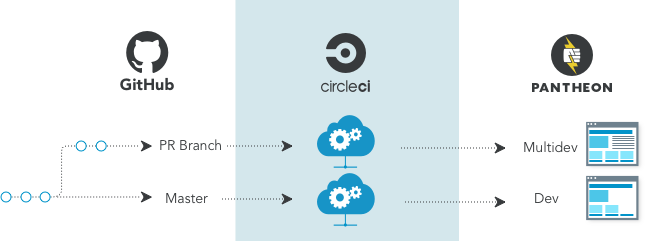
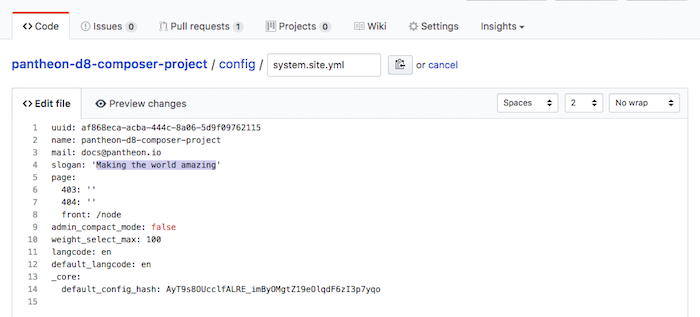

This section demonstrates GitHub's Pull Request workflow for Pantheon by making a simple code change on a feature branch then opening a Pull Request to accept that change into master.

The master branch is automatically built and deployed to the Dev environment. Feature branches are automatically built and deployed to individual Multidev environments:

<Accordion title="Continuous Delivery" id="understand-cd" icon="lightbulb">

Continuous delivery requires a consistently clear deployment pipeline from development to production. That is to say, an application must be able to deploy code to production at any given time regardless of current work in progress. Anything that keeps your application from deploying code to production is considered a blocker.

Production code is tracked by the master branch on GitHub and it is assumed to be production ready. Development work is done on a feature branch first, then proposed to master in the form of a Pull Request so it can be tested and reviewed before it's accepted.

</Accordion>

1. From your GitHub project page, click on the `config` directory. Select the file named `system.site.yml` and click  to open an editor:

  

2. Change the slogan to something inspiring:

  

3. Scroll down and enter a message describing this change in the **Commit changes** area. Then, click on the radio button to create a **new branch** and give it a short name, like `slogan`, then click **Propose file change**:

  

  <Accordion title="Branch Naming Conventions" id="understand-branch-names" icon="lightbulb">

  Be sure to use unique branch names for each feature branch; the Multidev environment created on Pantheon is named after your branch. Since there is a limit to the number of characters that may be used in a Pantheon Multidev name, your environments may conflict if you always use the branch name that GitHub suggests. For details, see [Multidev](/multidev/#what-are-the-naming-conventions-for-branches)).

  </Accordion>

4. Click **Create Pull Request**:

  

  <Accordion title="Builds" id="understand-builds" icon="watch">

  As soon as you commit changes to a feature branch, CircleCI builds a new Multidev environment on Pantheon to preview the change. Once the Multidev environment has been created, the build script will add a comment to the commit with links to the Multidev environment of the Pantheon Site Dashboard and a button to visit the Multidev site URL (e.g., `ci-4-my-pantheon-project.pantheonsite.io`). The Pull Request page conveniently shows the messages from each commit on the branch:

  

  ### Automated Tests
  It is also common to set up automated tests to confirm that the project is working as expected; when tests are available, GitHub will run them and display the results of the tests with the pull request. Working on projects with comprehensive tests increases the development team's confidence that submitted pull requests will work correctly when they are integrated into the main build.

  </Accordion>

5. Wait for the build on CircleCI to leave a comment, then click on the **Visit Site** button to access the Multidev site URL. Note that the slogan you entered in your Pull Request branch has been imported and is visible in the site header:

    

    This Multidev environment will persist for as long as the Pull Request remains open in GitHub.

6. Click **Log in** and to access the admin account for this site using the password you provided to the `build-env:create-project` command:

  
