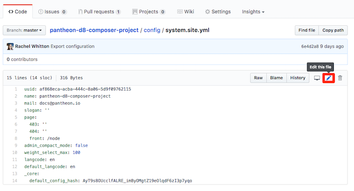
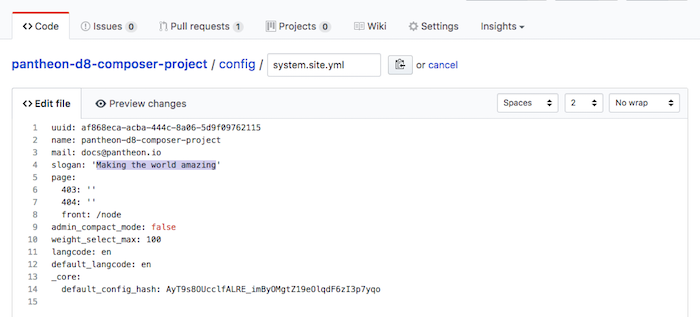
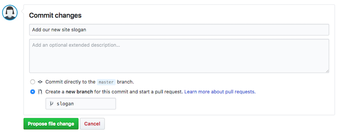
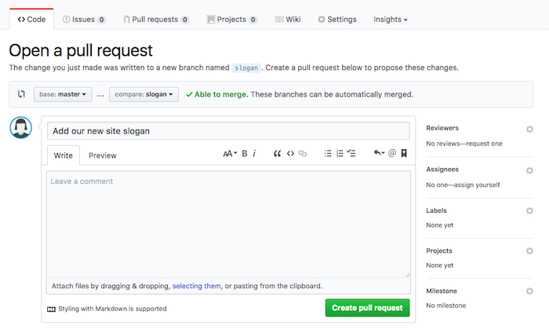
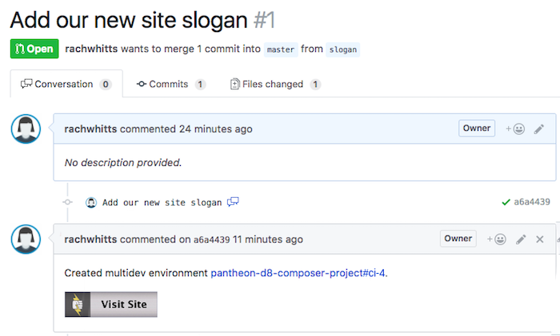
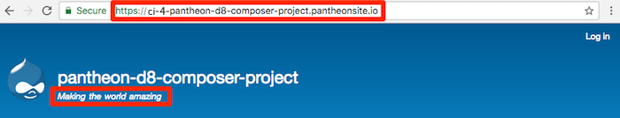
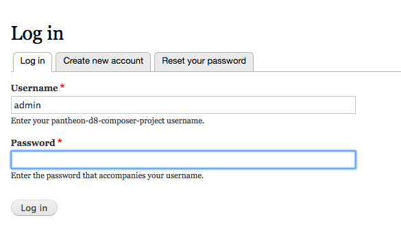

## Pull Request Introduction
This section demonstrates the Build Tools project workflow by making a code change on a Git feature branch and opening a Pull Request to accept that change into the `master` branch.

As a reminder, you will be working with the code repository hosted on <GitProvider />. <CIProvider /> will then build the full site artifact and deploy it to the project's Pantheon site.

Branches with an associated pull request are built and deployed to a [Pantheon multidev environment](https://pantheon.io/docs/multidev), with the pull request number being used to construct the multidev name. For example, pull request `12` will be deployed to a Pantheon multidev named `pr-12`.

The `master` branch is automatically built and deployed to the Pantheon `dev` environment. This happens both when you commit code directly to the `master` branch and when a pull request is merged into the `master` branch.

Deployments to the `test` and `live` environments on Pantheon must still be done manually, either in the dashboard or via Terminus. For this reason, Continuous Delivery <Popover title="Continuous Delivery" content="Continuous Delivery (CD) is the practice of automatically deploying code all the way to production, without human intervention. This requires a consistently clear deployment pipeline from development to production. That is to say, an application must be able to deploy code to production at any given time regardless of current work in progress." /> is not enabled.

## Create a Pull Request

1. From your <GitProvider /> project page, click on the `config` directory. Select the file named `system.site.yml` and click  to open an editor:

  

2. Change the slogan to something inspiring:

  

3. Scroll down and enter a message describing this change in the **Commit changes** area. Then, click on the radio button to create a **new branch** and give it a short name, like `slogan`, then click **Propose file change**:

  

4. Click **Create Pull Request**:

  

  <Accordion title="Builds" id="understand-builds" icon="watch">

  As soon as you commit changes to a feature branch, <CIProvider /> builds a new Multidev environment on Pantheon to preview the change. Once the Multidev environment has been created, the build script will add a comment to the commit with links to the Multidev environment of the Pantheon Site Dashboard and a button to visit the Multidev site URL (e.g., `pr-1-my-pantheon-project.pantheonsite.io`). The Pull Request page conveniently shows the messages from each commit on the branch:

  

  ### Automated Tests
  It is also common to set up automated tests to confirm that the project is working as expected; when tests are available, <GitProvider /> will run them and display the results of the tests with the pull request. Working on projects with comprehensive tests increases the development team's confidence that submitted pull requests will work correctly when they are integrated into the main build.

  </Accordion>

5. Wait for the build on <CIProvider /> to leave a comment, then click on the **Visit Site** button to access the Multidev site URL. Note that the slogan you entered in your Pull Request branch has been imported and is visible in the site header:

    

    This Multidev environment will persist for as long as the Pull Request remains open in <GitProvider />.

6. Click **Log in** and to access the admin account for this site using the password you provided to the `build-env:create-project` command:

  
