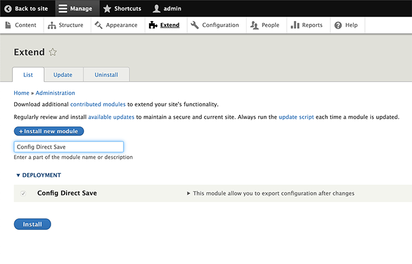
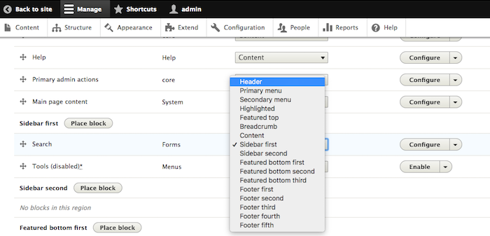
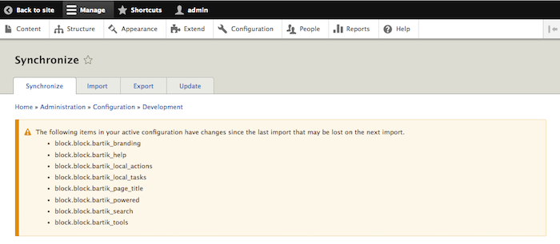
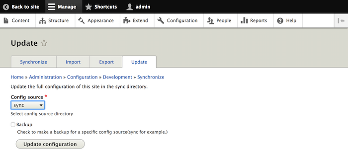
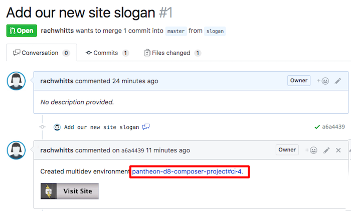
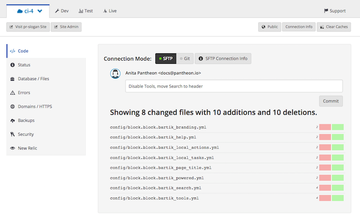
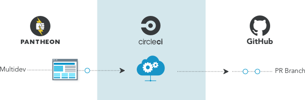

In this lesson, we'll use the Configuration Management system within the Drupal Admin interface to set block placements for our example site. Continuing from the previous step, we'll be working in the feature branch environment, not Dev.

<Accordion title="Configuration Management" id="understand-config" icon="lightbulb">

#### Configuration Management
 While it is possible to configure your site by directly editing the exported configuration files (as we did in the [previous lesson](/guides/build-tools/pr-workflow/)), it's only easy for properties with a known location and format. Most of the time, it's far more convenient to use the [Configuration Management system within the Drupal admin interface](/drupal-8-configuration-management/).

After making configuration changes in the Admin interface, settings are updated in the database. The Configuration Management system allows you to commit settings stored in the database to code so they can be easily tracked and applied to other environments.

</Accordion>

1. As a site administrator, navigate to **Extend** and search for "Config Direct Save". Enable the module and save.

  

  This module is required for the following steps.

1. As a site administrator, navigate to **Structure** > **Block layout**. Disable the **Tools** block and move the **Search** block to the header. Save your changes with the **Save blocks** button at the bottom of the page.

  

1. Go to **Configuration** > **Development** > **Configuration Synchronization**:

  

  Note the warning displayed on this page about modified configuration. This means that your recent configuration changes would be erased if you synchronized your configuration at this time.

1. Click **Update** and select the **sync** source, then click **Update configuration** to export configuration changes from the database to yaml files in your site's codebase:

  

1. Return to your open Pull Request in GitHub and use the link provided in the comment to open the associated Multidev environment on the Pantheon Site Dashboard:

  

1. The sync operation made changes to a number of configuration files that we now need to commit to version control. Enter a message describing the configuration change and click **Commit**:

  

1. Return to your open Pull Request in GitHub. Note that your commit has been added to this Pull Request, and the CircleCI status indicates that your tests are running:

  

Whenever you commit changes from the Pantheon dashboard, the commit will be reduced to contain only those files that belong in the source repository, and this commit will be pushed back to the canonical repository on GitHub:

GitHub will then start a new CircleCI build, and the build results will once again be pushed to the existing Multidev environment that was created for this branch:

You may continue working in this environment, making multiple changes, and committing updates whenever you would like your tests to run again.
