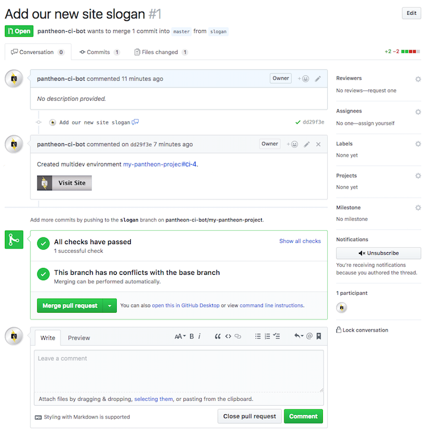

This lesson demonstrates the final process of the Pull Request workflow, merging. After completing an internal peer review process for a given Pull Request, work is considered ready for production and accepted into the master branch.

1.  Go to your GitHub project page, click on the **Pull requests** tab and navigate to the PR open against the `slogan` branch, which we [started in an earlier lesson](/guides/build-tools/pr-workflow/).

  Check if your tests have completed, and the test results are green If they haven't completed, just wait a few minutes. If they failed, go back and review the changes you made.

  

2.  Once your tests have passed, and there is nothing else that you wish to add to this particular feature, click on the **Merge Pull Request**.

    When your Pull Request is merged, one more test run will be started to test the result of combining the code and configuration from your Pull Request with the master branch. Once this test passes, the configuration for your site will be applied to the Dev environment, and the corresponding Multidev environment will be deleted. Note that database content is not merged; make sure that you have exported your configuration before merging your Pull Request to ensure that configuration changes are not lost.

You may now use the [Pantheon dev / test / live workflow](https://pantheon.io/docs/pantheon-workflow/) to deploy your site as usual. Continue reading this guide to learn how to manage core updates and create a custom theme.
