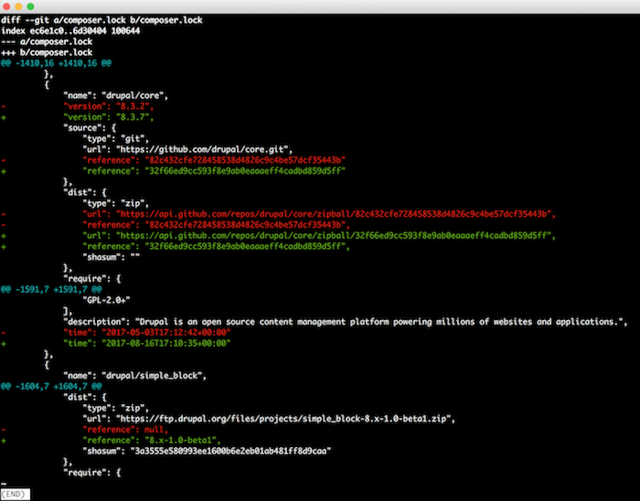

In this lesson, we'll take a closer look at how to update dependencies in a Composer workflow.

<Accordion title="Composer" id="understand-composer" icon="lightbulb">

## Composer Fundamentals

Composer is a PHP dependency manager that provides an alternative, more modern way to manage the external code used by a WordPress or Drupal site. At its primary level, Composer needs:

- A list of dependencies
- A place to put the dependencies

Understanding how Composer can be used independent of Drupal or WordPress is a good place to learn more about the general concepts. For a summary of basic usage, see [Composer's own documentation](https://getcomposer.org/doc/01-basic-usage.md).

<Enablement title="Automation Training" link="https://pantheon.io/learn-pantheon?docs">

Learn Composer concepts with help from our experts. Pantheon delivers on-demand training to help development teams navigate the platform and improve internal WebOps.

</Enablement>

## Dependencies

Composer encourages a mental model where code not written specifically for a given project is a dependency. Only files unique to the project are tracked as part of the project's main source repository, also referred to as the canonical site repository. Dependencies for WordPress and Drupal include core, plugins, contrib modules, themes, and libraries. A single dependency, such as a theme, is referred to as a package.

Composer looks within [The PHP Package Repository](https://packagist.org/) for dependencies to install, which does not include Drupal or WordPress packages by default. Additional repositories must be configured for Composer to use packages not found in the default repository. Each framework provides it's own respective package repository so dependencies can be managed with Composer:

- WordPress: <https://wpackagist.org>
- Drupal 8: <https://packages.drupal.org/8>
- Drupal 7: <https://packages.drupal.org/7>

Sites created from Pantheon's example repositories already include the appropriate package repository within the `composer.json` file, such as [Drupal 8](https://github.com/pantheon-systems/example-drops-8-composer/blob/master/composer.json#L6-L11):

```json
repositories": [
     {
       "type": "composer",
       "url": "https://packages.drupal.org/8"
     }
   ],
```

</Accordion>

## Update Core

1. Start by creating a new branch based off the tip of master (replace `drupal-8.3.7` according to your current task):

    ```bash
    git checkout -b drupal-8.3.7 master
    ```

1. Update your project to the current Drupal 8 stable version of core released on drupal.org with Composer:

    ```bash
    composer update drupal/core
    ```

1. Run `git diff composer.lock` to see the updated dependency details:

  

1. Commit the updated `composer.lock` file and push a new branch up to GitHub, for example (replace `drupal-8.3.7` according to your current task):

    ```bash
    git commit -m="Update to Drupal 8.3.7"
      git push origin drupal-8.3.7
    ```

1. Return to GitHub and compare your feature branch against `master`. You should see all commits made locally here in GitHub. Click **Create Pull Request** and go through your team's standard peer review process.

  

Use this process to update any dependency required by your project's `composer.json` file. The site should *never* receive Pantheon's One-click updates in the Pantheon Site Dashboard, Drupal's Admin interface, or Drush to update core, as none of these techniques modify the `composer.json` file. You must update core using Composer exclusively.
